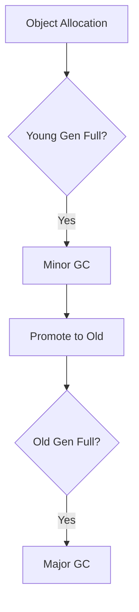

## Overview

Garbage Collection (GC) automatically manages memory by reclaiming unused objects. Java's GC is generational, with algorithms like Serial, Parallel, CMS, G1, ZGC. Key for interviews: understanding pauses, throughput, and tuning for low-latency systems.

## STAR Summary

**Situation:** High GC pauses causing request timeouts.

**Task:** Optimize GC for sub-100ms pauses.

**Action:** Switched to G1GC, tuned heap sizes and pause targets.

**Result:** Reduced pauses to <50ms, improved user experience.

## Detailed Explanation

### Generational Hypothesis

Most objects die young. Heap divided into Young (Eden, Survivor), Old gen.

### Algorithms

- **Serial GC:** Single-threaded, for small apps.

- **Parallel GC:** Multi-threaded, for throughput.

- **CMS:** Concurrent mark-sweep, low pauses but fragmentation.

- **G1:** Regional, predictable pauses.

- **ZGC/Shenandoah:** Low-latency, large heaps.

Phases: Mark, Sweep, Compact.

## Real-world Examples & Use Cases

- Web servers: G1 for balanced throughput/pauses.
- Big data: Parallel GC for batch jobs.
- Real-time systems: ZGC for minimal pauses.

## Code Examples

Tuning flags:

```bash
java -Xms4g -Xmx4g -XX:+UseG1GC -XX:MaxGCPauseMillis=200 -XX:G1HeapRegionSize=16m Main
```

Monitor GC: `jstat -gc <pid>`

## Data Models / Message Formats

GC log example:

[GC (Allocation Failure)  1024K->512K(2048K), 0.0012345 secs]

## Journey / Sequence



## Common Pitfalls & Edge Cases

- GC thrashing: Too frequent collections.
- Memory leaks: Objects not garbage collected.
- Tuning without metrics.

## Tools & Libraries

- GCViewer for log analysis.
- jstat, jmap for monitoring.

## Github-README Links & Related Topics

[[jvm-internals-and-classloading]], [[performance-tuning-and-profiling]], [[low-latency-systems]]

## References

- https://docs.oracle.com/javase/9/gctuning/
- https://www.oracle.com/technetwork/java/javase/gc-tuning-5-138395.html