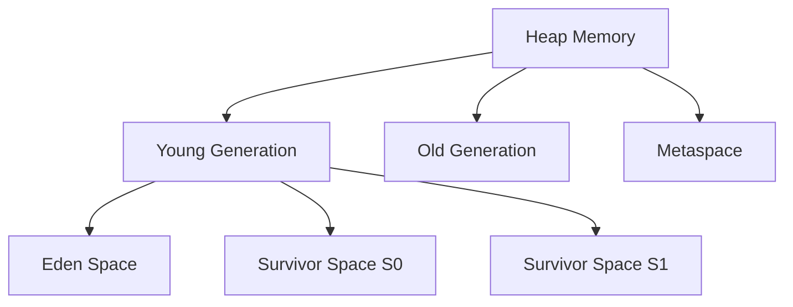
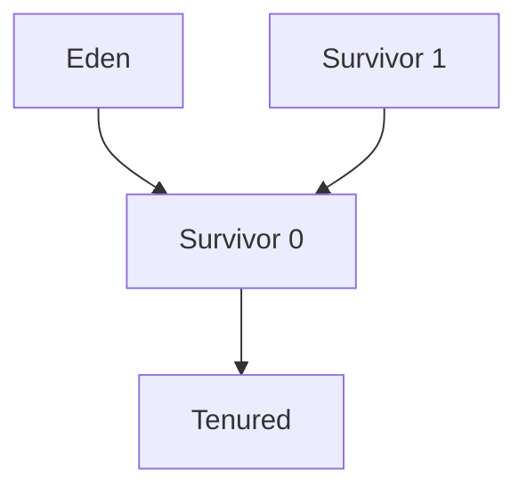

# Overview

Garbage Collection (GC) is the process by which the Java Virtual Machine automatically manages memory by reclaiming heap space occupied by objects that are no longer reachable. Understanding GC algorithms is crucial for Java developers to optimize application performance, reduce latency, and prevent memory-related issues. Different GC algorithms offer various trade-offs between throughput, latency, and memory usage.

# Detailed Explanation

## Generations in Java Heap

The JVM divides heap memory into generations based on object lifetime:

- **Young Generation**: Newly created objects
- **Old Generation (Tenured)**: Long-lived objects that survive multiple GC cycles
- **Permanent Generation/Metaspace**: Class metadata (Java 8+)



## Basic GC Concepts

### Reachability
- **Root Objects**: Static variables, local variables, active threads
- **Reachable Objects**: Objects accessible from roots through reference chains
- **Garbage**: Objects not reachable from any root

### GC Roots
- Local variables in stack frames
- Static variables of loaded classes
- JNI references
- Active threads

## Major GC Algorithms

### Serial Collector
- Single-threaded collector
- Uses mark-sweep-compact algorithm
- Suitable for small applications and single-core machines

```java
// JVM options for Serial GC
// -XX:+UseSerialGC
```

### Parallel Collector (Throughput Collector)
- Multi-threaded version of Serial collector
- Maximizes application throughput
- Uses multiple threads for both young and old generation collection

```java
// JVM options for Parallel GC
// -XX:+UseParallelGC
// -XX:ParallelGCThreads=4
// -XX:GCTimeRatio=99
```

### Concurrent Mark Sweep (CMS) Collector
- Concurrent low-pause collector
- Minimizes GC pause times
- Uses separate threads for marking while application runs

```java
// JVM options for CMS GC
// -XX:+UseConcMarkSweepGC
// -XX:CMSInitiatingOccupancyFraction=75
// -XX:+UseCMSInitiatingOccupancyOnly
```

### G1 (Garbage First) Collector
- Designed for large heaps (>4GB)
- Divides heap into regions
- Predictable pause times
- Concurrent and parallel collection

```java
// JVM options for G1 GC
// -XX:+UseG1GC
// -XX:MaxGCPauseMillis=200
// -XX:G1HeapRegionSize=16m
```

### Z Garbage Collector (ZGC)
- Scalable low-latency collector
- Handles heaps from 8MB to 16TB
- Pause times under 10ms
- Concurrent collection

```java
// JVM options for ZGC
// -XX:+UseZGC
// -XX:ZCollectionInterval=5
// -XX:ZAllocationSpikeTolerance=2.0
```

### Shenandoah GC
- Similar to ZGC but developed by Red Hat
- Concurrent evacuation
- Low pause times

```java
// JVM options for Shenandoah
// -XX:+UseShenandoahGC
```

## Young Generation Collection Algorithms

### Copying Collection
- Used in Young Generation
- Copies live objects between survivor spaces
- Fast but requires extra space



### Mark-Sweep-Compact
- Mark live objects
- Sweep dead objects
- Compact remaining objects
- Used in Old Generation

## Detailed Algorithm Explanations

### Serial GC Algorithm

1. **Young Generation**: Copying collection
   - Scan roots for references
   - Copy reachable objects to survivor space
   - Clear eden space

2. **Old Generation**: Mark-sweep-compact
   - Mark all reachable objects
   - Sweep unreachable objects
   - Compact live objects

### Parallel GC Algorithm

- Same as Serial but uses multiple threads
- Parallel young generation collection
- Parallel old generation collection
- Maximizes CPU utilization

### CMS Algorithm

1. **Initial Mark** (STW): Mark objects directly reachable from roots
2. **Concurrent Mark**: Trace object graph concurrently
3. **Remark** (STW): Final marking of objects
4. **Concurrent Sweep**: Remove unreachable objects concurrently

### G1 Algorithm

1. **Young Collection**: Copying collection in young regions
2. **Mixed Collection**: Collect young + some old regions
3. **Full GC**: Mark-sweep-compact across all regions (fallback)

## GC Tuning Parameters

### Heap Sizing

```java
// Initial and maximum heap size
// -Xms2g -Xmx8g

// Young generation size
// -Xmn1g
// -XX:NewRatio=2
// -XX:SurvivorRatio=8
```

### GC Behavior Tuning

```java
// Target pause time
// -XX:MaxGCPauseMillis=200

// GC threads
// -XX:ParallelGCThreads=4
// -XX:ConcGCThreads=2

// CMS specific
// -XX:CMSInitiatingOccupancyFraction=75
// -XX:CMSTriggerRatio=70
```

# Real-world Examples & Use Cases

## High-Throughput Application

```java
// JVM settings for batch processing application
// -XX:+UseParallelGC
// -XX:GCTimeRatio=19  // Spend 5% time in GC
// -Xms4g -Xmx4g       // Fixed heap size
// -Xmn1g              // 1GB young generation
```

## Low-Latency Application

```java
// JVM settings for web application requiring low latency
// -XX:+UseG1GC
// -XX:MaxGCPauseMillis=100
// -XX:G1HeapRegionSize=8m
// -XX:G1MixedGCCountTarget=8
// -Xms2g -Xmx8g
```

## Large Heap Application

```java
// JVM settings for application with large heap
// -XX:+UseZGC
// -Xms8g -Xmx64g
// -XX:ZCollectionInterval=5
// -XX:ZAllocationSpikeTolerance=2.0
```

## Memory-Constrained Environment

```java
// JVM settings for containerized application
// -XX:+UseSerialGC
// -Xms512m -Xmx1g
// -XX:MaxMetaspaceSize=256m
```

# Code Examples

## Monitoring GC Activity

```java
public class GCMonitoring {
    public static void main(String[] args) {
        // Add JVM arguments:
        // -XX:+PrintGC -XX:+PrintGCDetails -XX:+PrintGCTimeStamps
        
        List<byte[]> list = new ArrayList<>();
        
        for (int i = 0; i < 1000; i++) {
            // Allocate memory to trigger GC
            list.add(new byte[1024 * 1024]); // 1MB each
            
            if (i % 100 == 0) {
                System.out.println("Allocated " + (i + 1) + " MB");
                System.gc(); // Suggest GC (not guaranteed)
            }
        }
    }
}
```

## GC Logging Analysis

```bash
# Enable detailed GC logging
java -XX:+PrintGC -XX:+PrintGCDetails -XX:+PrintGCTimeStamps \
     -XX:+PrintGCApplicationStoppedTime -XX:+PrintGCApplicationConcurrentTime \
     -Xloggc:gc.log -XX:+UseGCLogFileRotation -XX:NumberOfGCLogFiles=5 \
     -XX:GCLogFileSize=10M \
     MyApplication
```

## Memory Leak Detection

```java
public class MemoryLeakDetector {
    private static final List<Object> leakList = new ArrayList<>();
    private static final Random random = new Random();
    
    public static void main(String[] args) throws InterruptedException {
        // JVM arguments for heap dump on OOM:
        // -XX:+HeapDumpOnOutOfMemoryError -XX:HeapDumpPath=./heapdump.hprof
        
        while (true) {
            // Simulate memory leak
            leakList.add(new byte[1024 * 1024]); // 1MB
            
            // Random cleanup (but not complete)
            if (random.nextInt(10) == 0) {
                int size = leakList.size();
                if (size > 10) {
                    leakList.subList(0, size / 2).clear();
                }
            }
            
            Thread.sleep(100);
            System.out.println("Leak list size: " + leakList.size());
        }
    }
}
```

## Weak References Example

```java
public class WeakReferenceExample {
    public static void main(String[] args) {
        // Strong reference
        Object strongRef = new Object();
        
        // Weak reference
        WeakReference<Object> weakRef = new WeakReference<>(new Object());
        
        // Soft reference
        SoftReference<Object> softRef = new SoftReference<>(new Object());
        
        System.out.println("Strong: " + strongRef);
        System.out.println("Weak: " + weakRef.get());
        System.out.println("Soft: " + softRef.get());
        
        // Suggest GC
        System.gc();
        
        System.out.println("After GC:");
        System.out.println("Strong: " + strongRef);
        System.out.println("Weak: " + weakRef.get());  // May be null
        System.out.println("Soft: " + softRef.get());  // May still exist
    }
}
```

# Common Pitfalls & Edge Cases

## Long GC Pauses

```java
public class GCPauseIssue {
    public static void main(String[] args) {
        // Problem: Large young generation causing long pauses
        // -Xmn4g with small heap causes frequent full GC
        
        List<byte[]> data = new ArrayList<>();
        for (int i = 0; i < 10000; i++) {
            data.add(new byte[100 * 1024]); // 100KB each
            // Frequent allocations cause GC pressure
        }
    }
}

// Solution: Tune generation sizes
// -Xms2g -Xmx2g -Xmn512m
```

## Memory Fragmentation

```java
public class FragmentationExample {
    private static final List<Object> objects = new ArrayList<>();
    
    public static void main(String[] args) {
        // Create objects of different sizes
        for (int i = 0; i < 1000; i++) {
            if (i % 2 == 0) {
                objects.add(new byte[1024]);      // 1KB
            } else {
                objects.add(new byte[1024 * 1024]); // 1MB
            }
        }
        
        // Remove every other object, creating fragmentation
        for (int i = 0; i < objects.size(); i += 2) {
            objects.set(i, null);
        }
        
        // Compact collection needed to defragment
        System.gc();
    }
}
```

## CMS Concurrent Mode Failure

```java
public class CMSFailure {
    public static void main(String[] args) {
        // CMS failure occurs when old gen fills up during concurrent marking
        // -XX:CMSInitiatingOccupancyFraction=75 (default)
        
        List<byte[]> oldGenFiller = new ArrayList<>();
        while (true) {
            // Fill old generation quickly
            oldGenFiller.add(new byte[1024 * 1024]);
            
            // CMS can't keep up, causing concurrent mode failure
            // Falls back to stop-the-world serial collection
        }
    }
}

// Solution: Increase CMS threads or adjust triggering
// -XX:ConcGCThreads=4 -XX:CMSInitiatingOccupancyFraction=50
```

## G1 Region Size Issues

```java
public class G1RegionIssue {
    public static void main(String[] args) {
        // Problem: Humongous objects > 50% of region size
        // -XX:G1HeapRegionSize=1m (too small)
        
        // Create large objects that span multiple regions
        List<byte[]> humongousObjects = new ArrayList<>();
        for (int i = 0; i < 10; i++) {
            // 2MB object with 1MB regions = humongous
            humongousObjects.add(new byte[2 * 1024 * 1024]);
        }
    }
}

// Solution: Increase region size
// -XX:G1HeapRegionSize=16m
```

# Tools & Libraries

## GC Analysis Tools

- **GCViewer**: Analyze GC logs visually
- **IBM GCMV**: Garbage collection and memory visualizer
- **jstat**: JVM statistics monitoring tool
- **VisualVM**: GUI tool for monitoring JVM
- **JMC (Java Mission Control)**: Advanced profiling and diagnostics

## Memory Profilers

- **YourKit Java Profiler**
- **JProfiler**
- **Eclipse Memory Analyzer (MAT)**
- **NetBeans Profiler**

## Command Line Tools

```bash
# Monitor GC in real-time
jstat -gcutil <pid> 1000

# Print heap histogram
jmap -histo <pid>

# Force heap dump
jmap -dump:live,file=heap.hprof <pid>

# Print class loader statistics
jcmd <pid> VM.classloader_stats
```

# References

- [Oracle JVM Garbage Collection Tuning Guide](https://docs.oracle.com/javase/8/docs/technotes/guides/vm/gctuning/)
- [Java Platform, Standard Edition HotSpot Virtual Machine Garbage Collection Tuning Guide](https://docs.oracle.com/javase/8/docs/technotes/guides/vm/gctuning/toc.html)
- [OpenJDK GC Documentation](https://openjdk.java.net/groups/hotspot/docs/)

# Github-README Links & Related Topics

- [jvm-internals-class-loading](jvm-internals-class-loading/)
- [jvm-memory-management](jvm-memory-management/)
- [java-performance-tuning](java-performance-tuning/)
- [latency-and-throughput-zero-to-hero](latency-and-throughput-zero-to-hero/)
