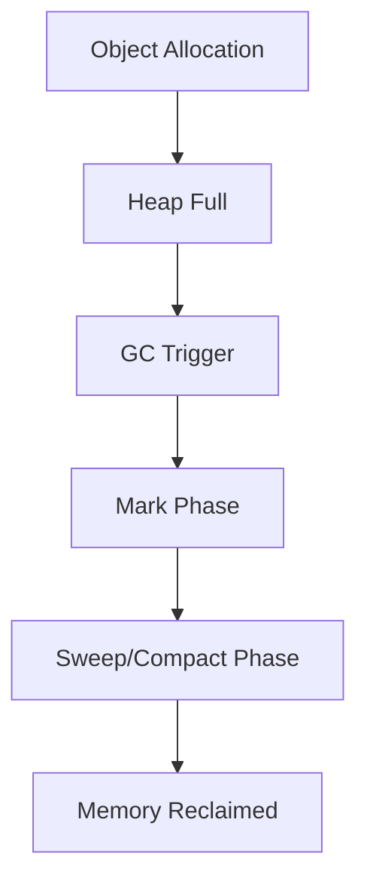

# Garbage Collection Algorithms

## Overview

Garbage Collection (GC) in Java automatically manages memory by identifying and reclaiming objects that are no longer in use. Various algorithms optimize for different scenarios like throughput or latency.

## Detailed Explanation

### Common Algorithms

- **Mark-Sweep**: Marks reachable objects, sweeps unreachables.
- **Mark-Compact**: Marks and compacts memory to reduce fragmentation.
- **Generational GC**: Divides heap into young and old generations.

### JVM GC Collectors

- Serial GC
- Parallel GC
- CMS (Concurrent Mark Sweep)
- G1 (Garbage First)
- ZGC, Shenandoah (low-latency)

## Real-world Examples & Use Cases

- Tuning GC for high-throughput batch processing.
- Using G1 for low-pause applications like web servers.

## Code Examples

```bash
# JVM options for G1 GC
java -XX:+UseG1GC -XX:MaxGCPauseMillis=200 -Xmx4g MyApp
```

## Journey / Sequence



## Common Pitfalls & Edge Cases

- Memory leaks due to strong references.
- Long GC pauses in large heaps.

## References

- [Oracle GC Tuning](https://docs.oracle.com/javase/8/docs/technotes/guides/vm/gctuning/)
- [Baeldung GC Algorithms](https://www.baeldung.com/jvm-garbage-collectors)

## Github-README Links & Related Topics

- [JVM Internals & Class Loading](../jvm-internals-class-loading)
- [Java Memory Management](../java-memory-management)
