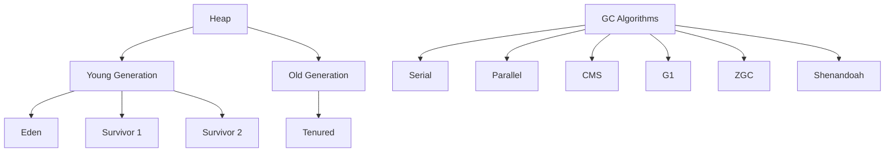

# Garbage Collection Algorithms

## Overview

Garbage Collection (GC) is the automatic memory management process in the JVM that reclaims heap memory occupied by objects no longer in use. Various algorithms optimize for different scenarios, balancing pause times, throughput, and memory efficiency.

## Detailed Explanation

### Garbage Collection Algorithms

#### Basic Algorithms

- **Mark-Sweep**: 
  - **Phase 1 (Mark):** Traverse the object graph from GC roots, marking reachable objects.
  - **Phase 2 (Sweep):** Reclaim memory from unmarked objects.
  - **Pros:** Simple implementation.
  - **Cons:** Causes memory fragmentation, potential for heap exhaustion.

- **Mark-Compact**: 
  - Similar to mark-sweep but adds a compaction phase to move live objects together.
  - **Pros:** Eliminates fragmentation.
  - **Cons:** More complex, potentially longer pause times.

- **Copying (Scavenge)**: 
  - Divides heap into two equal spaces (from-space and to-space).
  - Copies live objects from from-space to to-space, then swaps spaces.
  - **Pros:** No fragmentation, fast allocation.
  - **Cons:** Requires twice the memory, copying overhead.

#### Generational Algorithms

Most modern JVMs use generational GC, based on the "weak generational hypothesis" that most objects die young.

- **Young Generation:** Uses copying collection (Minor GC).
- **Old Generation:** Uses mark-sweep-compact (Major/Full GC).

#### Advanced Algorithms

- **Concurrent Mark Sweep (CMS):** 
  - Concurrent marking to minimize pauses.
  - **Pros:** Low pause times.
  - **Cons:** CPU intensive, can cause fragmentation.

- **G1 (Garbage First):** 
  - Divides heap into regions, prioritizes collection of regions with most garbage.
  - **Pros:** Predictable pauses, efficient for large heaps.
  - **Cons:** Higher overhead.

- **ZGC (Z Garbage Collector):** 
  - Concurrent, region-based, designed for low-latency applications.
  - **Pros:** Sub-millisecond pauses, handles multi-terabyte heaps.
  - **Cons:** Higher memory overhead.

- **Shenandoah:** 
  - Similar to ZGC, concurrent evacuation.
  - **Pros:** Low pause times, good for large heaps.



| Algorithm | Pros | Cons | Use Case | JVM Options |
|-----------|------|------|----------|-------------|
| Serial GC | Simple, low overhead | Long pauses | Single-threaded apps | -XX:+UseSerialGC |
| Parallel GC | High throughput | Longer pauses | Batch processing | -XX:+UseParallelGC |
| CMS | Low pause times | CPU intensive, fragmentation | Web servers | -XX:+UseConcMarkSweepGC |
| G1 | Balanced, predictable pauses | Higher overhead | Large heaps | -XX:+UseG1GC |
| ZGC | Ultra-low pauses | Memory overhead | Low-latency apps | -XX:+UseZGC |
| Shenandoah | Low pauses, large heaps | Complex | Cloud applications | -XX:+UseShenandoahGC |

## Real-world Examples & Use Cases

- **Web Apps**: G1 GC for low-latency e-commerce sites.

- **Big Data**: Parallel GC for high-throughput analytics.

- **Embedded**: Serial GC for resource-constrained devices.

## Code Examples

### Forcing GC (Not recommended)
```java
System.gc(); // Hint to JVM
```

### Monitoring GC
```java
Runtime runtime = Runtime.getRuntime();
long usedMemory = runtime.totalMemory() - runtime.freeMemory();
System.out.println("Used memory: " + usedMemory + " bytes");

// Force garbage collection (not recommended for production)
System.gc();
```

### Using JMX for GC Monitoring
```java
import java.lang.management.GarbageCollectorMXBean;
import java.lang.management.ManagementFactory;
import java.util.List;

public class GCMonitor {
    public static void main(String[] args) {
        List<GarbageCollectorMXBean> gcBeans = ManagementFactory.getGarbageCollectorMXBeans();
        
        for (GarbageCollectorMXBean gcBean : gcBeans) {
            System.out.println("GC Name: " + gcBean.getName());
            System.out.println("Collection Count: " + gcBean.getCollectionCount());
            System.out.println("Collection Time: " + gcBean.getCollectionTime() + " ms");
        }
    }
}
```

### Creating Objects to Demonstrate GC
```java
import java.util.ArrayList;
import java.util.List;

public class GCExample {
    public static void main(String[] args) {
        List<byte[]> list = new ArrayList<>();
        
        // Allocate memory to trigger GC
        for (int i = 0; i < 1000; i++) {
            list.add(new byte[1024 * 1024]); // 1MB each
            
            if (i % 100 == 0) {
                System.out.println("Allocated " + (i + 1) + " MB");
                Runtime runtime = Runtime.getRuntime();
                System.out.println("Free memory: " + runtime.freeMemory() / (1024 * 1024) + " MB");
            }
        }
        
        // Clear references
        list.clear();
        System.gc(); // Suggest GC
        System.out.println("After GC - Free memory: " + Runtime.getRuntime().freeMemory() / (1024 * 1024) + " MB");
    }
}
```

## Common Pitfalls & Edge Cases

- **Memory Leaks**: Retaining references unintentionally.

- **GC Pauses**: Can cause latency spikes.

- **Tuning**: Requires profiling for optimal settings.

## References

- [Oracle JVM Garbage Collection Tuning](https://docs.oracle.com/javase/8/docs/technotes/guides/vm/gctuning/)
- [Baeldung: Java Garbage Collectors](https://www.baeldung.com/java-garbage-collectors)
- [Java GC Algorithms - GeeksforGeeks](https://www.geeksforgeeks.org/garbage-collection-java/)
- [ZGC: The Z Garbage Collector](https://wiki.openjdk.java.net/display/zgc/Main)
- [Shenandoah GC](https://wiki.openjdk.java.net/display/shenandoah/Main)
- [G1 Garbage Collector - Oracle](https://www.oracle.com/technetwork/tutorials/tutorials-1876574.html)

## Github-README Links & Related Topics

- [JVM Internals & Class Loading](../jvm-internals-and-class-loading/)
- [Java Memory Management](../java-memory-management/)
- [GC Tuning](../gc-tuning/)