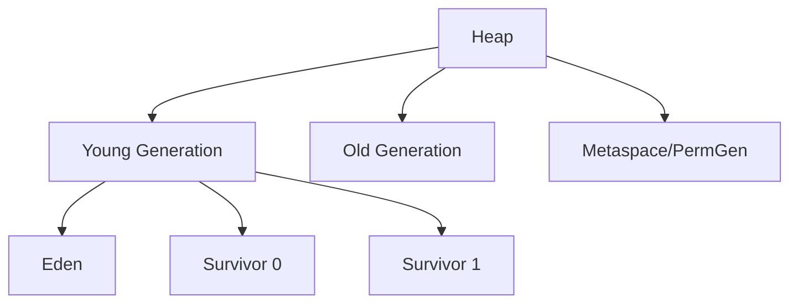
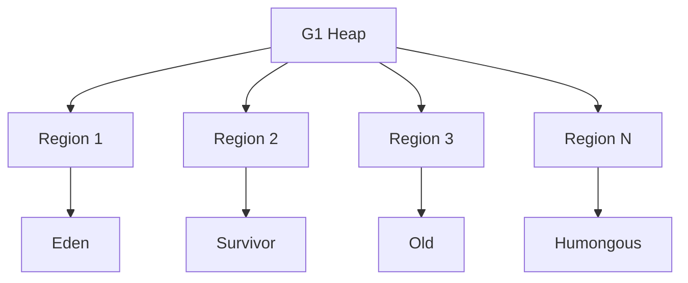

# Garbage Collection Algorithms

## Overview

Garbage Collection (GC) is the process of automatically reclaiming memory occupied by objects that are no longer in use. Java provides several GC algorithms with different trade-offs in terms of throughput, latency, and memory usage.

## Detailed Explanation

### Basic GC Concepts

- **Reachability**: An object is reachable if it can be accessed through a chain of references from GC roots
- **GC Roots**: Static variables, local variables in stack frames, JNI references
- **Generational Hypothesis**: Most objects die young, few objects survive long

### Heap Structure



### Major GC Algorithms

#### Mark-Sweep

**Process:**
1. Mark: Traverse object graph from GC roots, mark reachable objects
2. Sweep: Reclaim memory of unmarked objects

**Pros:** Simple, low pause times for marking
**Cons:** Fragmentation, sweep phase can be slow

#### Mark-Compact

**Process:**
1. Mark reachable objects
2. Compact: Move surviving objects to eliminate fragmentation

**Pros:** No fragmentation
**Cons:** Higher pause times due to compaction

#### Copying Collection

**Process:**
1. Divide heap into two equal spaces (from-space and to-space)
2. Copy live objects from from-space to to-space
3. Swap spaces

**Pros:** Fast allocation, no fragmentation
**Cons:** Wastes half the heap space

### Generational GC

Combines different algorithms for different generations:

- **Minor GC**: Copying collection in Young Generation
- **Major GC**: Mark-sweep or mark-compact in Old Generation

### Advanced GC Algorithms

#### G1 (Garbage First)

- Divides heap into regions
- Prioritizes regions with most garbage
- Aims for predictable pause times



#### ZGC (Z Garbage Collector)

- Concurrent GC with very low pause times
- Uses colored pointers
- Handles heaps up to 16TB

#### Shenandoah

- Concurrent evacuation
- Broker GC pauses
- Similar to ZGC but different implementation

## Real-world Examples & Use Cases

1. **High-Throughput Applications**: Use Parallel GC for maximum throughput
2. **Low-Latency Systems**: Use G1 or ZGC for predictable pauses
3. **Big Data Processing**: Use large heaps with appropriate GC tuning
4. **Microservices**: Tune GC for quick startup and low memory footprint
5. **Gaming Applications**: Use low-pause GC to avoid frame drops

## Code Examples

### GC Monitoring Example

```java
public class GCMonitoring {
    public static void main(String[] args) {
        // Add GC logging JVM arguments:
        // -XX:+PrintGC -XX:+PrintGCDetails -XX:+PrintGCTimeStamps
        
        List<byte[]> list = new ArrayList<>();
        
        for (int i = 0; i < 10000; i++) {
            list.add(new byte[1024]); // 1KB objects
            
            if (i % 1000 == 0) {
                System.out.println("Created " + i + " objects");
                System.gc(); // Force GC
            }
        }
    }
}
```

### Memory Leak Detection

```java
public class MemoryLeakDemo {
    static List<Object> leakList = new ArrayList<>();
    
    public static void main(String[] args) {
        // JVM arguments for heap dump on OOM:
        // -XX:+HeapDumpOnOutOfMemoryError -XX:HeapDumpPath=./heapdump.hprof
        
        while (true) {
            leakList.add(new byte[1024 * 1024]); // 1MB objects
            
            try {
                Thread.sleep(100);
            } catch (InterruptedException e) {
                Thread.currentThread().interrupt();
            }
        }
    }
}
```

## Tools & Libraries

- **VisualVM**: GUI tool for monitoring JVM and GC
- **JConsole**: Built-in monitoring tool
- **GCViewer**: Analyze GC logs
- **Async Profiler**: Low-overhead profiling including GC

## Common Pitfalls & Edge Cases

1. **Memory Leaks**: Objects held by static references
2. **GC Pauses**: Long pauses in latency-sensitive applications
3. **Heap Sizing**: Incorrect Xmx/Xms settings
4. **Reference Types**: Soft/weak references affecting GC behavior
5. **Finalizers**: Blocking GC, use Cleaner API instead

## References

- [Oracle GC Tuning Guide](https://docs.oracle.com/javase/8/docs/technotes/guides/vm/gctuning/)
- [JVM GC Algorithms](https://www.baeldung.com/jvm-garbage-collectors)
- [G1 GC Deep Dive](https://www.oracle.com/technetwork/tutorials/tutorials-1876574.html)

## Github-README Links & Related Topics

- [jvm-internals-and-class-loading/README.md](../jvm-internals-and-class-loading/README.md)
- [gc-tuning/README.md](../gc-tuning/README.md)
- [java-memory-model-and-concurrency/README.md](../java/java-memory-model-and-concurrency/README.md)
