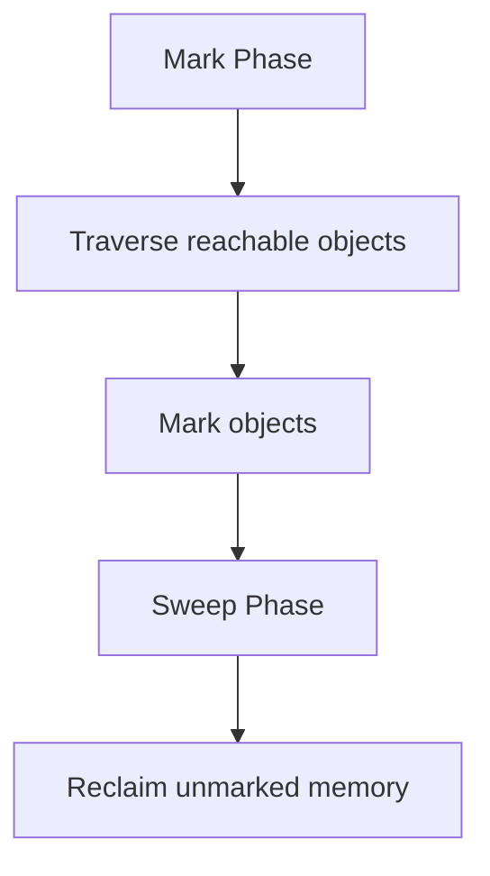

# Garbage Collection Algorithms

## Overview
Garbage Collection (GC) is the process of automatically reclaiming memory occupied by objects that are no longer in use. Java provides several GC algorithms, each with different trade-offs in terms of throughput, latency, and memory usage.

## Detailed Explanation

### Basic Concepts
- **Reachability**: An object is reachable if it can be accessed through a chain of references from GC roots
- **GC Roots**: Static variables, local variables in stack frames, JNI references
- **Generations**: Young Generation (Eden, Survivor spaces), Old Generation

### Common GC Algorithms

#### Mark-Sweep
1. **Mark Phase**: Traverse all reachable objects and mark them
2. **Sweep Phase**: Reclaim memory from unmarked objects



#### Mark-Compact
Similar to Mark-Sweep but adds a compaction phase to reduce fragmentation.

#### Generational GC
Divides heap into generations based on object age. Most objects die young.

#### G1 Garbage Collector
- Divides heap into regions
- Concurrent marking
- Evacuation pauses

#### Z Garbage Collector
- Low latency
- Handles large heaps
- Concurrent

#### Shenandoah
- Concurrent evacuation
- Low pause times

## Real-world Examples & Use Cases
- **Web Applications**: Choosing GC based on latency requirements
- **Big Data Processing**: Throughput-oriented GC for batch jobs
- **Real-time Systems**: Low-latency GC like ZGC
- **Microservices**: Tuning GC for containerized environments

## Code Examples

### Forcing GC (Not Recommended)
```java
public class GCExample {
    public static void main(String[] args) {
        System.gc(); // Request GC, but not guaranteed
        Runtime.getRuntime().gc(); // Same as above
    }
}
```

### Monitoring GC
```java
import java.lang.management.GarbageCollectorMXBean;
import java.lang.management.ManagementFactory;
import java.util.List;

public class GCMonitor {
    public static void main(String[] args) {
        List<GarbageCollectorMXBean> gcBeans = ManagementFactory.getGarbageCollectorMXBeans();
        for (GarbageCollectorMXBean gcBean : gcBeans) {
            System.out.println("GC Name: " + gcBean.getName());
            System.out.println("Collection Count: " + gcBean.getCollectionCount());
            System.out.println("Collection Time: " + gcBean.getCollectionTime() + " ms");
        }
    }
}
```

## Common Pitfalls & Edge Cases
- **GC Pauses**: Long pauses in high-throughput applications
- **Memory Leaks**: Objects kept alive unintentionally
- **Fragmentation**: In Mark-Sweep without compaction
- **Tuning Complexity**: Over-tuning can lead to worse performance

## Tools & Libraries
- **JVM Options**: -XX:+UseG1GC, -XX:+UseZGC
- **Monitoring Tools**: VisualVM, JConsole, GC logs
- **Profilers**: YourKit, JProfiler

## References
- [Oracle GC Tuning](https://docs.oracle.com/javase/8/docs/technotes/guides/vm/gctuning/)
- [OpenJDK GC Wiki](https://wiki.openjdk.java.net/display/shenandoah/Main)
- "Java Performance: The Definitive Guide" by Scott Oaks

## Github-README Links & Related Topics
- [gc-tuning](../gc-tuning/)
- [jvm-performance-tuning](../java/jvm-performance-tuning/)
- [java-memory-management](../java-memory-management/)
