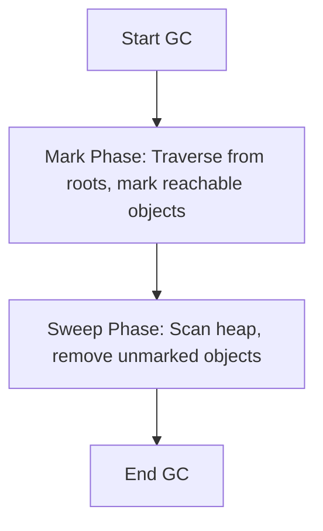
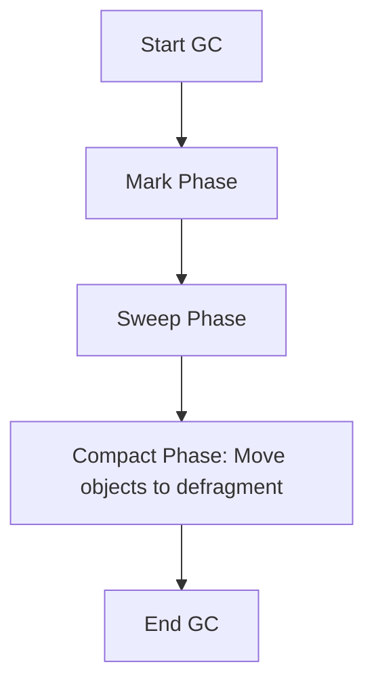
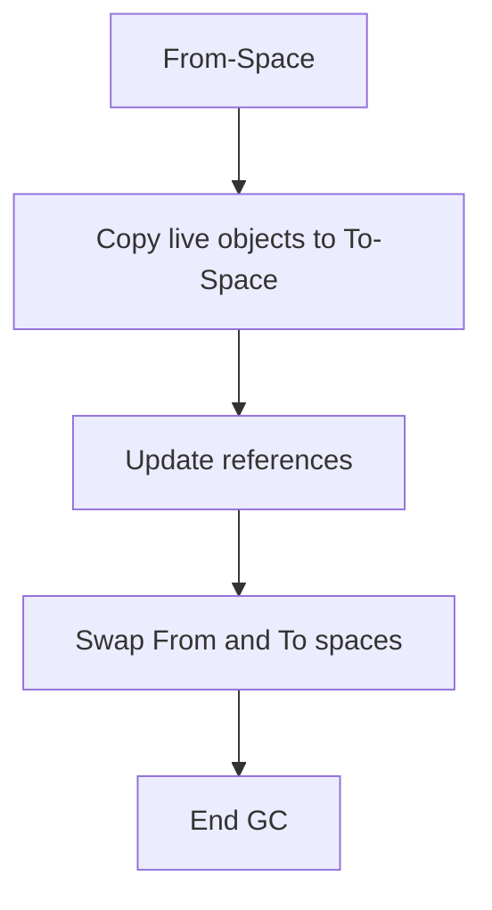

# Garbage Collection Algorithms

## Overview

Garbage Collection (GC) is the automatic memory management process in the JVM that identifies and removes unused objects to free up memory. Understanding GC algorithms is essential for optimizing application performance, reducing latency, and preventing memory leaks in Java applications.

## Detailed Explanation

### Why Garbage Collection?

In languages like Java, developers don't manually allocate/deallocate memory. The JVM's garbage collector automatically manages memory, preventing common issues like memory leaks and dangling pointers.

### Basic GC Concepts

- **Reachability**: An object is reachable if there's a path from GC roots (static variables, local variables, etc.)
- **Garbage**: Objects that are no longer reachable
- **GC Roots**: Starting points for reachability analysis (stack variables, static references, JNI references)

### Common GC Algorithms

#### 1. Mark-Sweep

- **Mark Phase**: Traverse from GC roots, mark reachable objects
- **Sweep Phase**: Remove unmarked objects, reclaim memory
- **Pros**: Simple, no object movement
- **Cons**: Fragmentation, potential for long pauses



#### 2. Mark-Sweep-Compact

- Adds a compact phase to defragment memory
- Moves surviving objects to create contiguous free space
- Reduces fragmentation but increases pause time



#### 3. Copying Collectors

- Divides heap into two equal spaces (from-space and to-space)
- Copies live objects from from-space to to-space
- Swaps spaces after collection
- **Pros**: Fast allocation, no fragmentation
- **Cons**: Uses only half the heap, copying overhead



#### 4. Generational GC

- Based on "weak generational hypothesis": most objects die young
- Divides heap into generations: Young (Eden, Survivor spaces), Old
- Different algorithms for different generations

### Comparison of GC Algorithms

| Algorithm          | Pros                          | Cons                          | Best For                  |
|--------------------|-------------------------------|-------------------------------|---------------------------|
| Mark-Sweep         | Simple, no object movement   | Fragmentation, long pauses   | Simple applications      |
| Mark-Sweep-Compact | Reduces fragmentation        | Higher pause times           | Memory-intensive apps    |
| Copying            | Fast allocation, no frag     | Uses half heap, copying cost | Young generation GC      |
| Generational       | Efficient for most apps      | Complex tuning               | General-purpose Java apps|

### Modern GC Implementations

#### CMS (Concurrent Mark Sweep)

- Concurrent marking to reduce pause times
- Used in older JVM versions

#### G1 (Garbage First)

- Divides heap into regions
- Prioritizes regions with most garbage
- Predictable pause times

#### ZGC (Z Garbage Collector)

- Designed for low latency
- Handles heaps up to 16TB
- Pause times under 10ms

#### Shenandoah

- Similar to ZGC, focuses on low pause times

## Real-world Examples & Use Cases

- **Web Applications**: Low-latency services need GC with minimal pauses
- **Big Data Processing**: Applications with large heaps require efficient GC
- **Real-time Systems**: Predictable GC behavior is crucial
- **Microservices**: Containerized apps with limited memory need optimized GC

## Code Examples

### GC Monitoring

```java
public class GCMonitoring {
    public static void main(String[] args) {
        Runtime runtime = Runtime.getRuntime();
        
        System.out.println("Initial memory: " + runtime.totalMemory());
        
        // Create objects to trigger GC
        List<byte[]> list = new ArrayList<>();
        for (int i = 0; i < 10000; i++) {
            list.add(new byte[1024]); // 1KB each
        }
        
        System.out.println("Memory after allocation: " + (runtime.totalMemory() - runtime.freeMemory()));
        
        list = null; // Make objects eligible for GC
        System.gc(); // Suggest GC
        
        System.out.println("Memory after GC: " + (runtime.totalMemory() - runtime.freeMemory()));
    }
}
```

### GC Tuning Example

```bash
# JVM flags for GC tuning
java -XX:+UseG1GC \
     -XX:MaxGCPauseMillis=200 \
     -XX:G1HeapRegionSize=16m \
     -XX:InitiatingHeapOccupancyPercent=45 \
     -Xms2g -Xmx4g \
     -XX:+PrintGCDetails \
     -XX:+PrintGCTimeStamps \
     MyApplication
```

### Weak References Example

```java
import java.lang.ref.WeakReference;

public class WeakReferenceDemo {
    public static void main(String[] args) {
        Object strongRef = new Object();
        WeakReference<Object> weakRef = new WeakReference<>(strongRef);
        
        System.out.println("Strong ref: " + strongRef);
        System.out.println("Weak ref: " + weakRef.get());
        
        strongRef = null; // Remove strong reference
        System.gc(); // Suggest GC
        
        System.out.println("After GC - Weak ref: " + weakRef.get()); // May be null
    }
}
```

## References

- [Oracle GC Tuning Guide](https://docs.oracle.com/en/java/javase/21/gctuning/)
- [OpenJDK Garbage Collection](https://openjdk.org/groups/hotspot/docs/gc/)
- [Java GC Basics](https://www.oracle.com/webfolder/technetwork/tutorials/obe/java/gc01/index.html)
- [Baeldung Garbage Collection](https://www.baeldung.com/java-garbage-collection)
- [JVM Anatomy: GC Barriers](https://shipilev.net/jvm/anatomy-quarks/23-gc-barriers/)

## Data Models / Message Formats

### Generational GC Architecture


## Github-README Links & Related Topics

- [GC Tuning](../gc-tuning/README.md)
- [Java Memory Management](../java-memory-management/README.md)
- [JVM Internals and Class Loading](../jvm-internals-and-class-loading/README.md)
- [Memory Models](../memory-models/README.md)
