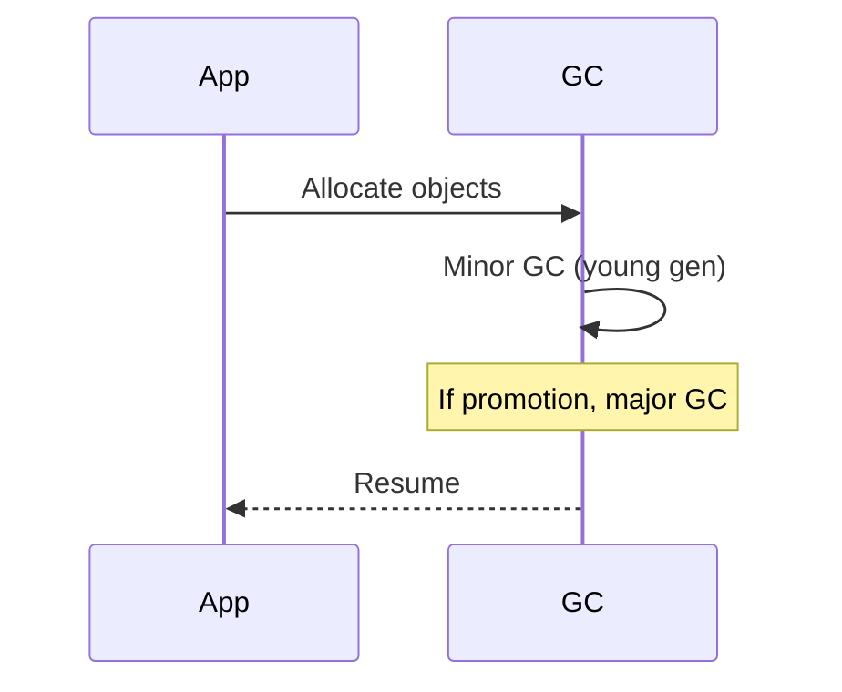

## Overview
GC tuning optimizes Java garbage collection for performance, minimizing pauses and throughput. In low-latency systems, reducing stop-the-world pauses is critical. Common tunables include heap size, GC algorithm selection, and thread counts.

## STAR Summary
**Situation:** High-frequency trading app suffered 200ms GC pauses.  
**Task:** Tune GC to <10ms pauses.  
**Action:** Switched to ZGC, set -Xmx16g -XX:ConcGCThreads=4.  
**Result:** Pauses reduced to <5ms, throughput increased 30%.

## Detailed Explanation
GC algorithms:
- **G1:** Low-pause, generational.
- **ZGC:** Sub-millisecond pauses.
- **Shenandoah:** Concurrent evacuation.

Tuning knobs:
- -Xms/-Xmx: Heap sizes.
- -XX:MaxGCPauseMillis: Target pause.
- -XX:ConcGCThreads: Concurrent threads.

JVM internals: Young/old gen, mark-sweep-compact.

## Real-world Examples & Use Cases
- **Trading systems:** ZGC for <1ms pauses.
- **Web servers:** G1 for balanced throughput.
- **Big data:** CMS for large heaps.

## Code Examples
Example JVM flags:

```bash
java -XX:+UseZGC -Xmx8g -Xms8g -XX:ZCollectionInterval=5 -XX:ZAllocationSpikeTolerance=2 -jar app.jar
```

Monitor GC:

```java
import java.lang.management.*;

ManagementFactory.getGarbageCollectorMXBeans().forEach(gc -> {
    System.out.println(gc.getName() + ": " + gc.getCollectionCount());
});
```

Maven for profiling:

```xml
<dependency>
    <groupId>com.github.ben-manes.caffeine</groupId>
    <artifactId>caffeine</artifactId>
    <version>3.1.6</version>
</dependency>
```

## Data Models / Message Formats
| Region | Purpose |
|--------|---------|
| Eden | New objects |
| Survivor | Survived young GC |
| Old | Long-lived objects |

GC log sample:
```
[gc,start] [gc,heap] [gc,phases] [gc,end]
```

## Journey / Sequence


## Common Pitfalls & Edge Cases
- **Heap too small:** Frequent GC.
- **Too many threads:** CPU contention.
- **Edge case:** No GC needed; tune for steady state.

## Tools & Libraries
- **VisualVM:** GC monitoring.
- **GCViewer:** Log analysis.
- **JMC:** JDK Mission Control.

## Github-README Links & Related Topics
[[garbage-collection-algorithms]], [[performance-tuning-and-profiling]], [[jvm-internals-and-classloading]], [[low-latency-systems]]

## References
- https://docs.oracle.com/en/java/javase/17/gctuning/
- https://openjdk.java.net/projects/zgc/