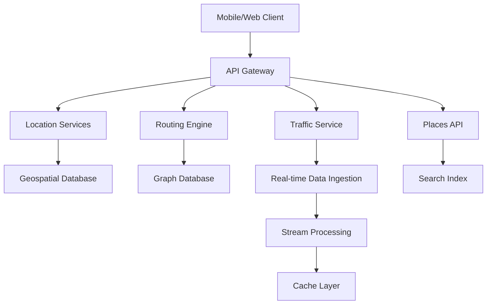

# Google Maps System Design

## Overview

Google Maps provides mapping, navigation, real-time traffic, and location-based services to billions of users. This system design covers geospatial data storage, routing algorithms, and real-time updates for a global mapping platform.

## Detailed Explanation

### Architecture



### Components

| Component | Description | Technology |
|-----------|-------------|------------|
| Client Apps | Maps interface, navigation UI | Android/iOS SDKs, JavaScript |
| API Gateway | Request routing, authentication | Google Cloud Endpoints |
| Location Services | GPS tracking, geofencing | Fused Location Provider |
| Geospatial Database | Map tiles, POIs | Bigtable, Spanner |
| Routing Engine | Shortest path algorithms | Custom graph algorithms |
| Graph Database | Road networks | Neo4j, custom |
| Traffic Service | Real-time congestion data | Kafka, Flink |
| Real-time Ingestion | Sensor data from devices | Pub/Sub |
| Stream Processing | Aggregate traffic data | Apache Beam |
| Cache | Tile caching, route caching | Redis, CDN |
| Places API | Search autocomplete, details | Elasticsearch |

### Data Models

#### Map Tile
```json
{
  "tileId": "12/1234/5678",
  "zoom": 12,
  "data": "base64-encoded-image",
  "version": "2023-09-25",
  "features": [
    {
      "type": "road",
      "geometry": {"type": "LineString", "coordinates": [[-122.4, 37.7], [-122.5, 37.8]]},
      "properties": {"name": "Highway 101", "speedLimit": 65}
    }
  ]
}
```

#### Route Request/Response
```json
{
  "origin": {"lat": 37.7749, "lng": -122.4194},
  "destination": {"lat": 34.0522, "lng": -118.2437},
  "mode": "driving",
  "waypoints": [],
  "response": {
    "routes": [
      {
        "legs": [{"distance": {"text": "383 mi", "value": 616000}, "duration": {"text": "5 hours 45 mins"}}],
        "polyline": "encoded-polyline-string"
      }
    ]
  }
}
```

## Real-world Examples & Use Cases

- **Navigation**: Turn-by-turn directions with voice guidance.
- **Traffic Updates**: Real-time congestion and incident reports.
- **Local Search**: Find restaurants, gas stations nearby.
- **Ride Sharing**: Integration with Uber/Lyft for ETAs.
- **Delivery Tracking**: Real-time package location.

## Code Examples

### Routing Algorithm (Simplified Dijkstra)

```python
import heapq

def shortest_path(graph, start, end):
    queue = [(0, start, [])]
    seen = set()
    while queue:
        (cost, node, path) = heapq.heappop(queue)
        if node in seen:
            continue
        path = path + [node]
        seen.add(node)
        if node == end:
            return cost, path
        for neighbor, edge_cost in graph.get(node, []):
            heapq.heappush(queue, (cost + edge_cost, neighbor, path))
    return float('inf'), []

# Usage
graph = {'A': [('B', 1), ('C', 4)], 'B': [('C', 2), ('D', 5)], 'C': [('D', 1)]}
cost, path = shortest_path(graph, 'A', 'D')
print(f"Cost: {cost}, Path: {path}")
```

### Geospatial Query (PostGIS)

```sql
-- Find points within radius
SELECT name, ST_AsText(location)
FROM places
WHERE ST_DWithin(location, ST_MakePoint(-122.4194, 37.7749)::geography, 1000);

-- Nearest neighbor
SELECT name, ST_Distance(location, ST_MakePoint(-122.4194, 37.7749)::geography) as distance
FROM places
ORDER BY location <-> ST_MakePoint(-122.4194, 37.7749)::geography
LIMIT 5;
```

## Journey / Sequence

1. **Data Collection**: Satellites, street view cars gather map data.
2. **Processing**: Convert to vector tiles, build routing graphs.
3. **Storage**: Distribute across global data centers.
4. **Serving**: Client requests tiles/routes via APIs.
5. **Updates**: Real-time traffic, new roads integrated.

## Common Pitfalls & Edge Cases

- **Geospatial Accuracy**: Handle coordinate precision, datum differences.
- **Real-time Updates**: Delay in traffic data propagation.
- **Scalability**: Billions of requests, cache misses.
- **Privacy**: Location data anonymization.
- **International Coverage**: Varying data quality by region.

## Tools & Libraries

- **PostGIS**: Geospatial extensions for PostgreSQL.
- **Mapbox GL JS**: Rendering library.
- **OSRM**: Open-source routing machine.
- **Apache Spark**: Large-scale data processing.

## References

- [Google Maps Platform](https://developers.google.com/maps)
- [Geospatial Data Structures](https://en.wikipedia.org/wiki/Spatial_database)
- [Routing Algorithms](https://en.wikipedia.org/wiki/Shortest_path_problem)

## Github-README Links & Related Topics

- [Geospatial Databases](system-design/geospatial-databases/README.md)
- [Graph Algorithms](algorithms/graph-algorithms/README.md)
- [Real-time Data Processing](system-design/real-time-data-processing/README.md)
- [Caching Strategies](system-design/caching-strategies/README.md)
- [API Design](system-design/api-design-rest-grpc-openapi/README.md)