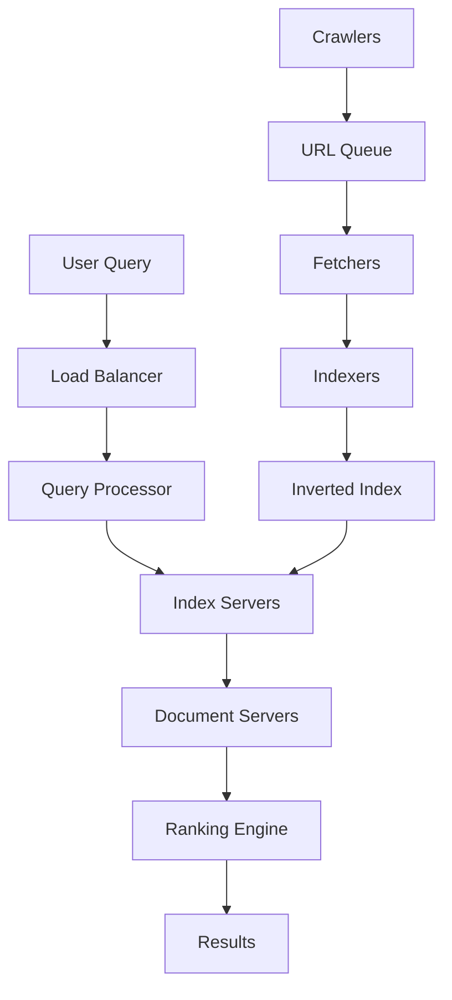

## Overview

Google Search is a distributed search engine that indexes billions of web pages and serves trillions of queries annually. It leverages the structure of the web (hyperlinks) to rank results using algorithms like PageRank, ensuring relevant and high-quality responses. The system handles massive scale, low latency, and high availability through distributed components including crawlers, indexers, and query processors.

## Detailed Explanation

Google Search operates on a distributed architecture designed for scalability and fault tolerance. Key components include:

- **Crawling**: Automated bots (spiders) traverse the web, following links to discover and fetch pages. Google uses a large fleet of crawlers to handle billions of URLs, respecting robots.txt and avoiding overload.

- **Indexing**: Fetched pages are processed to extract text, metadata, and links. Content is stored in inverted indexes, mapping terms to documents. This enables fast lookups during queries.

- **Ranking**: Results are ranked using PageRank (a link-based algorithm) combined with relevance signals like content quality, freshness, and user context. PageRank models web pages as nodes in a graph, where incoming links indicate importance.

- **Serving**: Queries are routed to data centers, where indexes are searched in parallel. Results are aggregated, ranked, and returned with snippets.

Challenges include handling web scale (petabytes of data), real-time updates, spam detection, and privacy. The system uses distributed storage (e.g., Bigtable-like systems), load balancing, and caching for performance.

### Architecture Diagram



### PageRank Algorithm

PageRank computes a score for each page based on link structure. The formula is:

\[ PR(A) = (1 - d) + d \sum_{i=1}^{n} \frac{PR(T_i)}{C(T_i)} \]

Where:
- \( PR(A) \): PageRank of page A
- \( d \): Damping factor (typically 0.85)
- \( T_i \): Pages linking to A
- \( C(T_i) \): Number of outgoing links from \( T_i \)

## Real-world Examples & Use Cases

- **Web Search**: Users query "best restaurants in Paris" to find relevant pages ranked by relevance and authority.
- **Image/Video Search**: Integrated with text queries for multimedia results.
- **Local Search**: Combines location data for nearby results.
- **News and Real-time Updates**: Prioritizes fresh content for trending topics.
- **Enterprise Use**: Powers internal search for large organizations.

Use cases include e-commerce (product searches), research (academic papers), and AI integration (generative responses).

## Code Examples

### Simple PageRank Pseudocode

```python
def pagerank(graph, damping=0.85, iterations=100):
    n = len(graph)
    pr = {node: 1/n for node in graph}
    for _ in range(iterations):
        new_pr = {}
        for node in graph:
            rank_sum = sum(pr[link] / len(graph[link]) for link in graph if node in graph[link])
            new_pr[node] = (1 - damping) + damping * rank_sum
        pr = new_pr
    return pr

# Example graph: {page: [outgoing_links]}
graph = {'A': ['B', 'C'], 'B': ['C'], 'C': ['A']}
print(pagerank(graph))
```

### Basic Inverted Index

```python
from collections import defaultdict

class InvertedIndex:
    def __init__(self):
        self.index = defaultdict(list)
    
    def add_document(self, doc_id, text):
        for word in text.lower().split():
            self.index[word].append(doc_id)
    
    def search(self, query):
        return self.index.get(query.lower(), [])

index = InvertedIndex()
index.add_document(1, "Google search engine")
index.add_document(2, "Search algorithms")
print(index.search("search"))  # [1, 2]
```

## References

- [The Anatomy of a Large-Scale Hypertextual Web Search Engine](https://research.google/pubs/the-anatomy-of-a-large-scale-hypertextual-web-search-engine/) - Original paper by Brin and Page.
- [How Search Works](https://www.google.com/search/howsearchworks/) - Google's official explanation.
- [The Architecture of Google's Web Search](https://highscalability.com/blog/2013/7/8/the-architecture-of-googles-web-search.html) - High Scalability blog post.
- [PageRank Paper](https://static.googleusercontent.com/media/research.google.com/en//pubs/archive/334.pdf) - Detailed PageRank algorithm.

## Github-README Links & Related Topics

- [Distributed Systems](../distributed-systems/README.md)
- [CAP Theorem](../cap-theorem-and-distributed-systems/README.md)
- [Load Balancing](../load-balancing-and-strategies/README.md)
- [Caching](../caching/README.md)
- [Data Structures](../collections-and-data-structures/README.md)

## STAR Summary

**Situation**: In 1998, web search was inefficient with poor relevance due to keyword matching.  
**Task**: Build a scalable search engine handling millions of pages with better ranking.  
**Action**: Developed PageRank, crawled the web, and built distributed infrastructure.  
**Result**: Google became the dominant search engine, processing billions of queries daily.

## Journey / Sequence

1. **Query Submission**: User enters query; routed to front-end servers.
2. **Preprocessing**: Query parsed, normalized, and expanded.
3. **Index Lookup**: Parallel search across index shards.
4. **Ranking**: Apply PageRank and other signals.
5. **Aggregation**: Combine results, apply filters (e.g., spam).
6. **Response**: Return top results with snippets.

## Data Models / Message Formats

- **Inverted Index**: Map terms to document lists with positions/frequencies.
- **PageRank Graph**: Adjacency list of links with weights.
- **Query Logs**: JSON-like structures for analytics.

## Common Pitfalls & Edge Cases

- **Scale Issues**: Handling index updates without downtime.
- **Spam**: Detecting link farms and keyword stuffing.
- **Freshness**: Balancing static indexes with real-time crawling.
- **Privacy**: Anonymizing queries while personalizing results.
- **Edge Case**: Queries with no results; fallback to suggestions.

## Tools & Libraries

- **Custom Tools**: Bigtable for storage, MapReduce for processing.
- **Open-Source Analogs**: Elasticsearch for indexing, Apache Nutch for crawling.
- **Languages**: C++, Java for core systems.