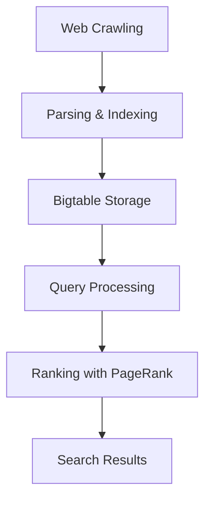

# Google Search Engine

## Overview

Google Search is a distributed web search engine that employs advanced indexing and ranking algorithms to retrieve and order search results from the vast World Wide Web. At its core, it uses a distributed architecture to crawl, index, and rank billions of web pages efficiently. The system leverages technologies like Bigtable for storage, MapReduce for processing, and the PageRank algorithm for ranking, ensuring scalability and relevance. This design handles massive data volumes, with indexing covering hundreds of terabytes and serving billions of queries daily.

## Detailed Explanation

### Distributed Indexing

Google's indexing process involves crawling the web using Googlebot, a distributed crawler that fetches pages across millions of machines. Pages are parsed, and their content is stored in a distributed database like Bigtable, which provides fault-tolerant, scalable storage. The index is partitioned across servers, allowing parallel processing.

Key components:
- **Crawling**: Googlebot starts from seed URLs and follows links, respecting robots.txt and crawl delays. It's distributed to avoid bottlenecks.
- **Parsing and Storage**: HTML is parsed for text, links, and metadata. Inverted indexes map terms to documents, stored in Bigtable for quick access.
- **Updates**: Continuous crawling updates the index, with Caffeine architecture moving from MapReduce to Bigtable for fresher results.

### Distributed Ranking Algorithms

Ranking combines multiple signals, with PageRank as the foundational algorithm. PageRank models web surfing as a random walk, assigning higher ranks to pages linked by important pages.

#### PageRank Algorithm

PageRank computes a probability distribution over web pages, representing the likelihood of a random surfer visiting each page. It's defined recursively:

\[ PR(u) = \sum_{v \in B_u} \frac{PR(v)}{L(v)} \]

Where:
- \( PR(u) \) is the PageRank of page u
- \( B_u \) is the set of pages linking to u
- \( L(v) \) is the number of outbound links from v

To handle sinks and ensure convergence, a damping factor d (typically 0.85) is added:

\[ PR(u) = \frac{1 - d}{N} + d \sum_{v \in B_u} \frac{PR(v)}{L(v)} \]

This is solved iteratively or using power iteration on the transition matrix.

#### Distributed Computation

PageRank is computed distributedly using MapReduce:
- **Map Phase**: For each page, emit (target, PR / outlinks) for each outlink.
- **Reduce Phase**: Sum contributions for each page, apply damping, and iterate until convergence.

Google's infrastructure scales this to billions of pages, converging in ~50 iterations for large graphs.

#### Other Ranking Signals

Beyond PageRank, Google uses BERT for semantic understanding, freshness signals, and user behavior data, all processed in a distributed manner.

### Architecture Diagram



## Real-world Examples & Use Cases

- **Web Search**: Powers Google's primary search, handling 3.5 billion queries/day in 2012, now vastly more.
- **Mobile Search**: Optimized for mobile with separate indexes, favoring mobile-friendly sites.
- **Shopping Search**: Integrates product data, though facing EU antitrust scrutiny.
- **AI Overviews**: Uses Gemini for generative summaries, rolled out in 2024.
- **Applications**: Influences SEO, academic rankings (e.g., Eigenfactor), and social network analysis.

## Code Examples

### PageRank Pseudocode (Python)

```python
import numpy as np

def pagerank(adj_matrix, d=0.85, max_iter=100, tol=1e-6):
    N = len(adj_matrix)
    pr = np.ones(N) / N
    for _ in range(max_iter):
        new_pr = np.zeros(N)
        for i in range(N):
            incoming = [pr[j] / sum(adj_matrix[j]) for j in range(N) if adj_matrix[j][i]]
            new_pr[i] = (1 - d) / N + d * sum(incoming)
        if np.linalg.norm(new_pr - pr) < tol:
            break
        pr = new_pr
    return pr

# Example: 4-page graph
adj = np.array([
    [0, 1, 1, 0],
    [1, 0, 0, 1],
    [1, 0, 0, 1],
    [0, 1, 1, 0]
])
print(pagerank(adj))
```

### Simple Distributed Indexing Sketch (MapReduce-style)

```python
# Map: Parse page, emit (term, doc_id)
def map(page_id, content):
    terms = tokenize(content)
    for term in terms:
        emit(term, page_id)

# Reduce: Collect doc_ids for each term
def reduce(term, doc_ids):
    emit(term, list(set(doc_ids)))
```

## Common Pitfalls & Edge Cases

- **Link Farms**: Artificial links inflate PageRank; Google penalizes via Penguin updates.
- **Sink Pages**: Pages with no outlinks; handled by redistributing rank.
- **Scale Issues**: Early systems couldn't handle web growth; solved with distributed storage.
- **Manipulation**: SEO tactics like paid links; mitigated by nofollow and algorithmic updates.

## Tools & Libraries

- **Bigtable**: Google's distributed storage.
- **MapReduce**: For parallel processing.
- **TensorFlow**: For ML-based ranking.
- **Open-source**: Libraries like NetworkX for graph algorithms.

## References

- [Wikipedia: Google Search](https://en.wikipedia.org/wiki/Google_Search)
- [Wikipedia: PageRank](https://en.wikipedia.org/wiki/PageRank)
- [Google Developers: Crawling and Indexing](https://developers.google.com/search/docs/crawling-indexing/overview)
- [Brin & Page: The Anatomy of a Large-Scale Hypertextual Web Search Engine](https://research.google/pubs/pub334/)

## Github-README Links & Related Topics

- [System Design Basics](../system-design/system-design-basics/README.md)
- [Distributed Systems](../system-design/distributed-systems/README.md)
- [Search Algorithms](../algorithms/search-algorithms/README.md)
- [Graph Algorithms](../algorithms/graph-algorithms/README.md)