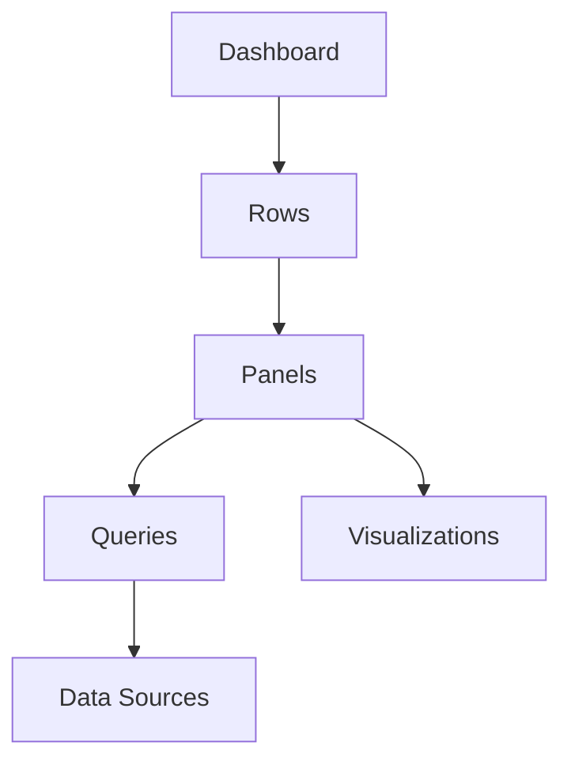

# Overview

Grafana dashboards allow you to query, transform, visualize, and understand your data no matter where it's stored. A Grafana dashboard is a set of one or more panels, organized and arranged into one or more rows, that provide an at-a-glance view of related information. These panels are created using components that query and transform raw data from a data source into visualizations.

# Detailed Explanation

A data source can be an SQL database, Grafana Loki, Grafana Mimir, or an API endpoint. Data source plugins take a query you want answered, retrieve the data from the data source, and reconcile the differences between the data model of the data source and the data model of Grafana dashboards.

Queries allow you to reduce the entirety of your data to a specific dataset, providing a more manageable visualization. Since data sources have their own distinct query languages, Grafana dashboards provide you with a query editor to accommodate these differences.

A panel is the container that displays the visualization and provides you with various controls to manipulate it. Panel options let you customize many aspects of a visualization and the options differ based on which visualization you select. When the data format in a visualization doesn't meet your requirements, you can apply a transformation that manipulates the data returned by a query.

With 150+ data source plugins, you can unify all your data sources into a single dashboard to streamline data monitoring and troubleshooting. With Grafana, you can translate, transform, and visualize data in flexible and versatile dashboards.

## Dashboard Structure



# Real-world Examples & Use Cases

- **Infrastructure Monitoring**: Visualize server metrics, CPU usage, memory, and network traffic from Prometheus or other sources.
- **Application Performance**: Track response times, error rates, and throughput for web applications.
- **Business Intelligence**: Create reports on sales data, user engagement, and KPIs.
- **IoT Data Visualization**: Monitor sensor data from connected devices.
- **Log Analysis**: Display log events and patterns using Loki or Elasticsearch.

# Code Examples

## Simple Dashboard JSON

```json
{
  "dashboard": {
    "title": "System Monitoring",
    "tags": ["monitoring"],
    "panels": [
      {
        "title": "CPU Usage",
        "type": "graph",
        "targets": [
          {
            "expr": "100 - (avg by(instance) (irate(node_cpu_seconds_total{mode=\"idle\"}[5m])) * 100)",
            "datasource": "prometheus"
          }
        ]
      }
    ]
  }
}
```

## Panel Configuration

```json
{
  "type": "stat",
  "title": "Total Requests",
  "targets": [
    {
      "query": "SELECT count(*) FROM requests",
      "datasource": "postgresql"
    }
  ]
}
```

# References

- [Grafana Dashboards Documentation](https://grafana.com/docs/grafana/latest/dashboards/)
- [Building Dashboards](https://grafana.com/docs/grafana/latest/dashboards/build-dashboards/)
- [Dashboard Best Practices](https://grafana.com/docs/grafana/latest/dashboards/build-dashboards/best-practices/)

# Github-README Links & Related Topics

- [Grafana GitHub](https://github.com/grafana/grafana)
- [Prometheus](prometheus/)
- [Loki](loki/)
- [Tempo](tempo/)