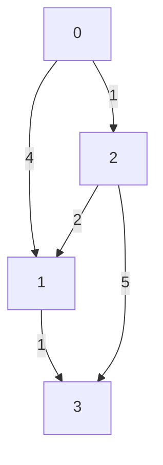

## Overview

Graph algorithms are essential computational techniques for analyzing and solving problems on graph structures, consisting of vertices (nodes) and edges. They enable efficient traversal, pathfinding, connectivity analysis, and optimization in networks. Widely used in computer science for applications like routing, social network analysis, and dependency resolution.

## Detailed Explanation

Graphs model relationships between entities, with vertices representing objects and edges denoting connections. Algorithms operate on various graph types: directed/undirected, weighted/unweighted, and cyclic/acyclic.

## Graph Representations

- **Adjacency List**: List of lists where each vertex has a list of adjacent vertices. Space: O(V + E), efficient for sparse graphs.
- **Adjacency Matrix**: 2D array where matrix[i][j] indicates edge presence/weight. Space: O(V²), suitable for dense graphs.

## Key Algorithms

| Algorithm | Time Complexity | Description | Use Case |
|-----------|-----------------|-------------|----------|
| BFS | O(V + E) | Explores level by level | Shortest path in unweighted graphs |
| DFS | O(V + E) | Explores depth-first | Topological sort, cycle detection |
| Dijkstra | O((V + E) log V) | Shortest path with non-negative weights | GPS routing |
| Bellman-Ford | O(V * E) | Shortest path with negative weights | Networks with potential losses |
| Floyd-Warshall | O(V³) | All-pairs shortest paths | Small graph distance matrices |
| Kruskal | O(E log E) | Minimum spanning tree | Network design |
| Prim | O((V + E) log V) | Minimum spanning tree | Clustering |
| Topological Sort | O(V + E) | Ordering in DAGs | Task scheduling |

### Example Graph Diagram



This undirected weighted graph can be used to demonstrate shortest path algorithms like Dijkstra.

## Real-world Examples & Use Cases

- **Social Networks**: Facebook's friend suggestions use BFS for degrees of separation; LinkedIn's connection paths.
- **Navigation Systems**: Google Maps employs Dijkstra or A* for route optimization with traffic weights.
- **Web Search Engines**: PageRank algorithm (based on graph centrality) ranks web pages.
- **Recommendation Engines**: Netflix uses graph-based collaborative filtering to suggest content.
- **Network Routing**: OSPF and BGP protocols implement shortest path algorithms for internet traffic.
- **Supply Chain**: Optimizing logistics with minimum spanning trees for cost-effective connections.
- **Biology**: Protein interaction networks analyzed with graph traversal for drug discovery.

## Code Examples

## BFS in Java

```java
import java.util.*;

public class BFS {
    public static void bfs(int start, List<List<Integer>> graph) {
        boolean[] visited = new boolean[graph.size()];
        Queue<Integer> queue = new LinkedList<>();
        queue.add(start);
        visited[start] = true;
        while (!queue.isEmpty()) {
            int node = queue.poll();
            System.out.print(node + " ");
            for (int neighbor : graph.get(node)) {
                if (!visited[neighbor]) {
                    visited[neighbor] = true;
                    queue.add(neighbor);
                }
            }
        }
    }

    public static void main(String[] args) {
        List<List<Integer>> graph = Arrays.asList(
            Arrays.asList(1, 2),
            Arrays.asList(0, 3),
            Arrays.asList(0, 3),
            Arrays.asList(1, 2)
        );
        bfs(0, graph);
    }
}
```

## BFS in Python

```python
from collections import deque

def bfs(graph, start):
    visited = set()
    queue = deque([start])
    visited.add(start)
    while queue:
        node = queue.popleft()
        print(node, end=' ')
        for neighbor in graph[node]:
            if neighbor not in visited:
                visited.add(neighbor)
                queue.append(neighbor)

graph = {
    0: [1, 2],
    1: [0, 3],
    2: [0, 3],
    3: [1, 2]
}
bfs(graph, 0)
```

## DFS in Java

```java
import java.util.*;

public class DFS {
    public static void dfs(int node, List<List<Integer>> graph, boolean[] visited) {
        visited[node] = true;
        System.out.print(node + " ");
        for (int neighbor : graph.get(node)) {
            if (!visited[neighbor]) {
                dfs(neighbor, graph, visited);
            }
        }
    }

    public static void main(String[] args) {
        List<List<Integer>> graph = Arrays.asList(
            Arrays.asList(1, 2),
            Arrays.asList(0, 3),
            Arrays.asList(0, 3),
            Arrays.asList(1, 2)
        );
        boolean[] visited = new boolean[graph.size()];
        dfs(0, graph, visited);
    }
}
```

## DFS in Python

```python
def dfs(graph, node, visited):
    visited.add(node)
    print(node, end=' ')
    for neighbor in graph[node]:
        if neighbor not in visited:
            dfs(graph, neighbor, visited)

graph = {
    0: [1, 2],
    1: [0, 3],
    2: [0, 3],
    3: [1, 2]
}
visited = set()
dfs(graph, 0, visited)
```

## Dijkstra's Algorithm in Java

```java
import java.util.*;

public class Dijkstra {
    public static int[] dijkstra(int start, List<List<int[]>> graph) {
        int n = graph.size();
        int[] dist = new int[n];
        Arrays.fill(dist, Integer.MAX_VALUE);
        dist[start] = 0;
        PriorityQueue<int[]> pq = new PriorityQueue<>(Comparator.comparingInt(a -> a[1]));
        pq.add(new int[]{start, 0});
        while (!pq.isEmpty()) {
            int[] curr = pq.poll();
            int node = curr[0], cost = curr[1];
            if (cost > dist[node]) continue;
            for (int[] neighbor : graph.get(node)) {
                int next = neighbor[0], weight = neighbor[1];
                if (dist[node] + weight < dist[next]) {
                    dist[next] = dist[node] + weight;
                    pq.add(new int[]{next, dist[next]});
                }
            }
        }
        return dist;
    }

    public static void main(String[] args) {
        List<List<int[]>> graph = Arrays.asList(
            Arrays.asList(new int[]{1, 4}, new int[]{2, 1}),
            Arrays.asList(new int[]{3, 1}),
            Arrays.asList(new int[]{1, 2}, new int[]{3, 5}),
            Arrays.asList()
        );
        int[] dist = dijkstra(0, graph);
        System.out.println(Arrays.toString(dist));
    }
}
```

## Dijkstra's Algorithm in Python

```python
import heapq

def dijkstra(graph, start):
    n = len(graph)
    dist = [float('inf')] * n
    dist[start] = 0
    pq = [(0, start)]
    while pq:
        cost, node = heapq.heappop(pq)
        if cost > dist[node]:
            continue
        for neighbor, weight in graph[node]:
            if dist[node] + weight < dist[neighbor]:
                dist[neighbor] = dist[node] + weight
                heapq.heappush(pq, (dist[neighbor], neighbor))
    return dist

graph = [
    [(1, 4), (2, 1)],
    [(3, 1)],
    [(1, 2), (3, 5)],
    []
]
print(dijkstra(graph, 0))
```

## References

- [Graph Algorithms - Wikipedia](https://en.wikipedia.org/wiki/Graph_algorithm)
- [Graph Data Structure and Algorithms - GeeksforGeeks](https://www.geeksforgeeks.org/graph-data-structure-and-algorithms/)
- [Introduction to Algorithms - Cormen et al.](https://mitpress.mit.edu/9780262033848/introduction-to-algorithms/)
- [Algorithms on Graphs - Stanford CS161](https://cs161.stanford.edu/)
- [Graph Theory - Khan Academy](https://www.khanacademy.org/computing/computer-science/algorithms/graph-representation/a/representing-graphs)

## Github-README Links & Related Topics

- [Algorithms](../algorithms/)
- [Data Structures](../collections-and-data-structures/)
- [Dynamic Programming](../dynamic-programming/)
- [Divide and Conquer](../divide-and-conquer/)
- [Backtracking](../backtracking/)
- [Graph Databases](../graph-databases/)