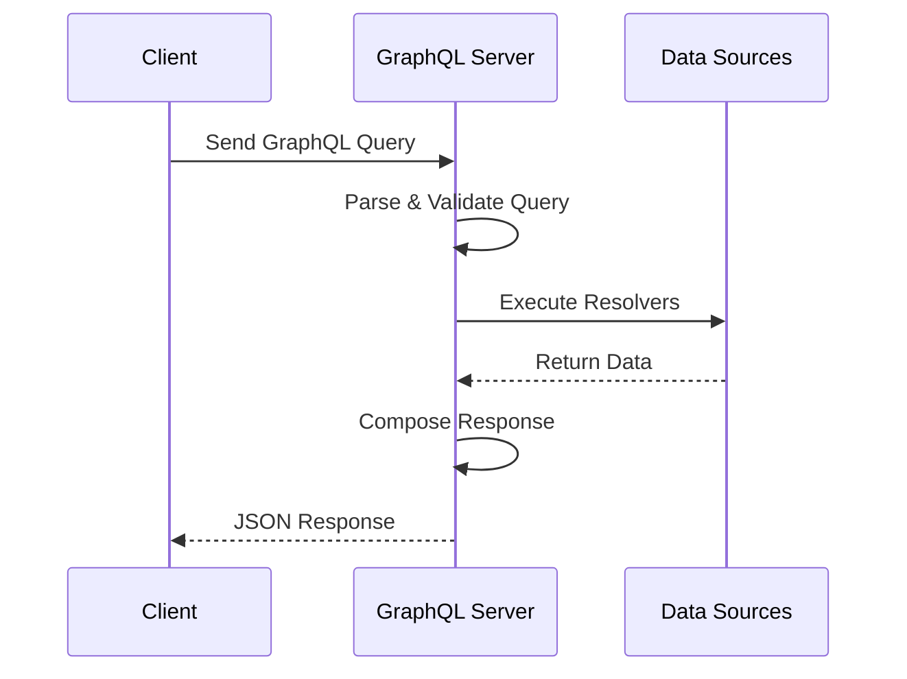

# GraphQL API Design

## Overview

GraphQL is a query language and runtime for APIs that allows clients to request exactly the data they need, making APIs more efficient and flexible compared to REST. It provides a single endpoint for data fetching and manipulation, with a strongly typed schema.

## Detailed Explanation

- **Schema**: Defines the types, queries, mutations, and subscriptions available.
- **Queries**: Read operations to fetch data.
- **Mutations**: Write operations to modify data.
- **Resolvers**: Functions that handle fetching data for each field.
- **Introspection**: Allows clients to query the schema itself.
- **Benefits**: Reduces over-fetching/under-fetching, single round trips, strong typing.
- **Challenges**: Complexity in schema design, N+1 query problem, caching.

## Journey / Sequence



## Data Models / Message Formats

### GraphQL Schema Example
```graphql
type User {
  id: ID!
  name: String!
  email: String!
  posts: [Post!]!
}

type Post {
  id: ID!
  title: String!
  content: String!
  author: User!
}

type Query {
  users: [User!]!
  user(id: ID!): User
}

type Mutation {
  createUser(name: String!, email: String!): User!
}
```

### Query Example
```graphql
query GetUser {
  user(id: "123") {
    name
    posts {
      title
    }
  }
}
```

## Real-world Examples & Use Cases

- **Social Media Apps**: Fetch user profiles with posts, comments, and likes in one query.
- **E-commerce**: Product details with variants, reviews, and recommendations.
- **Content Management Systems**: Flexible content fetching for different page layouts.
- **Mobile Apps**: Reduce bandwidth by requesting only needed data.

## Code Examples

### GraphQL Schema and Resolvers in Java (using graphql-java)

```java
import graphql.GraphQL;
import graphql.schema.GraphQLSchema;
import graphql.schema.GraphQLObjectType;
import graphql.schema.GraphQLList;
import graphql.schema.GraphQLNonNull;
import graphql.schema.GraphQLTypeReference;
import static graphql.Scalars.GraphQLString;
import static graphql.Scalars.GraphQLID;

// Define types
GraphQLObjectType userType = GraphQLObjectType.newObject()
    .name("User")
    .field(GraphQLFieldDefinition.newFieldDefinition()
        .name("id")
        .type(GraphQLNonNull(GraphQLID)))
    .field(GraphQLFieldDefinition.newFieldDefinition()
        .name("name")
        .type(GraphQLNonNull(GraphQLString)))
    .build();

// Define query
GraphQLObjectType queryType = GraphQLObjectType.newObject()
    .name("Query")
    .field(GraphQLFieldDefinition.newFieldDefinition()
        .name("users")
        .type(GraphQLList(userType))
        .dataFetcher(env -> getUsers())) // Resolver
    .build();

GraphQLSchema schema = GraphQLSchema.newSchema()
    .query(queryType)
    .build();

GraphQL graphQL = GraphQL.newGraphQL(schema).build();

// Execute query
String query = "{ users { id name } }";
ExecutionResult result = graphQL.execute(query);
```

### Resolver Implementation

```java
public List<User> getUsers() {
    // Fetch from database
    return userRepository.findAll();
}

public User getUser(String id) {
    return userRepository.findById(id).orElse(null);
}
```

## Common Pitfalls & Edge Cases

- **N+1 Query Problem**: Resolvers making multiple DB calls; use DataLoader.
- **Circular Dependencies**: Avoid infinite loops in schema.
- **Authorization**: Secure resolvers at field level.
- **Versioning**: GraphQL doesn't have versions; evolve schema carefully.
- **Performance**: Complex queries; implement query complexity limits.

## Tools & Libraries

- **GraphQL Java**: Library for building GraphQL servers in Java.
- **Apollo Server**: For Node.js, but concepts apply.
- **GraphiQL**: IDE for testing GraphQL queries.
- **DataLoader**: Batch and cache requests to avoid N+1.

## References

- [GraphQL Official Documentation](https://graphql.org/)
- [GraphQL Schema Design Best Practices](https://www.apollographql.com/docs/)
- [GraphQL vs REST](https://www.howtographql.com/basics/1-graphql-is-the-better-rest/)

## Github-README Links & Related Topics

- [API Design Principles](../api-design-principles/README.md)
- [API Gateway Design](../api-gateway-design/README.md)
- [Microservices Communication Patterns](../microservices-communication-patterns/README.md)