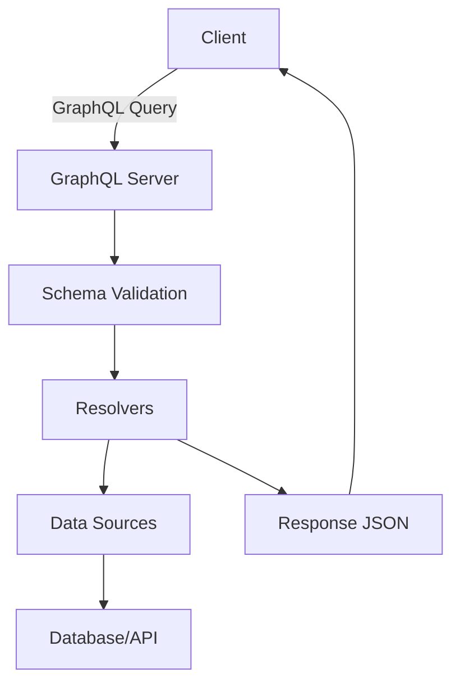

# Overview

GraphQL is a query language for your API, and a server-side runtime for executing queries using a type system you define for your data. It isn't tied to any specific database or storage engine and is backed by your existing code and data.

# Detailed Explanation

- **Type System**: Describe your API with a schema defining types and their fields.
- **Exact Queries**: Clients query exactly what they need, avoiding over-fetching or under-fetching.
- **API Evolution**: Evolve your API without versioning by adding fields and marking old ones as deprecated.
- **Single Endpoint**: Typically served over HTTP at a single endpoint.
- **Introspection**: Clients can query the schema itself.

Example Schema:

```graphql
type Query {
  me: User
  users(limit: Int): [User]
}

type User {
  id: ID!
  name: String
  email: String
  friends: [User]
}
```

## Architecture Diagram



# Real-world Examples & Use Cases

- Social media platforms like Facebook, where clients need flexible data fetching.
- Mobile applications requiring efficient data loading.
- APIs serving multiple clients with varying data needs.
- Replacing multiple REST endpoints with a single GraphQL endpoint.

# Code Examples

## GraphQL Schema Definition

```graphql
type Query {
  user(id: ID!): User
}

type Mutation {
  createUser(input: CreateUserInput!): User
}

type User {
  id: ID!
  name: String!
  email: String!
}

input CreateUserInput {
  name: String!
  email: String!
}
```

## Resolver in Node.js

```javascript
const resolvers = {
  Query: {
    user: async (parent, args, context) => {
      return context.db.findUserById(args.id);
    },
  },
  Mutation: {
    createUser: async (parent, args, context) => {
      return context.db.createUser(args.input);
    },
  },
};
```

## Client Query

```graphql
query GetUser($id: ID!) {
  user(id: $id) {
    name
    email
  }
}
```

# References

- [GraphQL Learn](https://graphql.org/learn/)
- [GraphQL Specification](https://spec.graphql.org/)
- [GraphQL Best Practices](https://graphql.org/learn/best-practices/)

# Journey / Sequence

1. Client constructs a GraphQL query specifying needed data.
2. Query sent to GraphQL server endpoint via HTTP POST.
3. Server parses query and validates against schema.
4. Resolvers execute to fetch data from sources.
5. Response assembled and sent back as JSON.

# Common Pitfalls & Edge Cases

- **N+1 Query Problem**: Inefficient resolvers causing multiple database calls. Mitigate with DataLoader.
- **Schema Complexity**: Overly nested schemas leading to performance issues.
- **Security Risks**: Lack of rate limiting or authorization.
- **Caching Challenges**: Harder to cache than REST due to dynamic queries.
- **Error Handling**: Partial failures in responses.

# Tools & Libraries

- **Servers**: Apollo Server, GraphQL Yoga, Graphene
- **Clients**: Apollo Client, Relay, URQL
- **Tools**: GraphQL Playground, GraphiQL, Prisma

# Github-README Links & Related Topics

- [API Design Principles](api-design-principles/README.md)
- [RESTful APIs](restful-apis/README.md)
- [Microservices Architecture](microservices-architecture/README.md)
- [System Design Basics](system-design-basics/README.md)
- [Event Sourcing and CQRS](event-sourcing-and-cqrs/README.md)