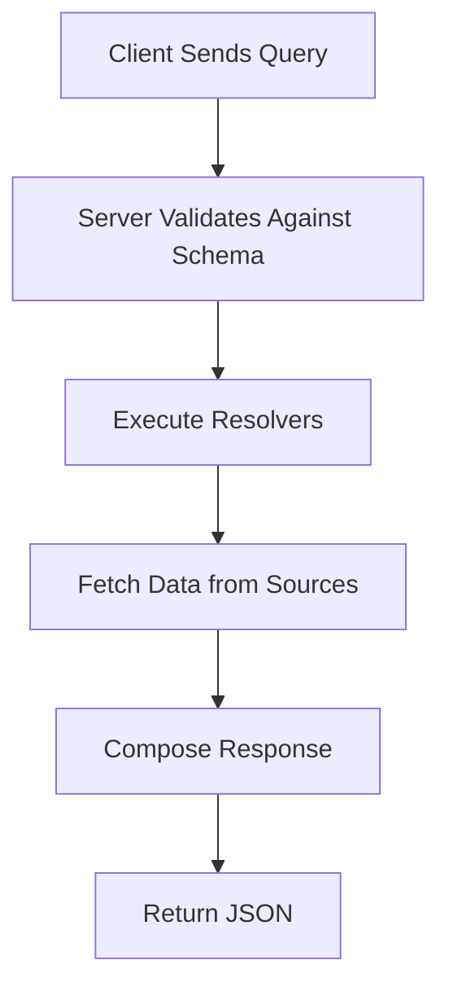

## Overview

GraphQL is a query language for APIs and a server-side runtime for executing queries using a type system you define for your data. Unlike REST APIs, which often require multiple round trips to fetch related data, GraphQL allows clients to request exactly the data they need in a single query, reducing over-fetching and under-fetching. It provides a strongly typed schema that describes available data and operations, enabling efficient, flexible, and predictable API interactions. GraphQL supports queries for reading data, mutations for modifying data, and subscriptions for real-time updates.

## Detailed Explanation

### Type System and Schema
GraphQL APIs are built around a type system that defines the structure of data. The schema is the core contract between client and server, specifying types, fields, and relationships. Key components include:

- **Object Types**: Represent entities with fields, e.g., `type User { id: ID! name: String! }`.
- **Scalar Types**: Built-in types like `Int`, `Float`, `String`, `Boolean`, and `ID`.
- **Enum Types**: Restricted sets of values, e.g., `enum Episode { NEWHOPE EMPIRE JEDI }`.
- **Interface and Union Types**: For polymorphic data, allowing fields to return different concrete types.
- **Input Object Types**: For complex mutation inputs.
- **Directives**: Annotations like `@deprecated` for schema evolution.

The schema uses Schema Definition Language (SDL) for readability and is language-agnostic.

### Queries
Queries fetch data by traversing the graph of types. Clients specify fields and sub-fields, ensuring responses match the request structure. Features include:
- **Arguments**: Pass parameters to fields, e.g., `user(id: "123") { name }`.
- **Aliases**: Rename fields to avoid conflicts, e.g., `hero: character(id: "1") { name }`.
- **Variables**: Dynamic values passed separately, e.g., `query GetUser($id: ID!) { user(id: $id) { name } }`.
- **Fragments**: Reusable field sets for complex queries.
- **Directives**: Conditional inclusion with `@include` and `@skip`.

Queries execute in parallel for efficiency.

### Mutations
Mutations modify data and run serially to prevent race conditions. They return updated data, e.g.:
```
mutation CreateReview($episode: Episode!, $review: ReviewInput!) {
  createReview(episode: $episode, review: $review) {
    id
    stars
  }
}
```
Mutations are purpose-built for specific operations, promoting expressive APIs.

### Thinking in Graphs
GraphQL models business domains as graphs, where nodes are types and edges are relationships. This approach encourages:
- **Shared Language**: Intuitive naming based on domain terms.
- **Business Logic Layer**: Centralized validation and authorization.
- **Incremental Development**: Build schema iteratively based on client needs.

Avoid mirroring legacy databases; focus on client usage patterns.

### Best Practices
- **Schema Design**: Evolve without versioning using deprecation.
- **Pagination**: Use cursor-based pagination for consistent traversal.
- **Caching**: Leverage global object IDs for client-side caching.
- **Performance**: Optimize resolvers and batch requests.
- **Security**: Limit query depth and complexity to prevent abuse.
- **Serving over HTTP**: Use POST for queries/mutations, GET for simple queries.

| Aspect | GraphQL | REST |
|--------|---------|------|
| Data Fetching | Single query for related data | Multiple endpoints |
| Over-fetching | Minimal, client specifies fields | Common |
| Under-fetching | Rare | Common |
| Type Safety | Strong schema | Loose |
| Real-time | Subscriptions | WebSockets/Poll |
| Caching | Client-side with IDs | HTTP caching |



## Real-world Examples & Use Cases

- **GitHub API**: Developers query repositories, issues, and pull requests with precise field selection, reducing API calls.
- **Shopify Admin API**: Merchants fetch product catalogs, orders, and analytics in one request, improving dashboard performance.
- **Facebook/Meta**: Powers mobile apps by fetching nested social data efficiently.
- **Content Management**: Systems like Contentful allow editors to query structured content without over-fetching.
- **IoT Dashboards**: Aggregate sensor data from multiple devices in real-time using subscriptions.

Use cases include mobile apps needing bandwidth-efficient data, complex UIs requiring nested data, and APIs serving multiple clients with varying needs.

## Code Examples

### Basic Query
```graphql
{
  hero {
    name
    friends {
      name
    }
  }
}
```

### Query with Variables
```graphql
query GetHero($episode: Episode) {
  hero(episode: $episode) {
    name
  }
}
```

### Mutation
```graphql
mutation CreateReview($episode: Episode!, $review: ReviewInput!) {
  createReview(episode: $episode, review: $review) {
    id
    stars
  }
}
```

### Fragment
```graphql
fragment HeroDetails on Character {
  name
  friends {
    name
  }
}

query GetHero {
  hero {
    ...HeroDetails
  }
}
```

### Schema Example
```graphql
type Query {
  hero(episode: Episode): Character
}

type Character {
  id: ID!
  name: String!
  friends: [Character]
}

enum Episode {
  NEWHOPE
  EMPIRE
  JEDI
}
```

## References

- [GraphQL Introduction](https://graphql.org/learn/)
- [Schemas and Types](https://graphql.org/learn/schema/)
- [Queries](https://graphql.org/learn/queries/)
- [Mutations](https://graphql.org/learn/mutations/)
- [Thinking in Graphs](https://graphql.org/learn/thinking-in-graphs/)
- [Best Practices](https://graphql.org/learn/best-practices/)
- [GraphQL Specification](https://spec.graphql.org/)

## Github-README Links & Related Topics

- [GraphQL vs REST APIs](../graphql-vs-rest/)
- [API Design Principles](../api-design-principles/)
- [API Design Best Practices](../api-design-best-practices/)
- [GraphQL Subscriptions](../graphql-subscriptions/)
- [API Authentication Methods](../api-authentication-methods/)