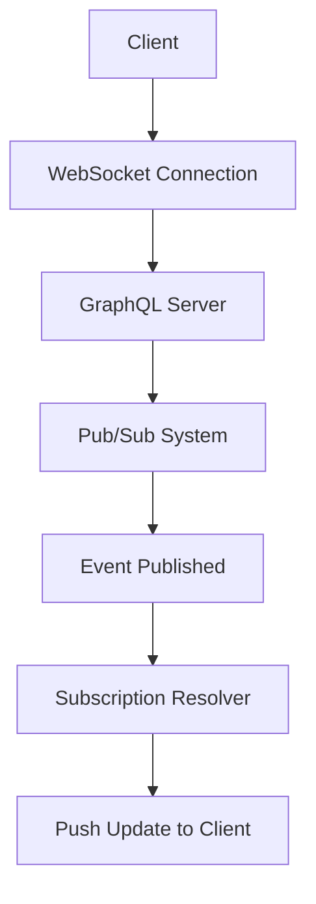

# GraphQL Subscriptions

## Overview

GraphQL subscriptions enable real-time data updates by allowing clients to subscribe to specific events on the server. Unlike queries and mutations, subscriptions maintain a persistent connection, pushing updates to clients as data changes occur.

## Detailed Explanation

Subscriptions are defined in the GraphQL schema alongside queries and mutations:

```graphql
type Subscription {
  reviewCreated: Review
  userUpdated(id: ID!): User
}
```

Key aspects:
- **Long-lived Requests**: Unlike HTTP-based queries, subscriptions use protocols like WebSockets.
- **Pub/Sub Pattern**: Server publishes events to a message broker; subscriptions listen for relevant events.
- **Real-time Updates**: Clients receive incremental updates without polling.
- **Operation Structure**: Similar to queries but with `subscription` keyword.

Subscriptions are ideal for live data like chat messages, stock prices, or collaborative editing.



## Real-world Examples & Use Cases

- **Live Chat Applications**: Real-time messaging between users.
- **Collaborative Tools**: Live cursors and edits in shared documents.
- **Financial Dashboards**: Real-time stock price updates.
- **Social Media Feeds**: Instant notifications for new posts or likes.
- **IoT Monitoring**: Live sensor data streams.

## Code Examples

### Schema Definition

```graphql
type Subscription {
  reviewAdded(movieId: ID!): Review!
  userOnlineStatusChanged: UserStatus!
}

type Review {
  id: ID!
  movieId: ID!
  rating: Int!
  comment: String
  user: User!
}

type UserStatus {
  userId: ID!
  isOnline: Boolean!
}
```

### Client Subscription

```javascript
import { useSubscription, gql } from '@apollo/client';

const REVIEW_SUBSCRIPTION = gql`
  subscription OnReviewAdded($movieId: ID!) {
    reviewAdded(movieId: $movieId) {
      id
      rating
      comment
      user {
        name
      }
    }
  }
`;

function ReviewList({ movieId }) {
  const { data, loading } = useSubscription(REVIEW_SUBSCRIPTION, {
    variables: { movieId }
  });

  // Handle real-time updates
  useEffect(() => {
    if (data) {
      console.log('New review:', data.reviewAdded);
      // Update UI with new review
    }
  }, [data]);

  return <div>{/* Render reviews */}</div>;
}
```

### Server Resolver (Node.js with Apollo Server)

```javascript
const { PubSub } = require('graphql-subscriptions');
const pubsub = new PubSub();

const resolvers = {
  Subscription: {
    reviewAdded: {
      subscribe: (_, { movieId }) => pubsub.asyncIterator([`REVIEW_ADDED_${movieId}`])
    }
  },
  Mutation: {
    addReview: async (_, { movieId, rating, comment }, { userId }) => {
      const review = await createReview({ movieId, rating, comment, userId });
      
      // Publish event
      pubsub.publish(`REVIEW_ADDED_${movieId}`, {
        reviewAdded: review
      });
      
      return review;
    }
  }
};
```

## Common Pitfalls & Edge Cases

- **Connection Limits**: WebSocket connections can overwhelm servers; implement connection pooling.
- **Authentication**: Secure subscriptions with proper auth tokens.
- **Race Conditions**: Handle timing between initial query and subscription updates.
- **Scalability**: Use Redis or similar for pub/sub in distributed systems.
- **Error Handling**: Manage connection drops and reconnection logic.

## Tools & Libraries

- **Apollo Server**: Popular GraphQL server with subscription support.
- **GraphQL-WS**: WebSocket protocol for GraphQL subscriptions.
- **Redis**: Pub/sub backend for scalable subscriptions.

## References

- [GraphQL Subscriptions Specification](https://graphql.org/learn/subscriptions/)
- [Apollo GraphQL Subscriptions](https://www.apollographql.com/docs/apollo-server/data/subscriptions/)
- [GraphQL over WebSockets Protocol](https://github.com/enisdenjo/graphql-ws)

## Github-README Links & Related Topics

- [GraphQL Queries](https://graphql.org/learn/queries/)
- [GraphQL Mutations](https://graphql.org/learn/mutations/)
- [Real-time Data Processing](https://aws.amazon.com/kinesis/)