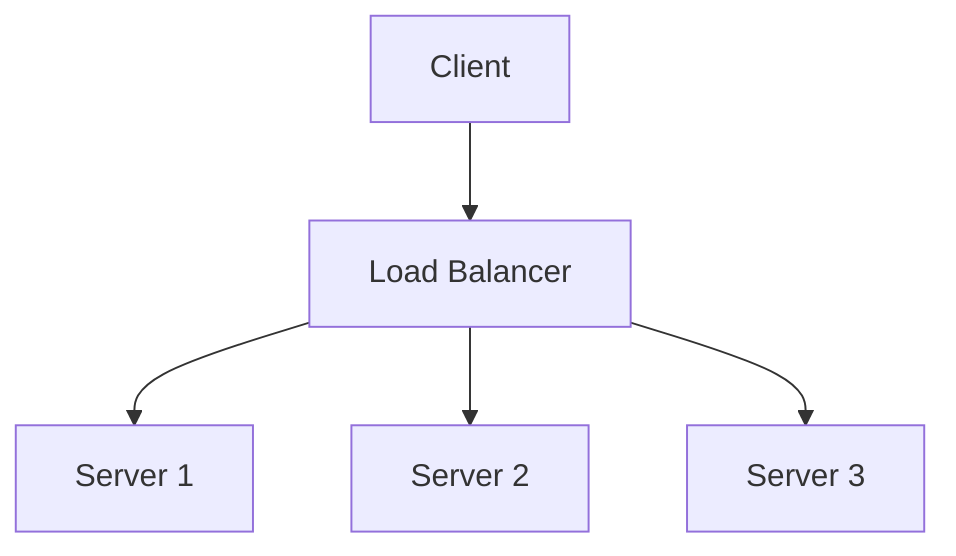
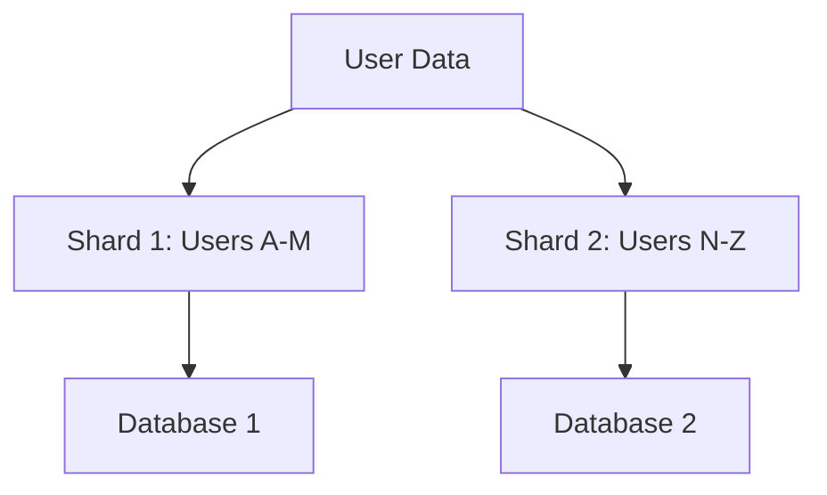

# Overview

High scalability patterns are architectural strategies that enable systems to handle increasing loads efficiently by distributing resources, optimizing performance, and ensuring reliability. These patterns address challenges in distributed systems, including load balancing, data partitioning, caching, fault tolerance, and asynchronous processing. Key principles involve horizontal scaling (adding more nodes), decoupling components, and leveraging patterns like sharding, circuit breaker, CQRS, and event sourcing to build resilient, high-performance applications capable of scaling from thousands to billions of users.

# Detailed Explanation

Scalability patterns are categorized into structural (e.g., sharding for data distribution), behavioral (e.g., circuit breaker for fault handling), and operational (e.g., deployment stamps for multi-region scaling). They draw from established sources like the AWS Well-Architected Framework, Microsoft Cloud Design Patterns, and microservices.io patterns, focusing on reliability, performance efficiency, and cost optimization.

## Key Patterns

### Load Balancing
Distributes incoming requests across multiple servers to prevent overload and improve availability. Common algorithms include round-robin, least connections, and IP hashing. Supports horizontal scaling by adding more instances.



### Caching
Stores frequently accessed data in memory (e.g., Redis, Memcached) for faster retrieval, reducing database load. Patterns include cache-aside (lazy loading), write-through (synchronous updates), and write-behind (asynchronous updates).

### Sharding
Partitions data across multiple databases or nodes to distribute load. Horizontal sharding splits rows by key (e.g., user ID), vertical sharding splits columns. Essential for databases handling terabytes of data.



### Circuit Breaker
Prevents cascading failures by monitoring service health and temporarily halting requests to failing endpoints. Transitions between closed (normal), open (blocking), and half-open (testing) states.

### CQRS (Command Query Responsibility Segregation)
Separates read (queries) and write (commands) operations, allowing optimized data models. Reads use denormalized views, writes use normalized models, improving performance for high-read workloads.

### Event Sourcing
Persists state changes as immutable events, enabling auditability, replayability, and scalability. Aggregates reconstruct state from event logs, supporting complex event-driven architectures.

### Saga Pattern
Manages distributed transactions across microservices using compensating actions. Choreography (event-driven) or orchestration (central coordinator) variants ensure consistency without two-phase commits.

### Microservices Decomposition
Breaks monolithic applications into loosely coupled services, enabling independent scaling, deployment, and technology choices. Follows domain-driven design (DDD) for service boundaries.

| Pattern | Purpose | Trade-offs | Example Use Case |
|---------|---------|------------|------------------|
| Load Balancing | Distribute load evenly | Adds latency; requires health checks | Web server farms |
| Sharding | Partition data for parallelism | Cross-shard queries complex; rebalancing costly | User databases in social platforms |
| Circuit Breaker | Prevent failure cascades | May block valid requests temporarily | API gateways calling external services |
| CQRS | Optimize reads vs. writes | Dual models increase complexity | E-commerce product catalogs |
| Event Sourcing | Enable audit and replay | Storage growth; eventual consistency | Financial transaction logs |
| Saga | Handle distributed transactions | Compensation logic needed | Order fulfillment across services |
| Microservices | Enable independent scaling | Network overhead; orchestration complexity | Video streaming platforms |

# Real-world Examples & Use Cases

- **Netflix**: Employs microservices with circuit breakers, event sourcing, and sharding to stream content to millions, using asynchronous processing for recommendations.
- **Amazon**: Uses sharding for product catalogs, load balancing for traffic spikes, and CQRS for inventory management, handling billions of transactions daily.
- **Twitter**: Implements caching (e.g., tweet timelines) and asynchronous messaging for real-time feeds, scaling to hundreds of millions of users.
- **Uber**: Applies sagas for ride bookings, coordinating drivers, payments, and notifications across services.
- **Facebook**: Leverages sharding for social graphs and CQRS for news feeds, managing petabytes of data with low-latency queries.
- **Google**: Uses load balancing and caching in services like Search and Maps, with sharding for Bigtable-like databases.

# Code Examples

## Load Balancing (Round-Robin in Python)

```python
from itertools import cycle

class RoundRobinLoadBalancer:
    def __init__(self, servers):
        self.servers = cycle(servers)
    
    def get_next_server(self):
        return next(self.servers)

# Usage
lb = RoundRobinLoadBalancer(['server1', 'server2', 'server3'])
print(lb.get_next_server())  # server1
```

## Circuit Breaker (Using Python's CircuitBreaker Library)

```python
from circuitbreaker import circuit

@circuit(failure_threshold=5, recovery_timeout=10)
def call_external_service():
    # Simulate API call
    return "response"

# Usage
try:
    result = call_external_service()
except CircuitBreakerError:
    print("Service unavailable")
```

## Sharding (Hash-Based in Java)

```java
public class ShardManager {
    private final int numShards;

    public ShardManager(int numShards) {
        this.numShards = numShards;
    }

    public int getShard(String key) {
        return Math.abs(key.hashCode()) % numShards;
    }
}

// Usage
ShardManager sm = new ShardManager(4);
int shard = sm.getShard("user123");  // e.g., 2
```

## CQRS Example (Simplified Command and Query in Go)

```go
// Command side
type CreateUserCommand struct {
    ID   string
    Name string
}

func (c *CreateUserCommand) Execute() {
    // Persist to write DB
}

// Query side
type UserQuery struct {
    ID string
}

func (q *UserQuery) GetUser() *User {
    // Fetch from read DB (materialized view)
    return &User{ID: q.ID, Name: "John"}
}
```

## Event Sourcing (Basic Event Store in JavaScript)

```javascript
class EventStore {
    constructor() {
        this.events = [];
    }

    append(event) {
        this.events.push(event);
    }

    getEvents(aggregateId) {
        return this.events.filter(e => e.aggregateId === aggregateId);
    }
}

// Usage
const store = new EventStore();
store.append({ aggregateId: 'user1', type: 'UserCreated', data: { name: 'Alice' } });
const history = store.getEvents('user1');
```

# References

- [AWS Well-Architected Framework](https://aws.amazon.com/architecture/well-architected/)
- [Microsoft Cloud Design Patterns](https://learn.microsoft.com/en-us/azure/architecture/patterns/)
- [Microservices Patterns by Chris Richardson](https://microservices.io/patterns/)
- [Wikipedia: Scalability](https://en.wikipedia.org/wiki/Scalability)
- [Martin Fowler on CQRS](https://martinfowler.com/bliki/CQRS.html)
- [Event Sourcing Pattern](https://learn.microsoft.com/en-us/azure/architecture/patterns/event-sourcing)

# Github-README Links & Related Topics

- [Microservices Architecture](../microservices-architecture/)
- [Load Balancing](../load-balancing/)
- [Caching Strategies](../caching-strategies/)
- [Database Sharding](../database-sharding/)
- [Circuit Breaker Pattern](../circuit-breaker-pattern/)
- [CQRS Pattern](../cqrs-pattern/)
- [Event Sourcing](../event-sourcing/)
- [Saga Pattern](../saga-pattern/)
- [Distributed Systems](../distributed-systems/)

# Common Pitfalls & Edge Cases

- **Over-Sharding**: Leads to complex joins and rebalancing during growth; mitigate with consistent hashing.
- **Cache Inconsistency**: Stale data in distributed caches; use cache invalidation strategies or TTL.
- **Saga Failures**: Incomplete compensations; design idempotent operations and monitor saga states.
- **Network Latency**: Ignored in horizontal scaling; optimize with regional deployments and CDNs.
- **CQRS Sync Issues**: Read models lag behind writes; implement event-driven updates for near-real-time consistency.

# Tools & Libraries

- **Load Balancing**: NGINX, HAProxy, AWS ELB.
- **Caching**: Redis, Memcached, Caffeine.
- **Circuit Breaker**: Resilience4j (Java), Polly (.NET), CircuitBreaker (Python).
- **Sharding**: Apache ShardingSphere, Vitess, MongoDB sharding.
- **Event Sourcing**: EventStore, Axon Framework.
- **Monitoring**: Prometheus, Grafana, Datadog for metrics and tracing.
