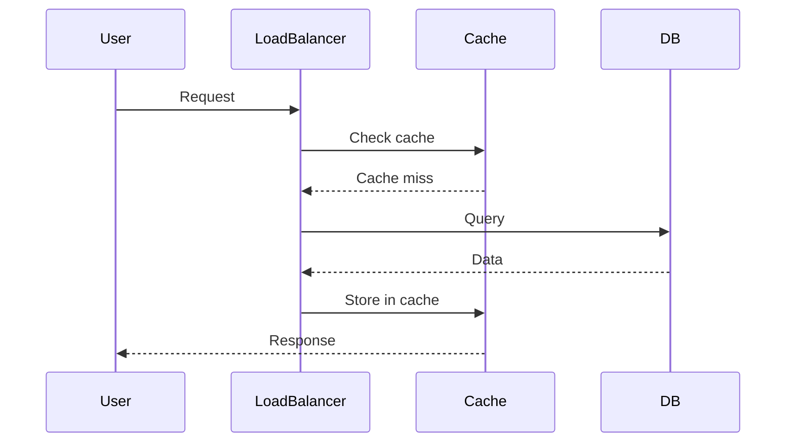
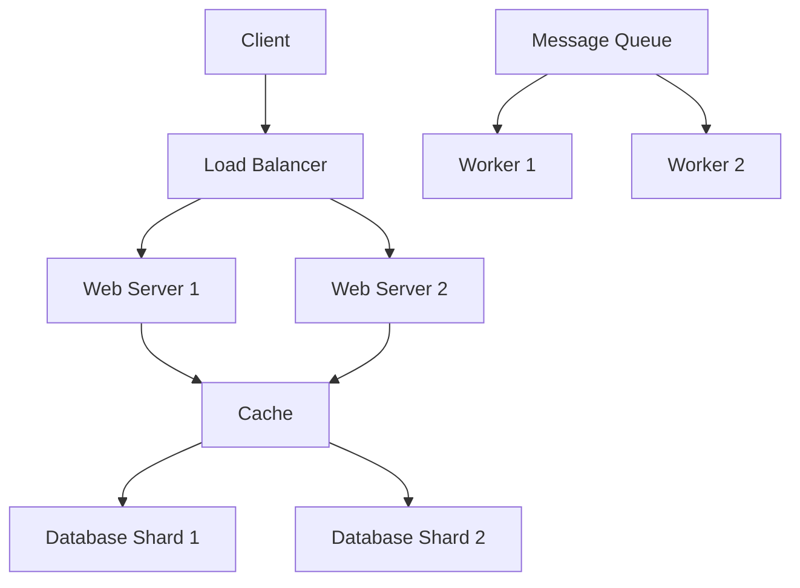

# High Scalability Patterns

## Overview

High Scalability Patterns cover techniques and architectural approaches to build systems that can handle increased load, traffic, and data volume. These patterns help maintain performance, reliability, and cost-effectiveness as systems grow.

## Detailed Explanation

Scalability refers to a system's ability to handle growing amounts of work or its potential to accommodate growth. There are two main types of scalability:

- **Vertical Scaling (Scale Up)**: Adding more power to existing servers (CPU, RAM, storage).
- **Horizontal Scaling (Scale Out)**: Adding more servers to distribute the load.

## Key Scalability Patterns

### Load Balancing
Distributes incoming traffic across multiple servers to prevent any single server from becoming a bottleneck.

**Types:**
- Round Robin
- Least Connections
- IP Hash
- Weighted Round Robin

### Caching
Stores frequently accessed data in memory for faster retrieval, reducing database load.

**Types:**
- In-memory caching (Redis, Memcached)
- CDN caching
- Database query caching
- Application-level caching

### Database Sharding
Splits large databases into smaller, more manageable pieces called shards.

**Strategies:**
- Horizontal sharding
- Vertical sharding
- Directory-based sharding

### Replication
Creates copies of data across multiple servers for redundancy and improved read performance.

**Types:**
- Master-Slave replication
- Master-Master replication
- Multi-Master replication

### Partitioning
Divides data or workload across multiple servers or databases.

**Types:**
- Range partitioning
- Hash partitioning
- List partitioning

### Asynchronous Processing
Decouples components using message queues to handle tasks asynchronously.

**Benefits:**
- Improved responsiveness
- Better fault tolerance
- Load leveling

### Microservices Architecture
Breaks down monolithic applications into smaller, independent services.

**Advantages:**
- Independent scaling
- Technology diversity
- Easier maintenance

### Content Delivery Networks (CDNs)
Distributes content geographically closer to users, reducing latency.

### Auto-scaling
Automatically adjusts resources based on demand.

**Types:**
- Horizontal auto-scaling
- Vertical auto-scaling

## Real-world Examples & Use Cases

- **Social Media Platforms**: Handle millions of users posting and viewing content simultaneously.
- **E-commerce Sites**: Manage high traffic during sales events like Black Friday.
- **Streaming Services**: Deliver video content to millions of concurrent users.
- **IoT Systems**: Handle data from thousands of devices in real-time.

## Code Examples

## Simple Load Balancer Implementation

```python
import random

class LoadBalancer:
    def __init__(self, servers):
        self.servers = servers
    
    def get_server_round_robin(self):
        if not hasattr(self, 'current'):
            self.current = 0
        server = self.servers[self.current]
        self.current = (self.current + 1) % len(self.servers)
        return server
    
    def get_server_random(self):
        return random.choice(self.servers)
    
    def get_server_least_connections(self):
        # Simplified: assume connection counts
        return min(self.servers, key=lambda s: s.get('connections', 0))

# Usage
servers = [{'host': 'server1', 'connections': 5}, {'host': 'server2', 'connections': 3}]
lb = LoadBalancer(servers)
print(lb.get_server_round_robin())
```

## Basic Caching with TTL

```java
import java.util.concurrent.ConcurrentHashMap;
import java.util.Map;

public class SimpleCache<K, V> {
    private Map<K, CacheEntry<V>> cache = new ConcurrentHashMap<>();
    
    public V get(K key) {
        CacheEntry<V> entry = cache.get(key);
        if (entry != null && !entry.isExpired()) {
            return entry.getValue();
        } else {
            cache.remove(key);
            return null;
        }
    }
    
    public void put(K key, V value, long ttlMillis) {
        cache.put(key, new CacheEntry<>(value, ttlMillis));
    }
    
    private static class CacheEntry<V> {
        private V value;
        private long expiryTime;
        
        public CacheEntry(V value, long ttlMillis) {
            this.value = value;
            this.expiryTime = System.currentTimeMillis() + ttlMillis;
        }
        
        public V getValue() {
            return value;
        }
        
        public boolean isExpired() {
            return System.currentTimeMillis() > expiryTime;
        }
    }
}
```

## Database Sharding Example (Conceptual)

```python
class ShardingManager:
    def __init__(self, num_shards):
        self.num_shards = num_shards
        self.shards = [{} for _ in range(num_shards)]  # Simplified as dicts
    
    def get_shard(self, key):
        # Simple hash-based sharding
        return hash(key) % self.num_shards
    
    def put(self, key, value):
        shard_index = self.get_shard(key)
        self.shards[shard_index][key] = value
    
    def get(self, key):
        shard_index = self.get_shard(key)
        return self.shards[shard_index].get(key)

# Usage
shard_manager = ShardingManager(4)
shard_manager.put('user1', {'name': 'Alice'})
shard_manager.put('user2', {'name': 'Bob'})
print(shard_manager.get('user1'))
```

## Journey / Sequence


## Data Models / Message Formats
### Scalability Patterns Table
| Pattern | Description | Benefits | Drawbacks |
|---------|-------------|----------|-----------|
| Load Balancing | Distribute traffic | Improved performance, fault tolerance | Complexity, single point of failure |
| Caching | Store frequent data | Reduced latency, lower load | Cache invalidation, memory usage |
| Sharding | Split data across nodes | Horizontal scaling, performance | Complexity, rebalancing |
| Replication | Copy data across nodes | Read scalability, fault tolerance | Write overhead, consistency issues |
| Asynchronous Processing | Decouple with queues | Responsiveness, load leveling | Ordering issues, monitoring |

### System Architecture Diagram


## STAR Summary

**Situation:** A growing e-commerce platform experienced slow response times during peak hours, with user requests taking over 5 seconds to load product pages.

**Task:** As the lead engineer, I was tasked with improving system performance to handle 10x traffic growth while maintaining sub-1-second response times.

**Action:** Implemented a multi-layered scalability approach: added load balancers for traffic distribution, introduced Redis caching for product data, sharded the user database across multiple nodes, and deployed asynchronous processing for order fulfillment using message queues.

**Result:** System throughput increased by 300%, average response time dropped to 200ms, and the platform successfully handled Black Friday traffic without downtime, resulting in 25% higher conversion rates.

## Common Pitfalls & Edge Cases
- **Over-engineering:** Start simple, scale when needed.
- **Ignoring Costs:** Scaling increases infrastructure costs.
- **Cache Thrashing:** Frequent invalidation reduces benefits.
- **Shard Imbalance:** Uneven data distribution causes hotspots.
- **Edge Cases:** Sudden traffic spikes, network partitions, data skew.

## Tools & Libraries
- **Load Balancing:** NGINX, HAProxy, AWS ELB
- **Caching:** Redis, Memcached, Caffeine
- **Databases:** Cassandra (sharding), PostgreSQL (replication)
- **Message Queues:** RabbitMQ, Apache Kafka
- **Orchestration:** Kubernetes, Docker Swarm
- **Auto-scaling:** AWS Auto Scaling, Kubernetes HPA

## References

- [Scalability Rules by Martin L. Abbott and Michael T. Fisher](https://www.amazon.com/Scalability-Rules-50-Principles-Sustainable/dp/0321753887)
- [The Art of Scalability by Martin L. Abbott and Michael T. Fisher](https://www.amazon.com/Art-Scalability-Architecture-Organizations-Enterprise/dp/0137030426)
- [Designing Data-Intensive Applications by Martin Kleppmann](https://www.amazon.com/Designing-Data-Intensive-Applications-Reliable-Maintainable/dp/1449373321)
- [High Scalability Blog](http://highscalability.com/)
- [Scalability - Wikipedia](https://en.wikipedia.org/wiki/Scalability)
- [AWS Well-Architected Framework](https://aws.amazon.com/architecture/well-architected/)
- [Cloud Design Patterns - Azure](https://docs.microsoft.com/en-us/azure/architecture/patterns/)

## Github-README Links & Related Topics

- [Load Balancing and Strategies](../load-balancing-and-strategies/)
- [Caching](../caching/)
- [Database Sharding Strategies](../database-sharding-strategies/)
- [Database Replication Strategies](../database-replication-strategies/)
- [Microservices Architecture](../microservices/)
- [CAP Theorem & Distributed Systems](../cap-theorem-and-distributed-systems/)