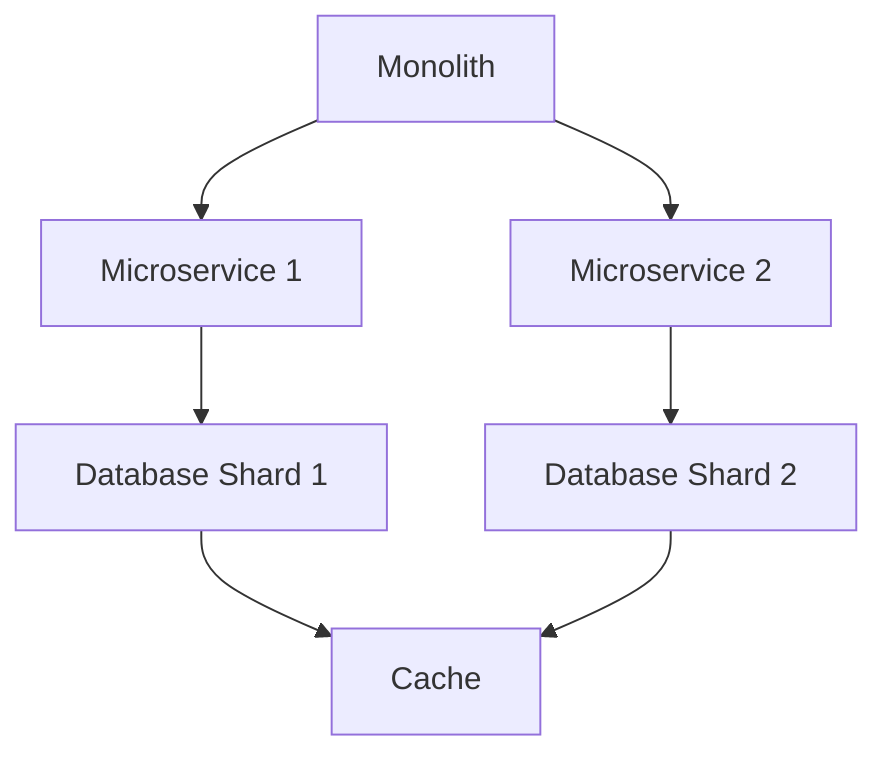

## Overview

High scalability patterns address challenges in building systems that can handle massive loads. Patterns include sharding, replication, caching, and microservices, enabling horizontal and vertical scaling.

## Detailed Explanation

### Key Patterns
- **Sharding**: Splitting data across multiple databases.
- **Replication**: Copying data for redundancy and read performance.
- **Caching**: Storing frequently accessed data in memory.
- **Microservices**: Decomposing monolithic apps into services.
- **Load Balancing**: Distributing requests across servers.

### Trade-offs
- Sharding improves write performance but complicates queries.
- Replication ensures availability but may lead to consistency issues.



## Real-world Examples & Use Cases

- **Netflix**: Uses microservices and caching for streaming.
- **Amazon**: Sharding for product databases.
- **Google**: Replication for search index.

## Code Examples

### Simple Sharding Logic (Pseudocode)
```python
def get_shard(user_id, num_shards):
    return user_id % num_shards

# Usage
shard = get_shard(12345, 4)  # 1
```

## References

- [AWS Scalability Patterns](https://aws.amazon.com/architecture/well-architected/)
- [Microservices Patterns](https://microservices.io/patterns/)

## Github-README Links & Related Topics

- [System Design Basics](../system-design-basics/)
- [Database Sharding Strategies](../database-sharding-strategies/)
- [Microservices Architecture](../event-driven-microservices/)
