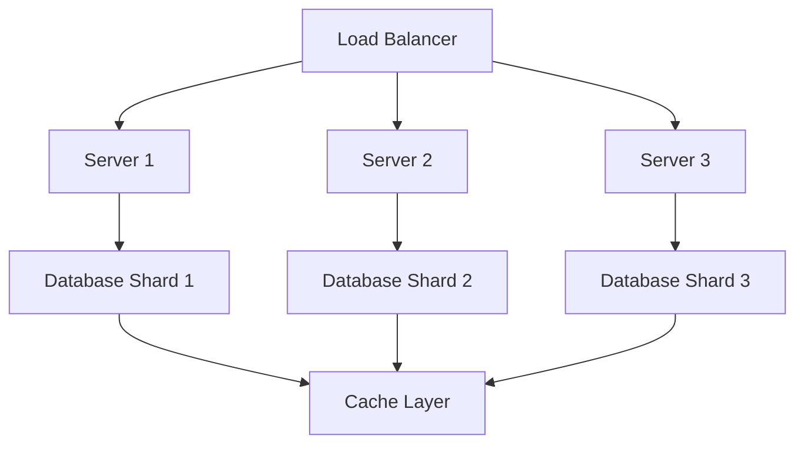

## Overview

High scalability patterns are architectural and design strategies that enable systems to handle increasing loads efficiently. These patterns focus on distributing workload, optimizing resource usage, and ensuring fault tolerance. Key concepts include horizontal and vertical scaling, load balancing, caching, sharding, replication, and microservices. By applying these patterns, systems can achieve linear or near-linear performance growth as demand increases, avoiding bottlenecks and single points of failure.

## Detailed Explanation

Scalability refers to a system's ability to handle growing amounts of work by adding resources. High scalability patterns address this through various techniques:

### Core Patterns

1. **Horizontal Scaling (Scale Out)**: Adding more nodes to a system to distribute load. This is preferred for cloud-native applications due to its flexibility.

2. **Vertical Scaling (Scale Up)**: Increasing resources (CPU, memory, storage) on existing nodes. Suitable for applications with limited parallelization.

3. **Load Balancing**: Distributing incoming requests across multiple servers to prevent overload.

4. **Caching**: Storing frequently accessed data in fast storage (e.g., Redis, Memcached) to reduce database load.

5. **Database Sharding**: Splitting data across multiple databases to improve read/write performance.

6. **Replication**: Creating copies of data for redundancy and faster access.

7. **Microservices Architecture**: Breaking down monolithic applications into smaller, independent services.

8. **Event-Driven Architecture**: Using asynchronous messaging to decouple components and improve responsiveness.

9. **CQRS (Command Query Responsibility Segregation)**: Separating read and write operations for optimized performance.

10. **Circuit Breaker Pattern**: Preventing cascading failures by temporarily stopping requests to failing services.

### Comparison of Scaling Approaches

| Pattern | Advantages | Disadvantages | Use Cases |
|---------|------------|---------------|-----------|
| Horizontal Scaling | High availability, cost-effective | Complexity in data consistency | Web applications, APIs |
| Vertical Scaling | Simplicity, no code changes | Hardware limits, single point of failure | Legacy systems, small apps |
| Load Balancing | Improved throughput, fault tolerance | Additional infrastructure | High-traffic websites |
| Caching | Reduced latency, lower DB load | Cache invalidation issues | Read-heavy applications |
| Sharding | Better performance for large datasets | Cross-shard queries complex | Big data, e-commerce |
| Replication | Data redundancy, faster reads | Write amplification | Global services, backups |

### Mermaid Diagram: Horizontal Scaling Architecture



This diagram illustrates how requests are balanced across servers, each connected to sharded databases with a shared cache.

## Real-world Examples & Use Cases

### Netflix
Netflix uses microservices and horizontal scaling to handle millions of concurrent streams. They employ caching for user recommendations and sharding for user data across regions.

### Amazon
Amazon's e-commerce platform relies on sharding for product catalogs and replication for global availability. Load balancers distribute traffic during peak shopping seasons.

### Google
Google's search engine uses replication for index data and event-driven processing for crawling. Their Bigtable (sharded NoSQL) handles massive data volumes.

### Twitter
Twitter applies sharding for tweets and timelines, with caching for trending topics. Event-driven architecture manages real-time feeds.

### Uber
Uber uses microservices for ride matching, with load balancing and caching for location data. Replication ensures data consistency across regions.

## Code Examples

### Load Balancer in Python (Simple Round-Robin)

```python
class LoadBalancer:
    def __init__(self, servers):
        self.servers = servers
        self.index = 0

    def get_server(self):
        server = self.servers[self.index]
        self.index = (self.index + 1) % len(self.servers)
        return server

# Usage
lb = LoadBalancer(['server1', 'server2', 'server3'])
print(lb.get_server())  # server1
print(lb.get_server())  # server2
```

### Caching with Redis in Java

```java
import redis.clients.jedis.Jedis;

public class CacheExample {
    private Jedis jedis = new Jedis("localhost");

    public String getData(String key) {
        String cached = jedis.get(key);
        if (cached != null) {
            return cached;
        }
        // Fetch from DB
        String data = fetchFromDatabase(key);
        jedis.setex(key, 3600, data);  // Cache for 1 hour
        return data;
    }

    private String fetchFromDatabase(String key) {
        // Simulate DB call
        return "Data for " + key;
    }
}
```

### Database Sharding in SQL (Conceptual)

```sql
-- Shard 1: Users with ID % 3 == 0
CREATE TABLE users_shard1 (
    id INT PRIMARY KEY,
    name VARCHAR(255)
);

-- Shard 2: Users with ID % 3 == 1
CREATE TABLE users_shard2 (
    id INT PRIMARY KEY,
    name VARCHAR(255)
);

-- Shard 3: Users with ID % 3 == 2
CREATE TABLE users_shard3 (
    id INT PRIMARY KEY,
    name VARCHAR(255)
);

-- Routing logic (in application code)
def get_shard(user_id):
    return user_id % 3
```

## STAR Summary

**Situation**: A monolithic e-commerce application experiences slowdowns during peak traffic, leading to lost sales.

**Task**: Implement high scalability patterns to handle 10x traffic increase without downtime.

**Action**: Adopted microservices architecture, added load balancers, implemented caching and database sharding.

**Result**: System now handles variable loads efficiently, with 99.9% uptime and improved user experience.

## Journey / Sequence

1. **Assessment**: Analyze current bottlenecks using profiling tools.
2. **Planning**: Choose patterns based on workload (read-heavy vs. write-heavy).
3. **Implementation**: Start with load balancing and caching for quick wins.
4. **Testing**: Use chaos engineering to simulate failures.
5. **Monitoring**: Implement metrics for scalability KPIs (throughput, latency).
6. **Iteration**: Gradually adopt sharding and microservices as needed.

## Data Models / Message Formats

### Event-Driven Message (JSON)

```json
{
  "eventType": "UserLogin",
  "userId": "12345",
  "timestamp": "2025-09-26T10:00:00Z",
  "metadata": {
    "ip": "192.168.1.1",
    "device": "mobile"
  }
}
```

### Sharded Data Model (User Table)

| Shard | User ID Range | Server |
|-------|----------------|--------|
| 0 | 0-999 | Server A |
| 1 | 1000-1999 | Server B |
| 2 | 2000+ | Server C |

## Common Pitfalls & Edge Cases

- **Hot Shards**: Uneven data distribution leading to overloaded shards. Mitigate with consistent hashing.
- **Cache Stampede**: Multiple requests hitting DB when cache expires. Use cache warming or locks.
- **Replication Lag**: Stale reads in eventually consistent systems. Choose strong consistency for critical data.
- **Microservices Complexity**: Increased operational overhead. Use service mesh (e.g., Istio) for management.
- **Scaling Too Early**: Premature optimization. Monitor metrics before implementing patterns.

## Tools & Libraries

- **Load Balancing**: NGINX, HAProxy, AWS ELB
- **Caching**: Redis, Memcached, Caffeine
- **Sharding**: Vitess, Citus, MongoDB sharding
- **Replication**: PostgreSQL streaming, MySQL replication
- **Microservices**: Spring Boot, Kubernetes, Docker
- **Monitoring**: Prometheus, Grafana, New Relic

## References

- [Scalability on Wikipedia](https://en.wikipedia.org/wiki/Scalability)
- [AWS Well-Architected Framework: Scalability](https://aws.amazon.com/architecture/well-architected/)
- [Microservices Patterns](https://microservices.io/patterns/scalability/)
- [Martin Fowler on Scalability](https://martinfowler.com/articles/scaling.html)
- [Neil Gunther's Universal Scalability Law](https://en.wikipedia.org/wiki/Neil_J._Gunther#Universal_Scalability_Law)

## Github-README Links & Related Topics

- [Caching](../caching/)
- [Database Sharding Strategies](../database-sharding-strategies/)
- [Microservices Architecture](../event-driven-microservices/)
- [Load Balancing](../api-gateway-design/)
- [Event-Driven Architecture](../event-driven-architecture/)
- [CQRS Pattern](../cqrs-pattern/)
- [Circuit Breaker Pattern](../circuit-breaker-pattern/)