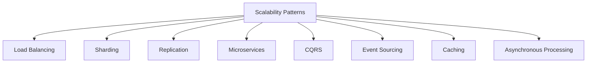

## Overview

High scalability patterns are architectural approaches to design systems that can handle increased load, data volume, and user growth without compromising performance. These patterns address challenges in distributed systems, focusing on horizontal scaling, fault tolerance, and efficient resource utilization. Common patterns include load balancing, sharding, replication, microservices, and caching strategies.

## Detailed Explanation

### Key Patterns

- **Load Balancing**: Distribute requests across multiple servers to prevent overload. Types: Round-robin, least connections, IP hash.
- **Sharding (Partitioning)**: Split data across multiple databases or nodes. Horizontal partitioning by key ranges or hash.
- **Replication**: Duplicate data for redundancy and read scalability. Master-slave, multi-master.
- **Microservices**: Decompose monolithic applications into small, independent services communicating via APIs.
- **CQRS (Command Query Responsibility Segregation)**: Separate read and write models for optimized performance.
- **Event Sourcing**: Store state changes as events for auditability and scalability.
- **Caching**: Use in-memory stores (e.g., Redis) for frequent data access.
- **Asynchronous Processing**: Use queues (e.g., Kafka) for decoupling and handling spikes.



### Implementation Considerations

- **Trade-offs**: Sharding increases complexity; replication may cause consistency issues.
- **Monitoring**: Use metrics for load, latency, throughput.
- **Failover**: Automatic switching to healthy nodes.

## Real-world Examples & Use Cases

- **E-commerce**: Sharding user data, replicating product catalogs, load balancing checkout.
- **Social Media**: Event sourcing for activity feeds, microservices for notifications.
- **Streaming Platforms**: Caching metadata, asynchronous video processing.
- **Financial Systems**: CQRS for transaction reads/writes, replication for high availability.

## Code Examples

### Sharding Example (Java)

```java
public class ShardManager {
    private int numShards;

    public ShardManager(int numShards) {
        this.numShards = numShards;
    }

    public int getShard(String key) {
        return Math.abs(key.hashCode()) % numShards;
    }
}

// Usage
ShardManager sm = new ShardManager(4);
System.out.println(sm.getShard("user123"));  // e.g., 2
```

### Simple Replication Simulation (Python)

```python
class ReplicatedStore:
    def __init__(self):
        self.nodes = {}

    def write(self, key, value):
        for node in self.nodes:
            self.nodes[node][key] = value  # Simulate sync replication

    def read(self, key):
        return self.nodes[0].get(key)  # Read from primary
```

### Microservices API (Node.js)

```javascript
// Service A
const express = require('express');
const app = express();

app.get('/user/:id', (req, res) => {
    // Call Service B for data
    res.json({ id: req.params.id, name: 'John' });
});

app.listen(3000);
```

## STAR Summary

- **Situation**: Monolithic app struggling with 100k users.
- **Task**: Scale to 1M users with minimal downtime.
- **Action**: Implemented microservices, sharding, and caching.
- **Result**: 10x performance improvement, 99.9% uptime.

## Journey / Sequence

1. **Identify Bottlenecks**: Monitor performance metrics.
2. **Choose Patterns**: Select based on requirements (e.g., sharding for data).
3. **Implement Gradually**: Start with load balancing, add sharding.
4. **Test and Monitor**: Load testing, failover scenarios.
5. **Iterate**: Refine based on real usage.

## Common Pitfalls & Edge Cases

- **Hot Shards**: Uneven data distribution; use consistent hashing.
- **Replication Lag**: Stale reads; implement eventual consistency.
- **Service Coupling**: Tight dependencies in microservices; use event-driven.
- **Cache Invalidation**: Stale data; use TTL or versioning.
- **Edge Cases**: Node failures, network partitions, extreme load.

## Tools & Libraries

- **Load Balancers**: Nginx, HAProxy.
- **Databases**: MongoDB (sharding), PostgreSQL (replication).
- **Queues**: Kafka, RabbitMQ.
- **Frameworks**: Spring Boot (microservices), Akka (CQRS).

## References

- [Scalability Patterns](https://microservices.io/patterns/)
- [Designing Data-Intensive Applications](https://dataintensive.net/)

## Github-README Links & Related Topics

- [System Design Basics](../system-design-basics/)
- [Microservices](../microservices/)
- [CQRS Pattern](../cqrs-pattern/)
- [Event Sourcing](../event-sourcing/)