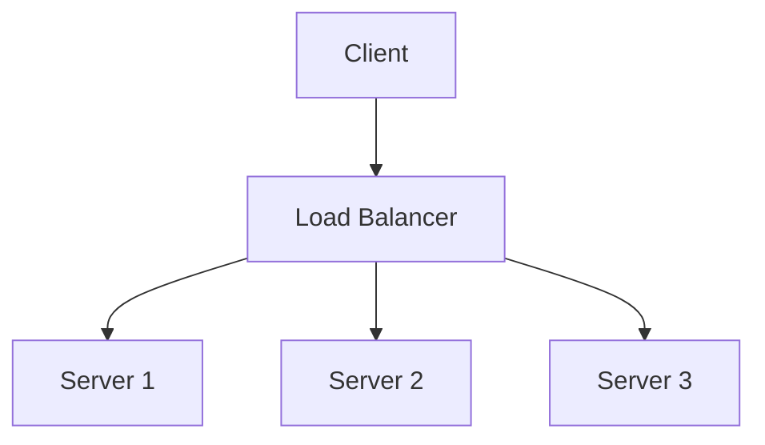
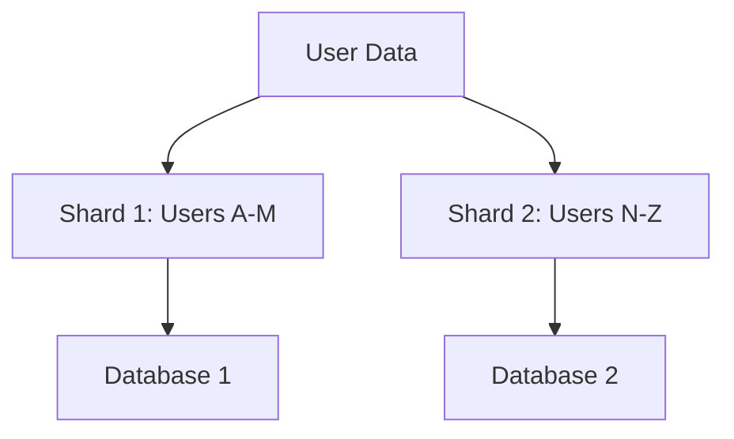

# Overview

High scalability patterns are architectural strategies designed to enable systems to handle increasing loads efficiently by distributing resources, optimizing performance, and ensuring reliability. These patterns address challenges in distributed systems, such as load balancing, data partitioning, caching, and fault tolerance. Key principles include horizontal scaling (adding more nodes), decoupling components, and asynchronous processing. Patterns like sharding, circuit breaker, and CQRS are essential for building resilient, high-performance applications that scale from thousands to billions of users.

# Detailed Explanation

Scalability patterns can be categorized into structural, behavioral, and operational types. Structural patterns focus on system architecture (e.g., sharding), behavioral on runtime interactions (e.g., circuit breaker), and operational on deployment and monitoring (e.g., deployment stamps).

## Key Patterns

### Load Balancing
Distributes incoming requests across multiple servers to prevent overload. Types include round-robin, least connections, and IP hashing.



### Caching
Stores frequently accessed data in memory for faster retrieval. Patterns include cache-aside, write-through, and write-behind.

### Sharding
Partitions data across multiple databases or nodes. Horizontal sharding distributes rows, vertical sharding splits columns.



### Circuit Breaker
Prevents cascading failures by temporarily halting requests to a failing service.

### CQRS (Command Query Responsibility Segregation)
Separates read and write operations for optimized performance.

### Event Sourcing
Stores state changes as events for auditability and scalability.

### Saga
Manages distributed transactions using compensating actions.

### Microservices Decomposition
Breaks monolithic apps into independent services, enabling independent scaling.

| Pattern | Purpose | Example Use Case |
|---------|---------|------------------|
| Load Balancing | Distribute load | Web servers |
| Sharding | Partition data | User databases |
| Circuit Breaker | Fault tolerance | API calls |
| CQRS | Optimize reads/writes | E-commerce inventory |

# Real-world Examples & Use Cases

- **Netflix**: Uses microservices with circuit breakers and event sourcing for video streaming, handling millions of concurrent users.
- **Amazon**: Employs sharding for product catalogs and load balancing for e-commerce traffic.
- **Twitter**: Implements caching and asynchronous processing for real-time feeds.
- **Uber**: Uses sagas for ride booking transactions across services.
- **Facebook**: Applies sharding and CQRS for social graph data.

# Code Examples

## Load Balancing with Java (Simple Round-Robin)

```java
import java.util.List;
import java.util.concurrent.atomic.AtomicInteger;

public class RoundRobinLoadBalancer {
    private final List<String> servers;
    private final AtomicInteger counter = new AtomicInteger(0);

    public RoundRobinLoadBalancer(List<String> servers) {
        this.servers = servers;
    }

    public String getNextServer() {
        int index = counter.getAndIncrement() % servers.size();
        return servers.get(index);
    }
}
```

## Circuit Breaker in Java (Using Resilience4j)

```java
import io.github.resilience4j.circuitbreaker.CircuitBreaker;
import io.github.resilience4j.circuitbreaker.CircuitBreakerConfig;

CircuitBreakerConfig config = CircuitBreakerConfig.custom()
    .failureRateThreshold(50)
    .waitDurationInOpenState(Duration.ofMillis(1000))
    .build();

CircuitBreaker circuitBreaker = CircuitBreaker.of("backendService", config);

Supplier<String> decoratedSupplier = CircuitBreaker.decorateSupplier(circuitBreaker, () -> callBackendService());
```

## Sharding Example (Simple Hash-Based)

```java
public class ShardManager {
    private final int numShards;

    public ShardManager(int numShards) {
        this.numShards = numShards;
    }

    public int getShard(String key) {
        return Math.abs(key.hashCode()) % numShards;
    }
}
```

# References

- [AWS Well-Architected Framework](https://aws.amazon.com/architecture/well-architected-framework/)
- [Microsoft Cloud Design Patterns](https://learn.microsoft.com/en-us/azure/architecture/patterns/)
- [Microservices Patterns](https://microservices.io/patterns/)
- [Wikipedia: Scalability](https://en.wikipedia.org/wiki/Scalability)

# Github-README Links & Related Topics

- [Microservices Architecture](../microservices-architecture/)
- [Load Balancing](../load-balancing/)
- [Caching Strategies](../caching-strategies/)
- [Database Sharding](../database-sharding/)
- [Circuit Breaker Pattern](../circuit-breaker-pattern/)
- [CQRS Pattern](../cqrs-pattern/)
- [Event Sourcing](../event-sourcing/)

# STAR Summary

- **Situation**: Systems face bottlenecks under high load.
- **Task**: Implement patterns to scale horizontally.
- **Action**: Apply load balancing, sharding, and caching.
- **Result**: Improved throughput and reliability.

# Journey / Sequence

1. Assess current bottlenecks (e.g., via profiling).
2. Choose patterns (e.g., sharding for data).
3. Implement incrementally (e.g., add load balancer).
4. Monitor and iterate (e.g., using metrics).

# Data Models / Message Formats

- **Event**: JSON with fields like `eventType`, `timestamp`, `payload`.
- **Command**: REST/JSON for CQRS writes.
- **Shard Key**: Hash-based identifier for partitioning.

# Common Pitfalls & Edge Cases

- Over-sharding leading to complex queries.
- Cache inconsistency in distributed systems.
- Saga failures without proper compensation.
- Ignoring network latency in horizontal scaling.

# Tools & Libraries

- **Load Balancing**: NGINX, HAProxy.
- **Caching**: Redis, Memcached.
- **Circuit Breaker**: Resilience4j, Hystrix.
- **Sharding**: Apache ShardingSphere, Vitess.
- **Monitoring**: Prometheus, Grafana.
