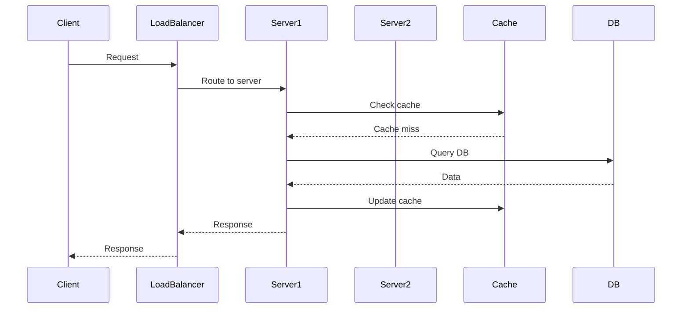
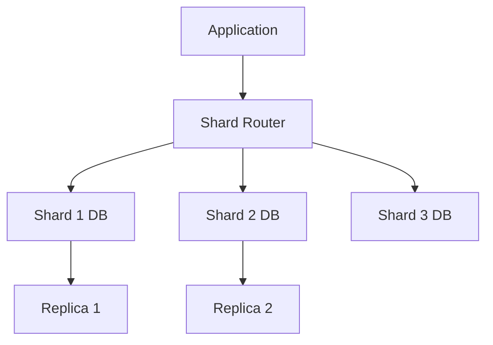
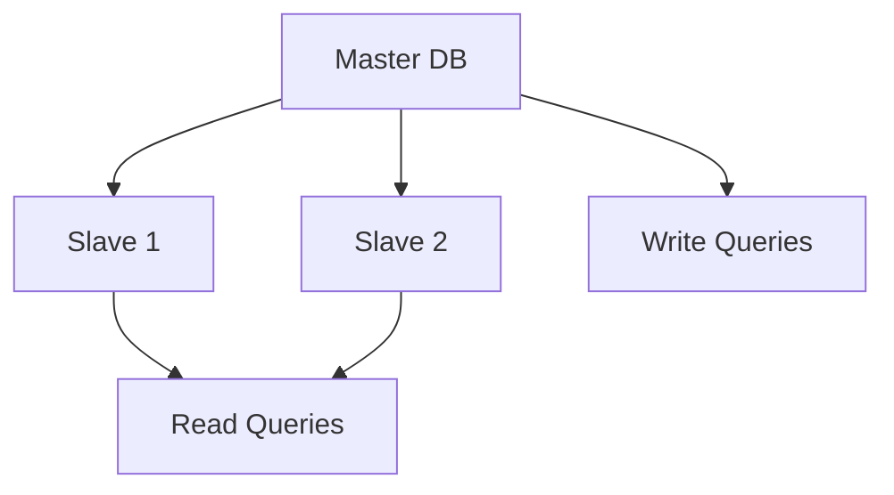

## Overview
High scalability patterns provide architectural solutions for systems that must handle exponential growth in users, data, and traffic. These patterns distribute load, optimize performance, and maintain reliability under high demand, enabling systems to scale from thousands to billions of operations.

## Detailed Explanation
Scalability patterns address the challenges of growing systems by distributing work across multiple resources. Key patterns include:

### Core Patterns
- **Load Balancing:** Distributes incoming requests across multiple servers to prevent overload.
- **Horizontal Scaling:** Adds more servers instead of upgrading existing ones.
- **Sharding:** Splits data across multiple databases or nodes.
- **Replication:** Creates copies of data for redundancy and faster access.
- **Caching:** Stores frequently accessed data in fast storage layers.
- **Asynchronous Processing:** Decouples operations using queues and background jobs.
- **CDN (Content Delivery Network):** Distributes static content geographically.
- **Microservices:** Breaks monolithic applications into smaller, independent services.

### Trade-offs
| Pattern | Benefits | Drawbacks |
|---------|----------|-----------|
| Sharding | Improved read/write performance | Complex queries across shards |
| Replication | High availability, faster reads | Write conflicts, storage overhead |
| Caching | Reduced latency, lower load | Cache invalidation, consistency issues |
| Microservices | Independent scaling, technology diversity | Increased complexity, network overhead |

## Real-world Examples & Use Cases
- **Sharding:** Twitter shards user timelines across databases.
- **Replication:** Amazon RDS replicates data across regions for global availability.
- **Caching:** Facebook uses TAO for social graph caching.
- **CDN:** Netflix uses Akamai to deliver video content worldwide.
- **Microservices:** Uber's architecture with separate services for rides, payments, etc.
- **Load Balancing:** Google distributes search queries across data centers.

## Code Examples
### Simple Sharding Logic
```python
class ShardingManager:
    def __init__(self, num_shards):
        self.num_shards = num_shards

    def get_shard(self, key):
        return hash(key) % self.num_shards

# Usage
shard_mgr = ShardingManager(4)
user_id = "user123"
shard_id = shard_mgr.get_shard(user_id)
print(f"User {user_id} goes to shard {shard_id}")
```

### LRU Cache Implementation
```java
import java.util.LinkedHashMap;
import java.util.Map;

class LRUCache<K, V> extends LinkedHashMap<K, V> {
    private int capacity;

    public LRUCache(int capacity) {
        super(capacity, 0.75f, true);
        this.capacity = capacity;
    }

    @Override
    protected boolean removeEldestEntry(Map.Entry<K, V> eldest) {
        return size() > capacity;
    }
}

// Usage
LRUCache<String, String> cache = new LRUCache<>(100);
cache.put("key1", "value1");
cache.put("key2", "value2");
System.out.println(cache.get("key1")); // Moves to end
```

### Asynchronous Processing with Queue
```python
import queue
import threading
import time

def worker(q):
    while True:
        item = q.get()
        if item is None:
            break
        print(f"Processing {item}")
        time.sleep(1)  # Simulate work
        q.task_done()

q = queue.Queue()
threading.Thread(target=worker, args=(q,), daemon=True).start()

# Add tasks
for i in range(5):
    q.put(f"task-{i}")

q.join()  # Wait for all tasks
```

## Journey / Sequence


## Data Models / Message Formats
### Sharding Architecture


### Replication Setup


### JSON Message for Queue
```json
{
  "task_id": "12345",
  "type": "email_send",
  "payload": {
    "to": "user@example.com",
    "subject": "Welcome",
    "body": "Welcome to our platform!"
  },
  "priority": "high"
}
```

## Common Pitfalls & Edge Cases
- **Hot Shards:** Uneven data distribution leading to overloaded shards.
- **Cache Invalidation:** Stale data causing inconsistencies.
- **Network Partitioning:** Split-brain scenarios in distributed systems.
- **Thundering Herd:** Mass cache misses after expiration.
- **Edge Case:** Single shard failure, extreme traffic spikes, data migration.

## Tools & Libraries
- **Load Balancing:** HAProxy, Nginx, AWS ELB
- **Caching:** Redis, Memcached, Caffeine
- **Message Queues:** Apache Kafka, RabbitMQ, AWS SQS
- **Databases:** Cassandra (sharding), PostgreSQL (replication)
- **CDN:** Cloudflare, Akamai, AWS CloudFront
- **Orchestration:** Kubernetes for microservices scaling

## Github-README Links & Related Topics
- [system-design-basics](../system-design-basics/)
- [caching-strategies](../system-design/caching-strategies/)
- [load-balancing-and-strategies](../system-design/load-balancing-and-strategies/)
- [replication-vs-sharding-vs-partitioning](../replication-vs-sharding-vs-partitioning/)

## References
- "Scalability Rules" by Martin L. Abbott and Michael T. Fisher
- https://github.com/donnemartin/system-design-primer
- AWS Well-Architected Framework: https://aws.amazon.com/architecture/well-architected/
- Google SRE Book: https://sre.google/sre-book/scalability/
- Netflix Tech Blog: https://netflixtechblog.com/