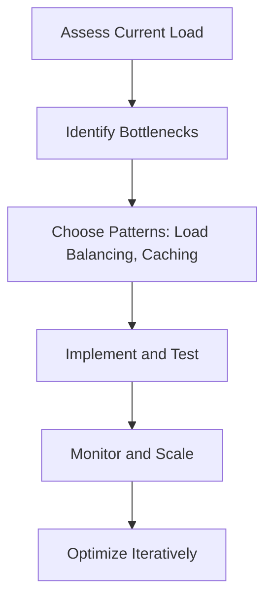

# Overview

High scalability patterns are architectural strategies designed to handle increased load, user growth, and data volume in software systems. These patterns ensure systems remain performant, reliable, and cost-effective as they scale from small applications to enterprise-level platforms. Key patterns include load balancing, caching, database sharding, and microservices, each addressing specific scalability challenges like bottlenecks in processing, storage, or network traffic.

# Detailed Explanation

Scalability patterns focus on distributing workload, optimizing resources, and minimizing single points of failure. They are categorized into horizontal (adding more nodes) and vertical (enhancing existing nodes) scaling.

## Load Balancing
Distributes incoming traffic across multiple servers to prevent overload.
- **Types**: Round-robin, least connections, IP hash.
- **Benefits**: Improves availability and fault tolerance.

## Caching
Stores frequently accessed data in fast-access storage to reduce database load.
- **Strategies**: Cache-aside, write-through, write-behind.
- **Tools**: Redis, Memcached.

## Database Sharding
Splits large databases into smaller, manageable pieces (shards) distributed across servers.
- **Types**: Horizontal (rows), vertical (columns).
- **Challenges**: Cross-shard queries, rebalancing.

## Replication
Creates copies of data across multiple nodes for redundancy and read scalability.
- **Types**: Master-slave, master-master.
- **Benefits**: High availability, load distribution.

## Microservices
Breaks monolithic applications into small, independent services.
- **Benefits**: Easier scaling, technology diversity, fault isolation.
- **Challenges**: Inter-service communication, data consistency.

## CDN (Content Delivery Network)
Distributes static content globally to reduce latency.
- **Use Cases**: Images, videos, static files.

## Message Queues
Decouples services for asynchronous processing.
- **Tools**: Kafka, RabbitMQ.
- **Benefits**: Handles spikes, improves reliability.

## Auto-scaling
Dynamically adjusts resources based on demand.
- **Cloud Tools**: AWS Auto Scaling, Kubernetes HPA.

# Real-world Examples & Use Cases

- **Netflix**: Uses microservices, CDNs, and caching for global video streaming, handling millions of concurrent users.
- **Amazon**: Employs sharding, replication, and load balancing for e-commerce, ensuring fast checkout during peak times.
- **Facebook**: Leverages caching, sharding, and message queues for real-time feeds and notifications.
- **Google**: Uses load balancing and replication for search engines, distributing queries across data centers.
- **Uber**: Applies microservices and auto-scaling for ride-sharing, managing variable demand.

# Code Examples

### Simple Load Balancer (Pseudocode)
```python
class LoadBalancer:
    def __init__(self, servers):
        self.servers = servers
        self.index = 0

    def get_server(self):
        server = self.servers[self.index]
        self.index = (self.index + 1) % len(self.servers)
        return server
```

### Cache Implementation (Java)
```java
import java.util.HashMap;
import java.util.Map;

class SimpleCache {
    private Map<String, String> cache = new HashMap<>();

    public String get(String key) {
        return cache.get(key);
    }

    public void put(String key, String value) {
        cache.put(key, value);
    }
}
```

### Database Sharding (SQL Example)
```sql
-- Shard 1: Users with ID 1-1000
CREATE TABLE users_shard1 (
    id INT PRIMARY KEY,
    name VARCHAR(50)
);

-- Shard 2: Users with ID 1001-2000
CREATE TABLE users_shard2 (
    id INT PRIMARY KEY,
    name VARCHAR(50)
);
```

# STAR Summary

- **Situation**: A monolithic e-commerce site experiences slowdowns during sales.
- **Task**: Implement scalability patterns to handle 10x traffic increase.
- **Action**: Introduced load balancing, caching, and database sharding.
- **Result**: Reduced response time by 50%, improved uptime to 99.9%.

# Journey / Sequence



# References

- [Scalability Patterns](https://microservices.io/patterns/scalability/)
- [Database Sharding](https://www.mongodb.com/features/database-sharding)
- [Microservices Patterns](https://microservices.io/patterns/)
- [AWS Scalability Best Practices](https://aws.amazon.com/architecture/well-architected/)
- [Google SRE Book](https://sre.google/sre-book/scalability/)

# Github-README Links & Related Topics

- [Load Balancing Strategies](../load-balancing-strategies/)
- [Caching](../caching/)
- [Database Sharding Strategies](../database-sharding-strategies/)
- [Microservices Architecture](../microservices-architecture/)
