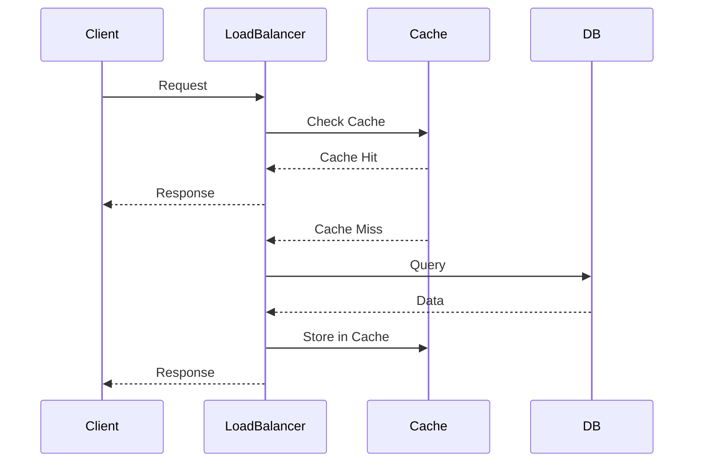
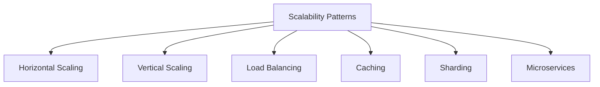

## Overview
High scalability patterns are architectural approaches to build systems that can handle growing amounts of work or data. These patterns help in distributing load, improving performance, and ensuring the system remains responsive as demand increases.

## Detailed Explanation
Common scalability patterns:

- **Horizontal Scaling:** Adding more servers to handle load.
- **Vertical Scaling:** Increasing the power of existing servers.
- **Load Balancing:** Distributing requests across multiple servers.
- **Database Sharding:** Splitting data across multiple databases.
- **Caching:** Storing frequently accessed data in memory.
- **CDN:** Distributing content geographically.
- **Microservices:** Breaking down the system into smaller, independent services.
- **Asynchronous Processing:** Using queues to handle tasks asynchronously.

## Real-world Examples & Use Cases
- **Horizontal Scaling:** Web applications like Facebook scale by adding more servers.
- **Database Sharding:** Instagram shards user data across multiple databases.
- **Caching:** Twitter caches timelines to reduce database load.
- **Microservices:** Netflix uses microservices for different features.

## Code Examples
### Simple Sharding (Pseudocode)
```python
class ShardedDatabase:
    def __init__(self, shards):
        self.shards = shards

    def get_shard(self, key):
        return self.shards[hash(key) % len(self.shards)]

    def put(self, key, value):
        shard = self.get_shard(key)
        shard.put(key, value)

    def get(self, key):
        shard = self.get_shard(key)
        return shard.get(key)
```

### Caching with TTL
```java
import java.util.concurrent.ConcurrentHashMap;

class Cache {
    private ConcurrentHashMap<String, CacheEntry> map = new ConcurrentHashMap<>();

    public void put(String key, Object value, long ttlMs) {
        map.put(key, new CacheEntry(value, System.currentTimeMillis() + ttlMs));
    }

    public Object get(String key) {
        CacheEntry entry = map.get(key);
        if (entry != null && entry.expiry > System.currentTimeMillis()) {
            return entry.value;
        } else {
            map.remove(key);
            return null;
        }
    }

    static class CacheEntry {
        Object value;
        long expiry;
        CacheEntry(Object value, long expiry) {
            this.value = value;
            this.expiry = expiry;
        }
    }
}
```

## Journey / Sequence


## Data Models / Message Formats
### Scalability Patterns Diagram


## Common Pitfalls & Edge Cases
- **Hot Spots:** Uneven load distribution leading to bottlenecks.
- **Cache Invalidation:** Ensuring cache consistency with database.
- **Shard Imbalance:** Data skew in sharding.
- **Edge Case:** Shard failure, cache expiration, high concurrency.

## Tools & Libraries
- **Load Balancers:** Nginx, HAProxy
- **Caching:** Redis, Ehcache
- **Databases:** Cassandra for sharding
- **Orchestration:** Kubernetes for microservices

## Github-README Links & Related Topics
- [system-design-basics](../system-design-basics/)
- [load-balancing-and-strategies](../load-balancing-and-strategies/)
- [caching](../caching/)

## References
- "Scalability Rules" by Martin L. Abbott
- https://microservices.io/patterns/
- "Building Scalable Web Sites" by Cal Henderson
