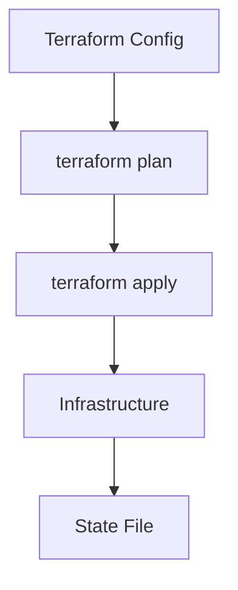

# Overview

Terraform is an open-source tool for provisioning and managing infrastructure as code, supporting multiple cloud providers with declarative configuration.

# Detailed Explanation

Uses HCL (HashiCorp Configuration Language) to define resources. Workflow: Write config, plan, apply. Manages state for tracking changes.

Key concepts: Providers, Resources, Modules, State.



# Real-world Examples & Use Cases

- Provisioning AWS EC2 instances and VPCs.
- Managing Kubernetes clusters on GCP.
- Version-controlled infrastructure changes.

# Code Examples

Basic Terraform config:

```hcl
provider "aws" {
  region = "us-east-1"
}

resource "aws_instance" "example" {
  ami           = "ami-0c55b159cbfafe1d0"
  instance_type = "t2.micro"
}
```

Run commands:

```bash
terraform init
terraform plan
terraform apply
```

# References

- [Terraform Documentation](https://www.terraform.io/docs/)
- [Terraform AWS Provider](https://registry.terraform.io/providers/hashicorp/aws/latest)

# Github-README Links & Related Topics

- [DevOps Infrastructure as Code](./devops-infrastructure-as-code/README.md)
- [Cloud Deployment Strategies](./cloud-deployment-strategies/README.md)
- [Kubernetes Orchestration](./kubernetes-orchestration/README.md)