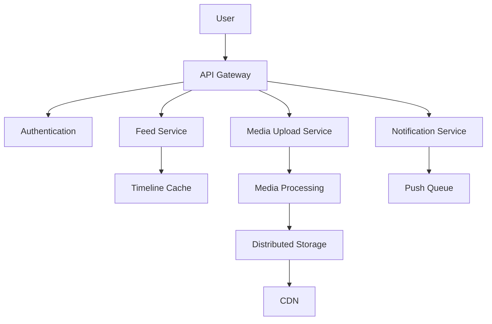

# Instagram System Design

## Overview

Instagram is a photo and video-sharing social networking service with over a billion users. This design focuses on handling massive media uploads, real-time feeds, and user interactions at scale.

## Detailed Explanation

### High-Level Architecture



### Key Components

- **Feed Generation**: Personalized timelines using algorithms.
- **Media Storage**: Efficient storage and delivery of images/videos.
- **Real-time Interactions**: Likes, comments, follows.
- **Search and Discovery**: Hashtags, location-based search.

### Data Models

- **Post**: ID, user, media URLs, caption, timestamp, likes, comments.
- **User**: ID, username, followers, following.
- **Relationship**: Follower-followee graph.

### Scalability

- Sharded databases.
- Caching layers.
- Asynchronous processing.

## Real-world Examples & Use Cases

- Personalized feeds.
- Stories and reels.
- Influencer marketing.

## Code Examples

### Java for Feed Generation

```java
public List<Post> generateFeed(User user) {
    List<User> following = db.getFollowing(user.getId());
    List<Post> posts = new ArrayList<>();
    for (User u : following) {
        posts.addAll(cache.getRecentPosts(u.getId()));
    }
    return ranker.rank(posts);
}
```

## References

- [Instagram Engineering Blog](https://instagram-engineering.com/)

## Github-README Links & Related Topics

- [System Design Basics](system-design-basics/README.md)
- [Facebook News Feed](facebook-news-feed/README.md)