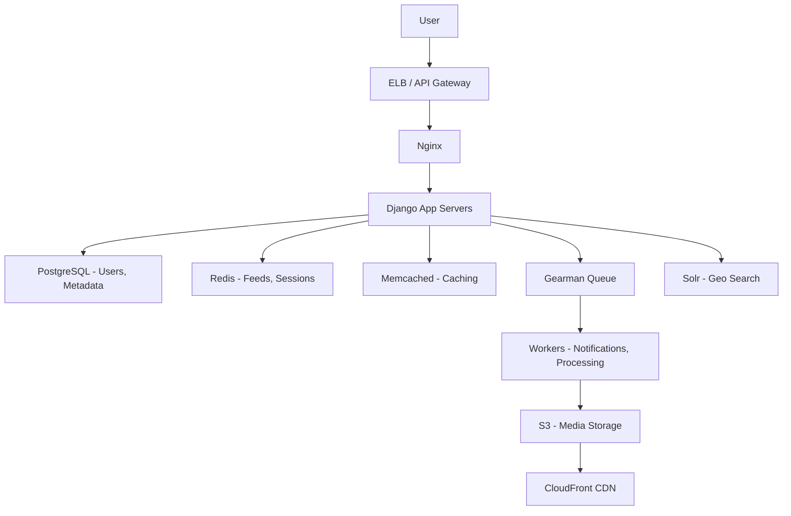
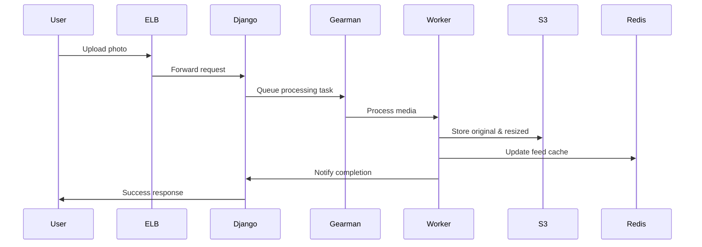
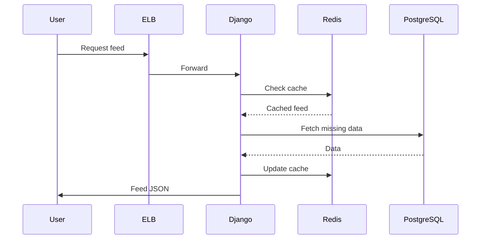

## Overview
Instagram is a photo and video-sharing social networking platform with over 1 billion active users, handling billions of media uploads, personalized feeds, and real-time interactions. This system design covers scalable architecture for media storage, feed generation, notifications, and search, built on AWS with a mix of SQL and NoSQL databases, caching, and asynchronous processing.

## Detailed Explanation
Instagram's architecture emphasizes simplicity, leveraging proven technologies like AWS services, PostgreSQL for relational data, Redis for caching, and S3 for media storage. It supports high write loads for posts and reads for feeds, with fault tolerance through replication and availability zones.

### High-Level Architecture


Key components include:
- **Load Balancing**: Amazon ELB routes traffic to nginx instances.
- **Application Layer**: Django with Gunicorn on EC2 instances.
- **Database**: PostgreSQL for structured data (users, posts, comments), sharded and replicated.
- **Caching**: Redis for feeds and sessions, Memcached for general caching.
- **Storage**: S3 for photos/videos, CloudFront for delivery.
- **Asynchronous Processing**: Gearman for tasks like notifications and media processing.
- **Search**: Apache Solr for location-based search.

### Scalability Strategies
- **Sharding**: Databases sharded by user ID or hash.
- **Replication**: Master-replica setup with streaming replication.
- **Caching**: In-memory caching for hot data.
- **CDN**: Global distribution of media.
- **Async Queues**: Decouple heavy operations.

### Feed Generation
Feeds are personalized using ranking algorithms. For each user, fetch posts from followed users, rank by recency, engagement, and relevance. Use fan-out on write for small followings, pull-based for large ones.

### Media Processing
Uploads are processed asynchronously: resize images, generate thumbnails, extract metadata. Use workers to handle encoding for videos.

## STAR Summary
**Situation**: Instagram grew to 14 million users in a year, storing terabytes of photos with only 3 engineers.  
**Task**: Design a scalable system to handle rapid growth without reinventing wheels.  
**Action**: Adopted AWS stack (EC2, S3, ELB), PostgreSQL with replication, Redis for caching, Gearman for async tasks, and open-source tools. Kept architecture simple, used proven technologies.  
**Result**: Supported 150 million photos, hundreds of instances, with high availability and low cost.

## Journey / Sequence
### User Upload Flow


### Feed Request Flow


## Data Models / Message Formats
### User Table (PostgreSQL)
| Field       | Type          | Description              |
|-------------|---------------|--------------------------|
| id          | BIGINT        | Sharded user ID          |
| username    | VARCHAR(255)  | Unique username          |
| email       | VARCHAR(255)  | User email               |
| created_at  | TIMESTAMP     | Account creation time    |
| followers_count | INT       | Number of followers      |

### Post Table (PostgreSQL)
| Field       | Type          | Description              |
|-------------|---------------|--------------------------|
| id          | BIGINT        | Sharded post ID          |
| user_id     | BIGINT        | Poster user ID           |
| media_url   | TEXT          | S3 URL to media          |
| caption     | TEXT          | Post text                |
| location    | JSON          | Geo data                 |
| created_at  | TIMESTAMP     | Post time                |
| likes_count | INT           | Cached likes count       |

### Feed Cache (Redis)
- Key: `feed:{user_id}`
- Value: Sorted set of post IDs with scores for ranking.

### Notification Message (Gearman)
```json
{
  "type": "like",
  "user_id": 123,
  "post_id": 456,
  "target_user_id": 789
}
```

## Real-world Examples & Use Cases
- **Personalized Feeds**: Algorithm ranks posts by engagement, recency; handles 1B+ users with low latency.
- **Stories and Reels**: Ephemeral content with 24-hour expiry; uses time-based sharding.
- **Influencer Marketing**: High-follower accounts use push-based fan-out to avoid overload.
- **Global Scale**: CDN delivers media to billions of requests daily.
- **Search and Discovery**: Hashtags and location search via Elasticsearch/Solr.

## Code Examples
### Python (Django) Feed Generation
```python
from django.core.cache import cache
from .models import Post, Follow

def get_feed(user_id):
    following_ids = Follow.objects.filter(follower_id=user_id).values_list('following_id', flat=True)
    posts = []
    for fid in following_ids:
        cached_posts = cache.get(f'posts:{fid}')
        if not cached_posts:
            cached_posts = list(Post.objects.filter(user_id=fid).order_by('-created_at')[:50])
            cache.set(f'posts:{fid}', cached_posts, 3600)
        posts.extend(cached_posts)
    # Rank by likes and recency
    posts.sort(key=lambda p: p.likes_count + (p.created_at.timestamp() / 1000), reverse=True)
    return posts[:100]
```

### Java Media Upload Handler
```java
@RestController
public class MediaController {
    @Autowired
    private S3Service s3Service;
    @Autowired
    private QueueService queueService;

    @PostMapping("/upload")
    public String upload(@RequestParam MultipartFile file) {
        String key = UUID.randomUUID().toString();
        s3Service.upload(file, key);
        queueService.sendTask("process_media", Map.of("key", key));
        return "https://cdn.instagram.com/" + key;
    }
}
```

### Redis Feed Cache Update
```python
import redis

r = redis.Redis()

def add_post_to_feeds(post_id, user_id):
    followers = get_followers(user_id)  # Assume function exists
    for follower_id in followers:
        r.zadd(f'feed:{follower_id}', {post_id: post.created_at.timestamp()})
```

## Common Pitfalls & Edge Cases
- **Thundering Herd**: Cache misses on popular posts; use probabilistic early expiration.
- **Hot Keys**: Viral posts overload single shards; implement consistent hashing.
- **Duplicate Detection**: Use perceptual hashing (e.g., pHash) for images.
- **Privacy Leaks**: Encrypt sensitive data; comply with GDPR/CCPA.
- **Edge Case**: Large video uploads; limit size, use resumable uploads.
- **Failure Scenarios**: DB failover; ensure replicas are up-to-date.

## Tools & Libraries
| Component          | Tool/Library          | Purpose                          |
|--------------------|-----------------------|----------------------------------|
| Web Server         | Nginx                 | Reverse proxy, SSL termination   |
| App Framework     | Django (Python)       | Web application                 |
| WSGI Server       | Gunicorn              | Serve Django apps                |
| Database          | PostgreSQL            | Relational data storage          |
| Cache             | Redis, Memcached      | In-memory caching                |
| Storage           | AWS S3                | Media storage                    |
| CDN               | CloudFront            | Global media delivery            |
| Queue             | Gearman               | Asynchronous task processing     |
| Search            | Apache Solr           | Geo and text search              |
| Monitoring        | Munin, Pingdom        | Metrics and alerting             |
| Push Notifications| Pyapns                | iOS notifications                |

## Github-README Links & Related Topics
- [system-design-basics](../system-design-basics/)
- [facebook-system-design](../facebook-system-design/)
- [twitter-system-design](../twitter-system-design/)
- [caching](../caching/)
- [distributed-caching-with-redis](../distributed-caching-with-redis/)
- [aws-architecture-patterns](../aws-architecture-patterns/)
- [event-streaming-with-apache-kafka](../event-streaming-with-apache-kafka/)
- [database-sharding-strategies](../database-sharding-strategies/)

## References
- [What Powers Instagram: Hundreds of Instances, Dozens of Technologies](https://instagram-engineering.tumblr.com/post/13649370142/what-powers-instagram-hundreds-of-instances-dozens-of)
- [Instagram Architecture: 14 Million Users, Terabytes of Photos](https://highscalability.com/blog/2011/12/6/instagram-architecture-14-million-users-terabytes-of-photos.html)
- [Storing Hundreds of Millions of Simple Key-Value Pairs in Redis](https://instagram-engineering.tumblr.com/post/12202313862/storing-hundreds-of-millions-of-simple-key-value-pairs)
- [Sharding & IDs at Instagram](https://instagram-engineering.tumblr.com/post/10853187575/sharding-ids-at-instagram)
- Instagram Engineering Blog: https://instagram-engineering.com/