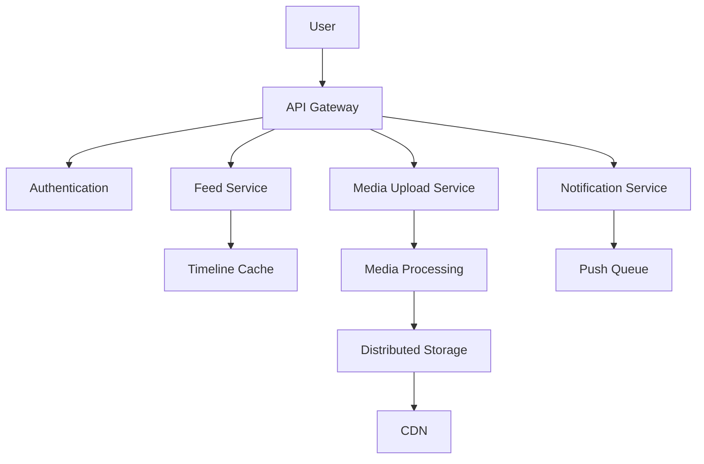
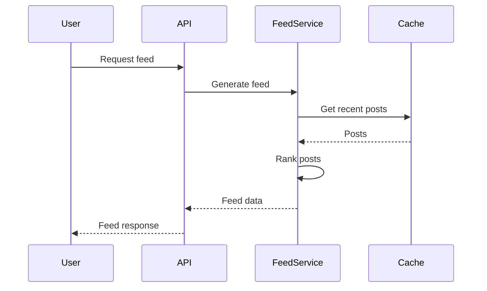

## Overview
Instagram is a photo and video-sharing social networking service with over a billion users. This design focuses on handling massive media uploads, real-time feeds, and user interactions at scale.

## Detailed Explanation
### High-Level Architecture


### Key Components
- **Feed Generation**: Personalized timelines using algorithms.
- **Media Storage**: Efficient storage and delivery of images/videos.
- **Real-time Interactions**: Likes, comments, follows.
- **Search and Discovery**: Hashtags, location-based search.

### Scalability
- Sharded databases.
- Caching layers.
- Asynchronous processing.

## Real-world Examples & Use Cases
- Personalized feeds.
- Stories and reels.
- Influencer marketing.

## Code Examples
### Java for Feed Generation
```java
import java.util.ArrayList;
import java.util.List;

public class FeedService {
    public List<Post> generateFeed(User user) {
        List<User> following = db.getFollowing(user.getId());
        List<Post> posts = new ArrayList<>();
        for (User u : following) {
            posts.addAll(cache.getRecentPosts(u.getId()));
        }
        return ranker.rank(posts);
    }
}
```

### Media Upload API
```java
@PostMapping("/upload")
public ResponseEntity<String> uploadMedia(@RequestParam("file") MultipartFile file) {
    String url = mediaService.processAndStore(file);
    return ResponseEntity.ok(url);
}
```

## Journey / Sequence


## Data Models / Message Formats
### Post Table
| Field | Type | Description |
|-------|------|-------------|
| id | BIGINT | Unique post ID |
| user_id | BIGINT | User who posted |
| media_url | TEXT | URL to media |
| caption | TEXT | Post caption |
| created_at | TIMESTAMP | Post time |
| likes_count | INT | Number of likes |

### User Table
| Field | Type | Description |
|-------|------|-------------|
| id | BIGINT | Unique user ID |
| username | VARCHAR | Username |
| email | VARCHAR | Email |

## Common Pitfalls & Edge Cases
- **Hot Posts:** Cache invalidation for viral content.
- **Duplicate Content:** Detection algorithms.
- **Privacy:** User data protection.
- **Edge Case:** High-resolution media processing.

## Tools & Libraries
- AWS S3 for storage.
- Redis for caching.
- Kafka for notifications.
- Elasticsearch for search.

## Github-README Links & Related Topics
- [system-design-basics](../system-design-basics/)
- [facebook-news-feed](../facebook-news-feed/)

## References
- Instagram Engineering Blog: https://instagram-engineering.com/