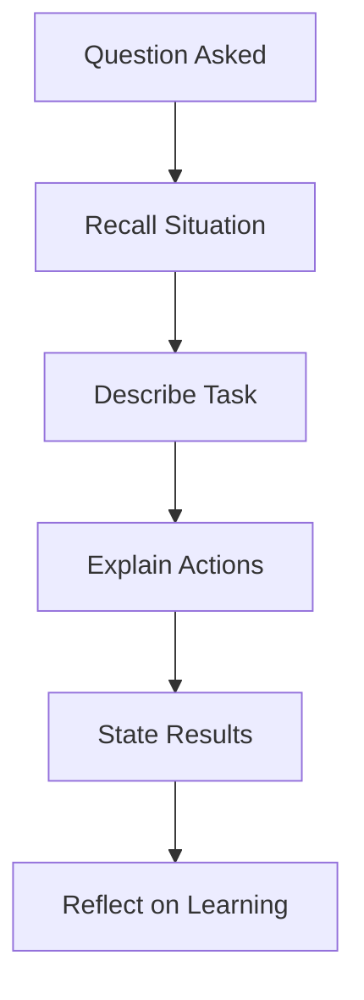

## Overview
Behavioral interviews assess past experiences using the STAR method: Situation, Task, Action, Result. Prepare stories from projects, challenges, leadership, and failures. Focus on MAANG values: impact, collaboration, innovation.

## STAR Summary
**Situation:** Team faced 50% performance degradation in a microservice.  
**Task:** Diagnose and fix within 24 hours.  
**Action:** Used profiling tools, identified bottleneck in DB queries, optimized with indexing.  
**Result:** Restored performance, reduced latency by 60%.

## Detailed Explanation
STAR structure:
- **Situation:** Set the context (1-2 sentences).
- **Task:** Describe responsibility.
- **Action:** Explain steps taken (focus on your role).
- **Result:** Quantify impact.

Common questions: "Tell me about a time you handled conflict," "Describe a failure and what you learned."

Prepare 5-7 stories, practice aloud.

## Real-world Examples & Use Cases
- Leadership: Leading a team through a deadline.
- Problem-solving: Debugging a production issue.
- Collaboration: Working with cross-functional teams.

## Code Examples
N/A (behavioral, not coding).

## Data Models / Message Formats
N/A

## Journey / Sequence

## Common Pitfalls & Edge Cases
- Rambling: Keep concise (1-2 min).
- No result: Always quantify.
- Negative focus: Frame failures positively.

## Tools & Libraries
- Practice: Pramp, LeetCode behavioral prep.

## Github-README Links & Related Topics
Related: [[system-design-interview-cases]]

## References
- https://www.thebalancecareers.com/star-interview-method-2061629
- "Cracking the Code to a Successful Interview" by Evan Pellett.