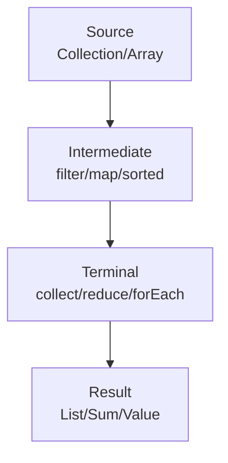

# Java Stream API & Functional Programming

## Overview

The Java Stream API, introduced in Java 8, revolutionizes data processing by providing a functional, declarative way to handle collections. It abstracts away the complexities of iteration, enabling concise, readable, and parallelizable operations. Functional programming in Java emphasizes immutability, higher-order functions, and composition, primarily through lambda expressions and functional interfaces from the `java.util.function` package.

## Detailed Explanation

### Streams: Core Abstraction

A stream represents a sequence of elements that can be processed sequentially or in parallel. Unlike collections, streams do not store data but operate on data from sources like collections, arrays, or generators.

Key properties:
- **Functional Nature**: Operations transform data without side effects.
- **Laziness**: Intermediate operations are deferred until a terminal operation triggers execution.
- **Possibly Infinite**: Supports unbounded sequences with short-circuiting operations.
- **Consumable**: Elements are processed once per pipeline.

Streams are created via methods like `Collection.stream()`, `Arrays.stream()`, or `Stream.of()`.

### Stream Pipeline: Operations and Execution

A stream pipeline consists of:
1. **Source**: Data origin.
2. **Intermediate Operations**: Transform the stream (e.g., `filter`, `map`).
3. **Terminal Operation**: Produce a result (e.g., `collect`, `reduce`).



#### Intermediate Operations
| Type | Examples | Description |
|------|----------|-------------|
| Stateless | `filter(Predicate)`, `map(Function)`, `flatMap(Function)` | No state across elements; process independently. |
| Stateful | `distinct()`, `sorted()`, `limit(long)` | Require buffering or full traversal. |

#### Terminal Operations
- **Reduction**: `reduce(BinaryOperator)`, `collect(Collector)`, `sum()`, `max()`.
- **Side-effecting**: `forEach(Consumer)`, `forEachOrdered(Consumer)`.
- **Short-circuiting**: `findFirst()`, `findAny()`, `anyMatch(Predicate)`.

### Functional Interfaces: Building Blocks

Functional interfaces define contracts for lambda expressions. Key ones include:

| Interface | Method | Use Case |
|-----------|--------|----------|
| `Predicate<T>` | `boolean test(T t)` | Filtering conditions. |
| `Function<T,R>` | `R apply(T t)` | Transformations. |
| `Consumer<T>` | `void accept(T t)` | Side effects (e.g., printing). |
| `Supplier<T>` | `T get()` | Value generation. |
| `BiFunction<T,U,R>` | `R apply(T t, U u)` | Two-argument functions. |

Specialized variants exist for primitives (e.g., `IntPredicate`, `DoubleFunction<R>`).

### Parallelism and Performance

Streams support parallel execution via `parallelStream()`. Operations must be stateless and non-interfering for safe parallelism. Parallel streams leverage fork-join pools for efficiency but may incur overhead for small datasets.

### Reduction Operations

Reductions combine elements into a single result:
- **Simple Reduce**: `stream.reduce(identity, accumulator)`
- **Mutable Reduce**: `stream.collect(supplier, accumulator, combiner)` using `Collector` implementations.

Predefined collectors in `Collectors` class enable grouping, partitioning, and summarizing.

## Real-world Examples & Use Cases

- **Data Filtering**: Extract valid records from a dataset.
- **Transformation Pipelines**: Convert and aggregate data in ETL processes.
- **Parallel Aggregation**: Compute statistics on large datasets efficiently.
- **Event Processing**: Handle streams of events with reactive patterns.
- **Big Data**: Integrate with frameworks like Apache Spark for distributed processing.

## Code Examples

### Basic Filtering and Mapping

```java
List<String> fruits = Arrays.asList("apple", "banana", "cherry", "date");

List<String> longFruits = fruits.stream()
    .filter(fruit -> fruit.length() > 5)
    .map(String::toUpperCase)
    .collect(Collectors.toList());
// Output: [BANANA, CHERRY]
```

### Primitive Streams and Reduction

```java
int[] numbers = {1, 2, 3, 4, 5};

int sum = Arrays.stream(numbers).sum(); // 15
OptionalDouble average = Arrays.stream(numbers).average(); // OptionalDouble[3.0]
```

### Grouping and Collecting

```java
List<Person> people = Arrays.asList(
    new Person("Alice", 25),
    new Person("Bob", 30),
    new Person("Charlie", 25)
);

Map<Integer, List<Person>> byAge = people.stream()
    .collect(Collectors.groupingBy(Person::getAge));
// {25=[Alice, Charlie], 30=[Bob]}
```

### Parallel Stream with Custom Collector

```java
List<Integer> nums = Arrays.asList(1, 2, 3, 4, 5, 6, 7, 8, 9, 10);

int evenSum = nums.parallelStream()
    .filter(n -> n % 2 == 0)
    .mapToInt(Integer::intValue)
    .sum(); // 30
```

### Infinite Stream with Short-Circuiting

```java
OptionalInt firstEven = IntStream.iterate(1, n -> n + 1)
    .filter(n -> n % 2 == 0)
    .findFirst(); // OptionalInt[2]
```

## Common Pitfalls & Edge Cases

- **Lazy Evaluation Confusion**: Intermediate operations don't run until terminal; debug with `peek()`.
- **Stateful Lambdas**: Avoid mutable state in parallel streams; leads to race conditions.
- **Null Pointer Exceptions**: Streams throw NPE on null elements; use `Objects::nonNull` in filters.
- **Performance Overhead**: Parallel streams shine on large datasets; sequential for small ones.
- **Ordering Issues**: Unordered streams may produce non-deterministic results in parallel.
- **Infinite Streams**: Always pair with limit or short-circuiting ops to prevent hangs.

## Tools & Libraries

- **JDK**: Core `java.util.stream` and `java.util.function` packages.
- **Vavr**: Enhances Java with persistent data structures and more FP features.
- **StreamEx**: Adds utilities like `mapToEntry`, `groupRuns` for advanced stream operations.
- **jOOL**: Provides lambda utilities and stream enhancements.

## References

- [Java Stream API Documentation](https://docs.oracle.com/en/java/javase/17/docs/api/java.base/java/util/stream/package-summary.html)
- [Functional Interfaces Guide](https://docs.oracle.com/en/java/javase/17/docs/api/java.base/java/util/function/package-summary.html)
- [Oracle Functional Programming Tutorial](https://docs.oracle.com/javase/tutorial/java/javaOO/lambdaexpressions.html)
- [Baeldung Stream API Guide](https://www.baeldung.com/java-streams)

## Github-README Links & Related Topics

- [Java Lambda Expressions](./java-lambda-expressions)
- [Java Collections](./java-collections)
- [Java Generics](./java-generics)
- [Java Optional Class](./java-optional-class)
- [Java Parallel Streams](./java-parallel-streams)