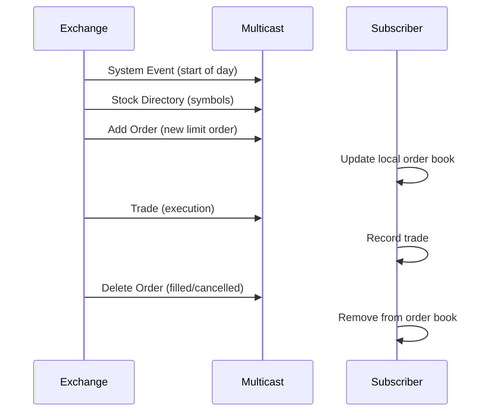

# Overview

The ITCH protocol is a binary message protocol developed by NASDAQ for disseminating market data, including order book updates, trades, and system events. ITCH stands for NASDAQ's "Interface for Trading and Connectivity to Host" and is used for real-time market data feeds from NASDAQ exchanges.

# STAR Summary

**SITUATION**: NASDAQ needed an efficient way to broadcast high-volume market data to subscribers without the overhead of text-based protocols.

**TASK**: Design a binary protocol optimized for low latency and high throughput market data dissemination.

**ACTION**: Created ITCH with fixed-length binary messages, multicast UDP transport, and comprehensive message types for order book depth, trades, and administrative events.

**RESULT**: ITCH enables real-time market data feeds supporting algorithmic trading, market surveillance, and data analytics across global financial markets.

# Detailed Explanation

ITCH is a binary protocol where each message has a fixed format with no delimiters, making parsing extremely fast. Messages are sent via UDP multicast for efficiency. Key components:

- **Message Types**: Over 20 message types including Add Order, Delete Order, Trade, System Event, and Stock Directory.
- **Encoding**: Big-endian binary with fixed field sizes.
- **Transport**: UDP multicast for broadcast efficiency.
- **Versions**: Multiple versions (e.g., 4.1, 5.0) with incremental improvements.

ITCH provides full order book depth, trade executions, and market statistics, essential for HFT and quantitative strategies.

# Real-world Examples & Use Cases

ITCH is used by:

- High-frequency trading firms for order book reconstruction
- Market data vendors for redistribution
- Regulators for market surveillance
- Research institutions for backtesting

Example: A trading algorithm subscribes to ITCH feed, parses Add Order messages to maintain local order book, and executes trades based on price levels.

# Message Formats / Data Models

ITCH messages start with a 1-byte message type, followed by fixed-length fields. Sample Add Order message (type 'A'):

| Field | Size | Description |
|-------|------|-------------|
| Message Type | 1 byte | 'A' |
| Stock Locate | 2 bytes | Stock identifier |
| Tracking Number | 2 bytes | Message sequence |
| Timestamp | 6 bytes | Nanosecond timestamp |
| Order Reference | 8 bytes | Unique order ID |
| Buy/Sell | 1 byte | 'B' or 'S' |
| Shares | 4 bytes | Quantity |
| Stock | 8 bytes | Symbol (padded) |
| Price | 4 bytes | Price in cents |
| Attribution | 4 bytes | MPID |

# Journey of a Trade



# Common Pitfalls & Edge Cases

- **Message Loss**: UDP doesn't guarantee delivery; use sequence numbers for gap detection.
- **Out-of-Order Delivery**: Multicast can reorder packets; buffer and sort by timestamp.
- **Symbol Mapping**: Stock Locate codes change; maintain mapping tables.
- **High Volume**: Process millions of messages/second; optimize parsing.
- **Version Upgrades**: Handle protocol version changes gracefully.

# Tools & Libraries

- **ITCH Parser Libraries**: Open-source parsers in C++, Python (e.g., itch-parser on GitHub).
- **NASDAQ ITCH Viewer**: Official tools for testing.
- **Sample Code (Python)**:

```python
import struct

def parse_add_order(data):
    msg_type, stock_locate, tracking, timestamp, order_ref, side, shares, stock, price, attr = struct.unpack('>cHH6sQc8sIc', data[:40])
    # Process fields
    return {
        'type': msg_type,
        'stock': stock.decode().strip(),
        'side': side,
        'price': price / 100.0,  # Convert cents to dollars
        'shares': shares
    }
```

# Github-README Links & Related Topics

[[fix-protocol]]
[[ouch-protocol]]
[[market-data]]
[[order-book-modeling]]
[[latency-measurement]]