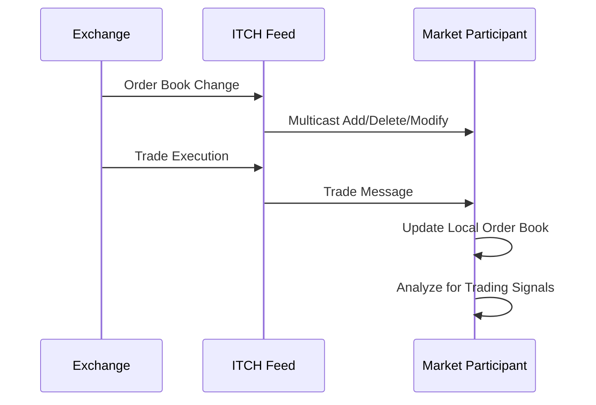

# Overview

ITCH is NASDAQ's protocol for disseminating real-time market data, providing detailed order book updates, trades, and market statistics. It enables efficient distribution of Level 2 quotes and time & sales data to market participants.

# STAR Summary

**SITUATION:** Early electronic markets needed efficient ways to broadcast detailed market data without overwhelming network bandwidth.

**TASK:** Develop a binary protocol for high-speed dissemination of order book and trade information.

**ACTION:** Created ITCH as a multicast UDP protocol with compact binary messages for add/delete/modify order events.

**RESULT:** ITCH became NASDAQ's primary market data protocol, supporting real-time trading and market surveillance with minimal latency.

# Detailed Explanation

ITCH provides real-time market data through multicast UDP feeds:

- **Order Book Updates:** Add, delete, modify orders with full depth visibility
- **Trade Reports:** Executed transactions with buyer/seller anonymity
- **Market Statistics:** Opening/closing prices, volume summaries
- **System Events:** Market open/close, trading halts

Key message types:
- **Add Order (A):** New order added to book
- **Delete Order (D):** Order removed from book
- **Modify Order (U):** Order quantity/price changed
- **Trade (P/E):** Executed trade report
- **System Event (S):** Market status changes

Messages are binary-encoded for efficiency, with fixed field sizes.

# Real-world Examples & Use Cases

ITCH is used by:
- **Market Makers:** Monitor full order book for liquidity provision
- **HFT Algorithms:** Detect order flow patterns for prediction
- **Risk Systems:** Real-time position and exposure monitoring
- **Regulators:** Market surveillance and anomaly detection
- **Data Vendors:** Feed aggregation and redistribution

Example: A market maker uses ITCH to track order book imbalances and adjust quotes accordingly.

# Message Formats / Data Models

ITCH messages have fixed binary structure with big-endian byte order.

## Add Order Message (Type 'A')

| Field | Size | Description |
|-------|------|-------------|
| Message Type | 1 byte | 'A' |
| Stock Locate | 2 bytes | Stock symbol index |
| Tracking Number | 2 bytes | Message tracking |
| Timestamp | 6 bytes | Nanosecond timestamp |
| Order Reference | 8 bytes | Unique order ID |
| Side | 1 byte | 'B' or 'S' |
| Shares | 4 bytes | Quantity |
| Stock | 8 bytes | Symbol (padded) |
| Price | 4 bytes | Price * 10000 |
| Attribution | 4 bytes | MPID |

Sample hex: 41 00 01 00 02 00 00 00 00 00 00 00 01 42 00 00 03 E8 41 41 50 4C 20 20 20 20 00 00 96 00 00 00 00 00

## Trade Message (Type 'P')

| Field | Size | Description |
|-------|------|-------------|
| Message Type | 1 byte | 'P' |
| Stock Locate | 2 bytes | Stock symbol index |
| Tracking Number | 2 bytes | Message tracking |
| Timestamp | 6 bytes | Nanosecond timestamp |
| Order Reference | 8 bytes | Executed order ID |
| Side | 1 byte | 'B' or 'S' |
| Shares | 4 bytes | Executed quantity |
| Stock | 8 bytes | Symbol |
| Price | 4 bytes | Price * 10000 |
| Match Number | 8 bytes | Trade ID |

# Journey of a Trade



# Common Pitfalls & Edge Cases

- **Sequence Gaps:** Missing messages require recovery from snapshots
- **Symbol Mapping:** Stock Locate codes change; maintain current mappings
- **Binary Parsing:** Endianness and alignment critical for performance
- **High Volume:** Handle bursts during market open/close
- **Feed Redundancy:** Multiple feeds for reliability
- **Regulatory Data:** Handle special messages for halts/dividends

# Tools & Libraries

- **ITCH Parsers:** Open-source decoders in C++/Python
- **Market Data Platforms:** Integration with Kafka/Redis
- **Testing Tools:** NASDAQ simulation environments

Sample Python parser:

```python
import struct

def parse_add_order(data):
    msg_type, stock_locate, tracking, timestamp, order_ref, side, shares, stock, price, attribution = struct.unpack('>cHH6sQcI8sIc', data[:42])
    stock = stock.decode().strip()
    price = price / 10000.0
    side = 'Buy' if side == b'B' else 'Sell'
    print(f"Add Order: {stock} {side} {shares}@{price} (Order: {order_ref})")

# Usage with UDP socket
# data = sock.recv(1024)
# if data[0] == ord('A'):
#     parse_add_order(data)
```

# Github-README Links & Related Topics

[FIX Protocol](../fix-protocol/)

[OUCH Protocol](../ouch-protocol/)

[Market Data (overview & dissemination)](../market-data/market-data-overview-dissemination/)

[Order Entry Protocols](../order-entry-protocols/)

[Execution Report](../compliance/execution-report/)

[Journey of a Trade](../lifecycle/journey-of-a-trade/)

# References

- [NASDAQ ITCH Specification](https://www.nasdaqtrader.com/content/technicalsupport/specifications/dataproducts/nqtv-itch-v4_1.pdf)
- [ITCH Protocol Overview](https://www.nasdaq.com/solutions/technology-innovation/trading-protocols)
- [Market Data Best Practices](https://www.fixtrading.org/resources/recommended-practices/)