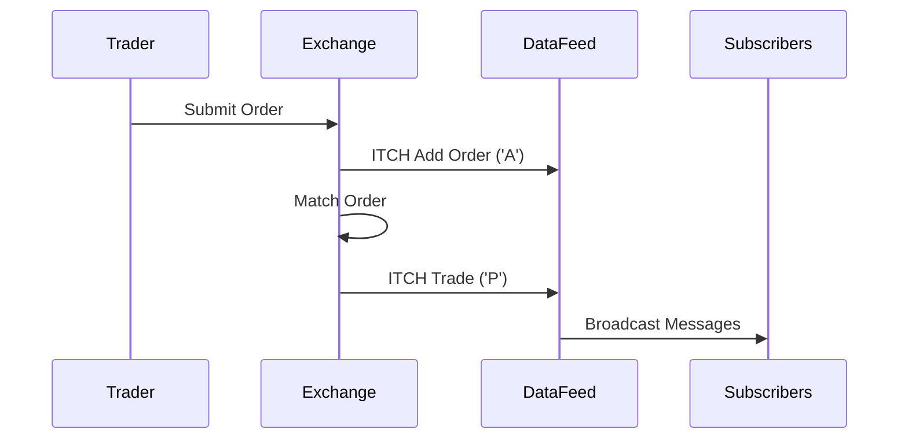

# Overview

The ITCH protocol is a binary message protocol used by NASDAQ for the dissemination of market data. It provides real-time information about changes to the order book, including additions, modifications, and deletions of orders. ITCH is designed for high-throughput, low-latency market data feeds.

# STAR Summary

**SITUATION**: Traditional text-based protocols were inefficient for high-volume market data dissemination.

**TASK**: Create a binary protocol optimized for speed and bandwidth efficiency.

**ACTION**: NASDAQ developed ITCH as a binary format for order book updates.

**RESULT**: ITCH enables real-time market data feeds with minimal latency, supporting high-frequency trading.

# Detailed Explanation

ITCH uses a binary format where each message starts with a message type byte followed by fixed-length fields. It supports messages for system events, stock directory, trading status, order book updates, and trade reports. The protocol is session-based with sequence numbers for reliability.

Key message types:
- 'S': System Event
- 'R': Stock Directory
- 'H': Stock Trading Action
- 'Y': Reg SHO Restriction
- 'L': Market Participant Position
- 'V': MWCB Decline Level
- 'W': MWCB Status
- 'K': IPO Quoting Period Update
- 'J': LULD Auction Collar
- 'h': Operational Halt
- 'A': Add Order
- 'F': Add Order with MPID
- 'E': Order Executed
- 'C': Order Executed with Price
- 'X': Order Cancel
- 'D': Order Delete
- 'U': Order Replace
- 'P': Trade
- 'Q': Cross Trade
- 'B': Broken Trade
- 'I': NOII

# Real-world Examples & Use Cases

- **Order Book Updates**: When a new limit order is added, an 'A' message is sent with order details.
- **Trade Execution**: 'P' messages report executed trades with price and volume.
- **Market Halts**: 'h' messages indicate trading halts for specific stocks.

Used by market data vendors and HFT firms for real-time order book reconstruction.

# Message Formats / Data Models

Messages are binary with big-endian byte order. Example Add Order ('A'):

| Field | Type | Length | Description |
|-------|------|--------|-------------|
| Message Type | char | 1 | 'A' |
| Stock Locate | uint16 | 2 | Stock symbol locator |
| Tracking Number | uint16 | 2 | Tracking number |
| Timestamp | uint48 | 6 | Nanoseconds since midnight |
| Order Reference Number | uint64 | 8 | Unique order ID |
| Buy/Sell Indicator | char | 1 | 'B' or 'S' |
| Shares | uint32 | 4 | Number of shares |
| Stock | char[8] | 8 | Stock symbol |
| Price | uint32 | 4 | Price (4 decimal places) |

# Journey of a Trade



# Common Pitfalls & Edge Cases

- **Binary Parsing**: Requires careful handling of endianness and field alignment.
- **High Volume**: Messages arrive at rates of millions per second; efficient processing is critical.
- **Sequence Gaps**: Missing messages can lead to incorrect order book state; use snapshots for recovery.
- **Symbol Changes**: Handle stock splits, mergers via directory messages.

# Tools & Libraries

- **NASDAQ ITCH Specs**: Official specifications available from NASDAQ.
- **Open-source Parsers**: Libraries in Python, C++ for parsing ITCH feeds. Example Python snippet:

```python
import struct

def parse_add_order(data):
    msg_type, stock_locate, tracking, timestamp, ref_num, side, shares, stock, price = struct.unpack('>cHHQHQ8sI', data)
    # Process fields
```

- **Market Data Platforms**: Tools like Bloomberg Terminal consume ITCH feeds.

# Github-README Links & Related Topics

- [FIX Protocol](../fix-protocol/README.md)
- [OUCH Protocol](../ouch-protocol/README.md)
- [Market Data](../market-data/README.md)

# References

- [NASDAQ ITCH Specification](https://www.nasdaqtrader.com/content/technicalsupport/specifications/dataproducts/itch4.1.pdf)
- [ITCH Protocol Overview](https://en.wikipedia.org/wiki/ITCH)