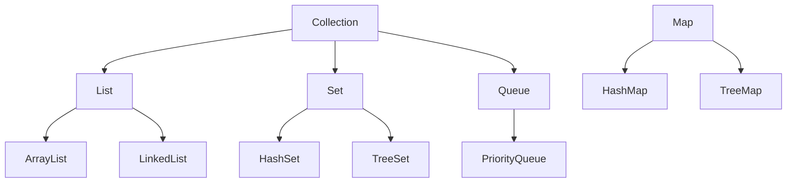

# Java Collections

## Overview

The Java Collections Framework provides a unified architecture for storing and manipulating groups of objects. It includes interfaces, implementations, and algorithms that enable efficient data handling, making it a cornerstone of Java programming for managing collections of data.

## Detailed Explanation

The framework is built around core interfaces that define different types of collections, each with specific characteristics and use cases.

### Core Interfaces

- **Collection**: Root interface for collections that can contain objects.
- **List**: Ordered collection that allows duplicates.
- **Set**: Collection that does not allow duplicates.
- **Map**: Collection of key-value pairs.
- **Queue**: Collection designed for holding elements prior to processing.

### Common Implementations

| Interface | Implementation | Description | Time Complexity |
|-----------|----------------|-------------|-----------------|
| List | ArrayList | Resizable array | O(1) access, O(n) insert/remove |
| List | LinkedList | Doubly-linked list | O(n) access, O(1) insert/remove at ends |
| Set | HashSet | Hash table based | O(1) operations |
| Set | TreeSet | Red-black tree based | O(log n) operations |
| Map | HashMap | Hash table based | O(1) operations |
| Map | TreeMap | Red-black tree based | O(log n) operations |
| Queue | PriorityQueue | Priority heap based | O(log n) operations |

### Key Features

- **Generics**: Type-safe collections since Java 5.
- **Iterators**: Unified way to traverse collections.
- **Algorithms**: Utility methods for sorting, searching, etc.
- **Concurrency**: Thread-safe implementations like ConcurrentHashMap.



## Real-world Examples & Use Cases

- **ArrayList**: Storing a list of user inputs or dynamic arrays.
- **HashMap**: Caching data with key lookups, like user sessions.
- **HashSet**: Ensuring uniqueness, such as in deduplication tasks.
- **TreeSet**: Maintaining sorted collections, like leaderboards.
- **PriorityQueue**: Task scheduling based on priority.

## Code Examples

### Using ArrayList

```java
import java.util.ArrayList;
import java.util.List;

List<String> fruits = new ArrayList<>();
fruits.add("Apple");
fruits.add("Banana");
System.out.println(fruits.get(0)); // Apple
fruits.remove("Banana");
```

### Using HashMap

```java
import java.util.HashMap;
import java.util.Map;

Map<String, Integer> ages = new HashMap<>();
ages.put("Alice", 25);
ages.put("Bob", 30);
System.out.println(ages.get("Alice")); // 25
```

### Iterating with Iterator

```java
import java.util.Set;
import java.util.HashSet;
import java.util.Iterator;

Set<String> languages = new HashSet<>();
languages.add("Java");
languages.add("Python");

Iterator<String> iterator = languages.iterator();
while (iterator.hasNext()) {
    System.out.println(iterator.next());
}
```

### Sorting a List

```java
import java.util.Collections;
import java.util.List;
import java.util.ArrayList;

List<Integer> numbers = new ArrayList<>();
numbers.add(3);
numbers.add(1);
numbers.add(2);
Collections.sort(numbers);
System.out.println(numbers); // [1, 2, 3]
```

## Common Pitfalls & Edge Cases

- **ConcurrentModificationException**: Modifying collection during iteration without proper synchronization.
- **Null Values**: HashMap allows null keys/values, but TreeMap does not.
- **Performance**: Choosing wrong implementation for frequent operations.
- **Memory Leaks**: Holding references in collections longer than needed.

## Tools & Libraries

- **Java Collections Framework**: Built-in in `java.util` package.
- **Guava**: Enhanced collections from Google.
- **Apache Commons Collections**: Additional utilities.
- **Eclipse Collections**: High-performance alternatives.

## References

- [Oracle Java Collections Tutorial](https://docs.oracle.com/javase/tutorial/collections/)
- [Java Collections API](https://docs.oracle.com/en/java/javase/17/docs/api/java.base/java/util/package-summary.html)
- [Effective Java: Collections](https://www.amazon.com/Effective-Java-Joshua-Bloch/dp/0134685997)

## Github-README Links & Related Topics

- [Java Collections Deep Dive](../java-collections-deep-dive/)
- [Java Generics](../java-generics/)
- [Java Stream API](../java-stream-api-and-functional-programming/)