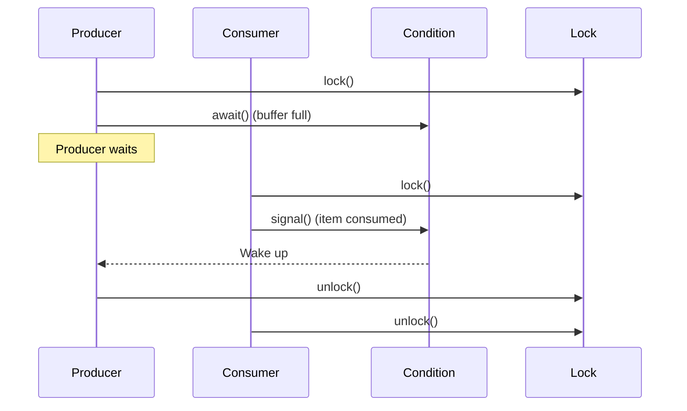

## Overview

The Condition interface in Java provides a means for threads to wait for a condition to become true while holding a lock, and to signal other threads when the condition might have changed. It's part of the `java.util.concurrent.locks` package and is typically used with ReentrantLock to replace the built-in monitor methods (`wait()`, `notify()`, `notifyAll()`).

## Detailed Explanation

A Condition is always associated with a Lock. Unlike the built-in monitor methods, Condition allows for multiple wait-sets per lock, enabling more fine-grained thread coordination.

Key methods:
- `await()`: Causes the current thread to wait until signaled or interrupted.
- `awaitNanos(long nanos)`: Waits for a specified time.
- `awaitUntil(Date deadline)`: Waits until a deadline.
- `signal()`: Wakes up one waiting thread.
- `signalAll()`: Wakes up all waiting threads.

Conditions support interruptible and uninterruptible waits, and can be used to implement producer-consumer patterns more efficiently than using `Object.wait()`.

### Sequence Diagram



## Real-world Examples & Use Cases

1. **Producer-Consumer Pattern**: Coordinating producers and consumers in a bounded buffer.
2. **Thread-Safe Queues**: Implementing blocking queues with fine-grained control.
3. **Custom Synchronizers**: Building complex synchronization primitives.
4. **Resource Pools**: Managing connection pools with wait/notify semantics.

## Code Examples

### Producer-Consumer with Condition

```java
import java.util.concurrent.locks.Condition;
import java.util.concurrent.locks.Lock;
import java.util.concurrent.locks.ReentrantLock;

public class BoundedBuffer {
    private final Lock lock = new ReentrantLock();
    private final Condition notFull = lock.newCondition();
    private final Condition notEmpty = lock.newCondition();
    private final Object[] items = new Object[100];
    private int putptr, takeptr, count;

    public void put(Object x) throws InterruptedException {
        lock.lock();
        try {
            while (count == items.length)
                notFull.await();
            items[putptr] = x;
            if (++putptr == items.length) putptr = 0;
            ++count;
            notEmpty.signal();
        } finally {
            lock.unlock();
        }
    }

    public Object take() throws InterruptedException {
        lock.lock();
        try {
            while (count == 0)
                notEmpty.await();
            Object x = items[takeptr];
            if (++takeptr == items.length) takeptr = 0;
            --count;
            notFull.signal();
            return x;
        } finally {
            lock.unlock();
        }
    }
}
```

### Timed Wait Example

```java
import java.util.concurrent.locks.Condition;
import java.util.concurrent.locks.Lock;
import java.util.concurrent.locks.ReentrantLock;
import java.util.concurrent.TimeUnit;

public class TimedConditionExample {
    private final Lock lock = new ReentrantLock();
    private final Condition condition = lock.newCondition();
    private boolean ready = false;

    public void waitForReady(long timeout, TimeUnit unit) throws InterruptedException {
        lock.lock();
        try {
            while (!ready) {
                if (condition.await(timeout, unit) <= 0) {
                    // Timeout occurred
                    break;
                }
            }
        } finally {
            lock.unlock();
        }
    }

    public void makeReady() {
        lock.lock();
        try {
            ready = true;
            condition.signalAll();
        } finally {
            lock.unlock();
        }
    }
}
```

## Common Pitfalls & Edge Cases

- **Lock Ownership**: Always acquire the lock before calling condition methods.
- **Spurious Wakeups**: Always check the condition in a loop after await().
- **Interrupt Handling**: Await methods can throw InterruptedException.
- **Multiple Conditions**: Use separate Condition objects for different wait conditions on the same lock.

## Tools & Libraries

- **JDK**: Built-in `java.util.concurrent.locks.Condition`
- **Testing**: Use `java.util.concurrent.CountDownLatch` for simpler coordination in tests

## References

- [Oracle Java Documentation: Condition](https://docs.oracle.com/javase/8/docs/api/java/util/concurrent/locks/Condition.html)
- [Java Concurrency in Practice - Chapter 14](https://www.amazon.com/Java-Concurrency-Practice-Brian-Goetz/dp/0321349601)

## Github-README Links & Related Topics

- [Java ReentrantLock](./java-reentrantlock/README.md)
- [Java Wait Notify](./java-wait-notify/README.md)
- [Multithreading & Concurrency in Java](./multithreading-and-concurrency-in-java/README.md)