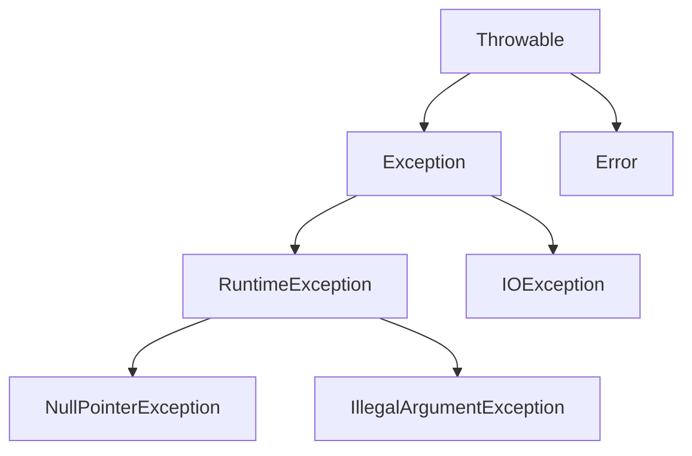

# Java Exception Handling

## Overview

Exception handling in Java is a mechanism to handle runtime errors, allowing programs to continue execution or fail gracefully. It uses try-catch-finally blocks and the throw keyword to manage exceptional conditions.

## Detailed Explanation

Java exceptions are objects that represent errors occurring during program execution. The exception hierarchy starts with `Throwable`, which has two main subclasses: `Exception` and `Error`. Exceptions are further divided into checked exceptions (must be handled or declared) and unchecked exceptions (RuntimeException and its subclasses).

### Exception Hierarchy



### Key Concepts

- **Try-Catch Block**: Code that might throw an exception is placed in try, and handling in catch.
- **Finally Block**: Executes regardless of exception occurrence, often for cleanup.
- **Throw**: Explicitly throw an exception.
- **Throws**: Declare exceptions a method can throw.

## Real-world Examples & Use Cases

- **File Operations**: Handling `FileNotFoundException` when reading files.
- **Network Connections**: Managing `IOException` for socket failures.
- **Database Transactions**: Catching `SQLException` for query errors.
- **User Input Validation**: Throwing `IllegalArgumentException` for invalid data.

## Code Examples

### Basic Exception Handling

```java
public class Example {
    public static void main(String[] args) {
        try {
            int result = divide(10, 0);
            System.out.println("Result: " + result);
        } catch (ArithmeticException e) {
            System.out.println("Error: " + e.getMessage());
        } finally {
            System.out.println("Cleanup code here");
        }
    }

    public static int divide(int a, int b) {
        return a / b;
    }
}
```

### Custom Exception

```java
class InvalidAgeException extends Exception {
    public InvalidAgeException(String message) {
        super(message);
    }
}

public class Person {
    private int age;

    public void setAge(int age) throws InvalidAgeException {
        if (age < 0) {
            throw new InvalidAgeException("Age cannot be negative");
        }
        this.age = age;
    }
}
```

### Multiple Catch Blocks

```java
try {
    // code that can throw multiple exceptions
} catch (IOException e) {
    // handle IO exception
} catch (SQLException e) {
    // handle SQL exception
} catch (Exception e) {
    // handle any other exception
}
```

## Common Pitfalls & Edge Cases

- **Swallowing Exceptions**: Catching exceptions without proper handling or logging can hide bugs.
- **Overusing Checked Exceptions**: Makes APIs cumbersome; prefer unchecked exceptions for programming errors.
- **Resource Leaks**: Forgetting to close resources; always use try-with-resources for AutoCloseable.
- **Exception Chaining**: Use `initCause()` to preserve original exception information.
- **Performance Impact**: Throwing exceptions is expensive; reserve for truly exceptional cases.
- **Edge Case**: Exceptions in finally blocks can suppress primary exceptions.

## Tools & Libraries

- **Java Standard Library**: Built-in `Throwable`, `Exception`, `RuntimeException` classes.
- **Logging Frameworks**: Log4j, SLF4J for exception logging.
- **Testing**: JUnit's `@Test(expected = ...)` or `assertThrows` for exception testing.
- **Frameworks**: Spring's `@ExceptionHandler` for web exception handling.
- **Monitoring**: Tools like New Relic for exception tracking.

## References

- [Oracle Java Tutorials: Exceptions](https://docs.oracle.com/javase/tutorial/essential/exceptions/)
- [Java Exception Handling Best Practices](https://www.baeldung.com/java-exceptions)

## Github-README Links & Related Topics

- [Java Fundamentals](../java-fundamentals/README.md)
- [JVM Internals & Class Loading](../jvm-internals-and-class-loading/README.md)