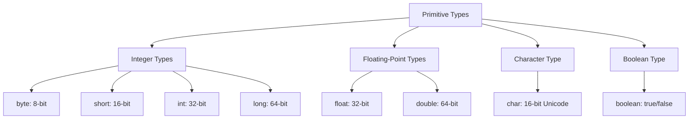

# Java Fundamentals

## Overview

Java Fundamentals cover the core concepts and building blocks of the Java programming language. This includes basic syntax, data types, control structures, object-oriented principles, and essential language features that form the foundation for all Java development.

## Detailed Explanation

### Basic Syntax and Structure

Java programs are organized into classes and methods. Every Java application must have a `main` method as the entry point.

```java
public class HelloWorld {
    public static void main(String[] args) {
        System.out.println("Hello, World!");
    }
}
```

#### Key Elements:
- **Package Declaration**: Organizes classes into namespaces
- **Import Statements**: Brings classes from other packages into scope
- **Class Declaration**: Defines a blueprint for objects
- **Method Declaration**: Defines executable code blocks

### Data Types

Java has two categories of data types: primitive and reference.

#### Primitive Data Types



#### Reference Data Types

- **Classes**: User-defined types
- **Interfaces**: Abstract contracts
- **Arrays**: Fixed-size collections of same type
- **Enums**: Special classes for constants

### Variables and Constants

```java
// Variable declarations
int age = 25;
String name = "John Doe";
final double PI = 3.14159; // Constant

// Type inference (Java 10+)
var message = "Hello"; // Inferred as String
```

### Operators

Java supports various operators for arithmetic, comparison, logical, and assignment operations.

#### Arithmetic Operators
```java
int a = 10, b = 3;
int sum = a + b;        // 13
int difference = a - b; // 7
int product = a * b;    // 30
int quotient = a / b;   // 3
int remainder = a % b;  // 1
```

#### Comparison and Logical Operators
```java
boolean isEqual = (a == b);     // false
boolean isGreater = (a > b);    // true
boolean andResult = (a > 5 && b < 5); // true
boolean orResult = (a < 5 || b < 5);  // true
```

### Control Structures

#### Conditional Statements

```java
// If-else statement
if (age >= 18) {
    System.out.println("Adult");
} else {
    System.out.println("Minor");
}

// Switch expression (Java 14+)
String dayType = switch (day) {
    case "Monday", "Tuesday", "Wednesday", "Thursday", "Friday" -> "Weekday";
    case "Saturday", "Sunday" -> "Weekend";
    default -> "Invalid day";
};
```

#### Loops

```java
// For loop
for (int i = 0; i < 5; i++) {
    System.out.println("Count: " + i);
}

// Enhanced for loop
int[] numbers = {1, 2, 3, 4, 5};
for (int num : numbers) {
    System.out.println(num);
}

// While loop
int counter = 0;
while (counter < 3) {
    System.out.println("Counter: " + counter);
    counter++;
}

// Do-while loop
do {
    System.out.println("Executed at least once");
} while (false);
```

### Methods

Methods are blocks of code that perform specific tasks.

```java
// Method with parameters and return type
public static int addNumbers(int a, int b) {
    return a + b;
}

// Method overloading
public static double addNumbers(double a, double b) {
    return a + b;
}

// Varargs method
public static int sum(int... numbers) {
    int total = 0;
    for (int num : numbers) {
        total += num;
    }
    return total;
}
```

### Arrays

Arrays are fixed-size, homogeneous data structures.

```java
// Array declaration and initialization
int[] numbers = new int[5];
int[] primes = {2, 3, 5, 7, 11};

// Multidimensional arrays
int[][] matrix = new int[3][3];
int[][] pascalTriangle = {
    {1},
    {1, 1},
    {1, 2, 1}
};
```

### Strings

Strings are immutable objects in Java.

```java
// String creation
String greeting = "Hello";
String name = new String("World");

// String methods
String fullGreeting = greeting + " " + name; // "Hello World"
int length = greeting.length(); // 5
boolean startsWithH = greeting.startsWith("H"); // true
String upperCase = greeting.toUpperCase(); // "HELLO"
```

### Exception Handling

Java uses try-catch blocks for exception handling.

```java
try {
    int result = divide(10, 0);
    System.out.println("Result: " + result);
} catch (ArithmeticException e) {
    System.out.println("Cannot divide by zero: " + e.getMessage());
} finally {
    System.out.println("This always executes");
}

public static int divide(int a, int b) throws ArithmeticException {
    if (b == 0) {
        throw new ArithmeticException("Division by zero");
    }
    return a / b;
}
```

### Input/Output

Basic console I/O using Scanner.

```java
import java.util.Scanner;

public class ConsoleIO {
    public static void main(String[] args) {
        Scanner scanner = new Scanner(System.in);
        
        System.out.print("Enter your name: ");
        String name = scanner.nextLine();
        
        System.out.print("Enter your age: ");
        int age = scanner.nextInt();
        
        System.out.println("Hello " + name + ", you are " + age + " years old!");
        
        scanner.close();
    }
}
```

## Real-world Examples & Use Cases

1. **Calculator Application**: Using arithmetic operators and control structures
2. **Student Grade Management**: Arrays and conditional statements
3. **Bank Account System**: Classes, methods, and encapsulation
4. **File Processing**: I/O operations and exception handling
5. **Command-line Tools**: Console input/output and argument parsing
6. **Data Validation**: String manipulation and regular expressions
7. **Configuration Management**: Properties files and environment variables

## Code Examples

### Complete Calculator Class

```java
public class Calculator {
    public static void main(String[] args) {
        double num1 = 10.5;
        double num2 = 3.2;
        char operator = '+';
        
        double result = calculate(num1, num2, operator);
        System.out.println(num1 + " " + operator + " " + num2 + " = " + result);
    }
    
    public static double calculate(double a, double b, char operator) {
        return switch (operator) {
            case '+' -> a + b;
            case '-' -> a - b;
            case '*' -> a * b;
            case '/' -> {
                if (b == 0) {
                    throw new ArithmeticException("Division by zero");
                }
                yield a / b;
            }
            default -> throw new IllegalArgumentException("Invalid operator: " + operator);
        };
    }
}
```

### Student Grade Processor

```java
import java.util.Scanner;

public class GradeProcessor {
    public static void main(String[] args) {
        Scanner scanner = new Scanner(System.in);
        
        System.out.print("Enter number of students: ");
        int numStudents = scanner.nextInt();
        
        double[] grades = new double[numStudents];
        
        // Input grades
        for (int i = 0; i < numStudents; i++) {
            System.out.print("Enter grade for student " + (i + 1) + ": ");
            grades[i] = scanner.nextDouble();
        }
        
        // Calculate average
        double sum = 0;
        for (double grade : grades) {
            sum += grade;
        }
        double average = sum / numStudents;
        
        // Find highest and lowest
        double highest = grades[0];
        double lowest = grades[0];
        for (double grade : grades) {
            if (grade > highest) highest = grade;
            if (grade < lowest) lowest = grade;
        }
        
        // Display results
        System.out.println("Average grade: " + average);
        System.out.println("Highest grade: " + highest);
        System.out.println("Lowest grade: " + lowest);
        
        scanner.close();
    }
}
```

### Simple Bank Account

```java
public class BankAccount {
    private String accountNumber;
    private String accountHolder;
    private double balance;
    
    public BankAccount(String accountNumber, String accountHolder) {
        this.accountNumber = accountNumber;
        this.accountHolder = accountHolder;
        this.balance = 0.0;
    }
    
    public void deposit(double amount) {
        if (amount > 0) {
            balance += amount;
            System.out.println("Deposited $" + amount + ". New balance: $" + balance);
        } else {
            System.out.println("Invalid deposit amount");
        }
    }
    
    public void withdraw(double amount) {
        if (amount > 0 && amount <= balance) {
            balance -= amount;
            System.out.println("Withdrew $" + amount + ". New balance: $" + balance);
        } else {
            System.out.println("Invalid withdrawal amount or insufficient funds");
        }
    }
    
    public double getBalance() {
        return balance;
    }
    
    public String getAccountInfo() {
        return "Account: " + accountNumber + ", Holder: " + accountHolder + ", Balance: $" + balance;
    }
    
    public static void main(String[] args) {
        BankAccount account = new BankAccount("123456789", "John Doe");
        account.deposit(1000);
        account.withdraw(500);
        System.out.println(account.getAccountInfo());
    }
}
```

## References

- [Oracle Java Tutorials - Language Basics](https://docs.oracle.com/javase/tutorial/java/nutsandbolts/index.html)
- [Baeldung Java Fundamentals](https://www.baeldung.com/java-fundamentals)
- [GeeksforGeeks Java Basics](https://www.geeksforgeeks.org/java/)
- [Java Language Specification](https://docs.oracle.com/javase/specs/jls/se21/html/index.html)

## Github-README Links & Related Topics

- [oop-principles-in-java/README.md](../oop-principles-in-java/README.md)
- [jvm-internals-and-class-loading/README.md](../jvm-internals-and-class-loading/README.md)
- [multithreading-and-concurrency-in-java/README.md](../multithreading-and-concurrency-in-java/README.md)
- [collections-and-data-structures/README.md](../collections-and-data-structures/README.md)
