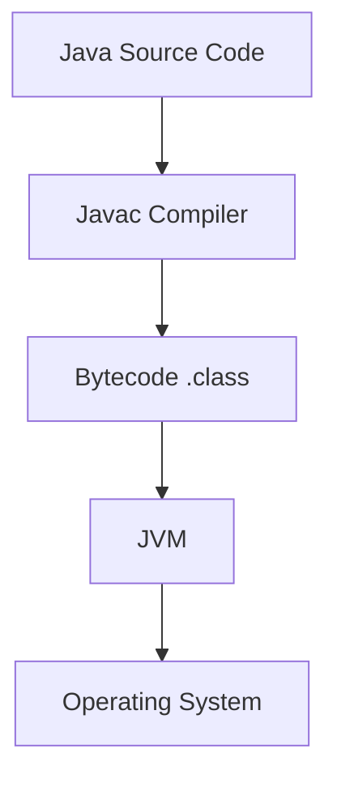

# Java Fundamentals

## Overview

Java is a high-level, object-oriented programming language that enables developers to write code that runs on any platform with a Java Virtual Machine (JVM). It's designed for portability, security, and robustness, making it ideal for enterprise applications, web development, and mobile apps.

## Detailed Explanation

Java fundamentals include basic syntax, data types, operators, control structures, and object-oriented concepts.

### Data Types

- **Primitive Types**: int, long, float, double, boolean, char, byte, short
- **Reference Types**: Objects, arrays, strings

### Variables and Operators

Variables store data, and operators perform operations on them.

### Control Structures

- Conditional: if-else, switch
- Loops: for, while, do-while

### Methods and Classes

Methods are functions in classes, and classes are blueprints for objects.



## Real-world Examples & Use Cases

- Developing Android applications
- Building web servers with Spring Framework
- Creating desktop applications with JavaFX
- Enterprise software for banking and finance

## Code Examples

### Hello World

```java
public class HelloWorld {
    public static void main(String[] args) {
        System.out.println("Hello, World!");
    }
}
```

### Variables and Data Types

```java
public class DataTypesExample {
    public static void main(String[] args) {
        int age = 25;
        double salary = 50000.50;
        boolean isEmployed = true;
        String name = "John Doe";
        System.out.println("Name: " + name + ", Age: " + age + ", Salary: " + salary + ", Employed: " + isEmployed);
    }
}
```

### Control Structures

```java
public class ControlStructures {
    public static void main(String[] args) {
        int number = 10;
        if (number > 0) {
            System.out.println("Positive number");
        } else if (number < 0) {
            System.out.println("Negative number");
        } else {
            System.out.println("Zero");
        }
        for (int i = 0; i < 5; i++) {
            System.out.println("Count: " + i);
        }
    }
}
```

## References

- [Oracle Java Tutorials](https://docs.oracle.com/javase/tutorial/)
- [Java Language Specification](https://docs.oracle.com/javase/specs/jls/se21/html/index.html)

## Github-README Links & Related Topics

- [OOP Principles in Java](../oop-principles-in-java/README.md)
- [JVM Internals & Class Loading](../jvm-internals-class-loading/README.md)
- [Multithreading & Concurrency in Java](../java-multithreading-and-concurrency/README.md)
