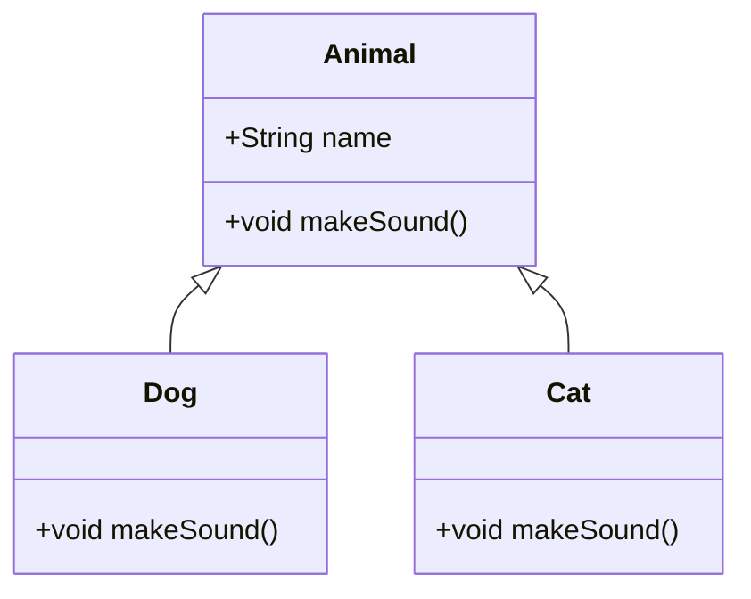

# Java Fundamentals

## Overview

Java Fundamentals encompass the core building blocks of the Java programming language, providing the foundation for writing efficient, object-oriented code. This includes syntax, data types, operators, control structures, and basic object-oriented programming (OOP) concepts. Mastering these fundamentals is essential for developing robust applications, from simple console programs to complex enterprise systems.

## Detailed Explanation

### Data Types and Variables

Java supports two categories of data types: primitive and reference types.

#### Primitive Data Types

Primitive types are the most basic data types, storing values directly in memory.

| Type    | Size    | Range                                      | Default Value | Use Case |
|---------|---------|--------------------------------------------|---------------|----------|
| `byte`  | 1 byte  | -128 to 127                               | 0             | Small integers, file I/O |
| `short` | 2 bytes | -32,768 to 32,767                         | 0             | Memory-constrained environments |
| `int`   | 4 bytes | -2,147,483,648 to 2,147,483,647           | 0             | General-purpose integers |
| `long`  | 8 bytes | -9,223,372,036,854,775,808 to 9,223,372,036,854,775,807 | 0L            | Large numbers, timestamps |
| `float` | 4 bytes | Approximately ±3.40282347E+38F            | 0.0f          | Single-precision floating-point |
| `double`| 8 bytes | Approximately ±1.79769313486231570E+308   | 0.0d          | Double-precision floating-point |
| `char`  | 2 bytes | '\u0000' to '\uffff' (0 to 65,535)        | '\u0000'      | Single Unicode characters |
| `boolean`| 1 bit  | `true` or `false`                         | `false`       | Logical values |

#### Reference Types

Reference types store references to objects rather than the objects themselves. They include classes, interfaces, arrays, and enums.

- **Classes**: Blueprints for objects (e.g., `String`, custom classes).
- **Interfaces**: Contracts for classes to implement.
- **Arrays**: Fixed-size collections of elements.
- **Enums**: Enumerated types for constants.

Example: `String greeting = "Hello";` - `greeting` holds a reference to a `String` object.

#### Variables and Constants

Variables store data and must be declared with a type:

```java
int age = 25;
String name = "Alice";
```

Constants are immutable variables declared with `final`:

```java
final double PI = 3.14159;
```

### Operators

Java provides various operators for performing operations on variables and values.

#### Arithmetic Operators

| Operator | Description | Example |
|----------|-------------|---------|
| `+`      | Addition    | `5 + 3` → 8 |
| `-`      | Subtraction | `5 - 3` → 2 |
| `*`      | Multiplication | `5 * 3` → 15 |
| `/`      | Division    | `5 / 3` → 1 (integer division) |
| `%`      | Modulo      | `5 % 3` → 2 |

#### Relational and Equality Operators

| Operator | Description | Example |
|----------|-------------|---------|
| `==`     | Equal to    | `5 == 3` → false |
| `!=`     | Not equal to| `5 != 3` → true |
| `<`      | Less than   | `5 < 3` → false |
| `>`      | Greater than| `5 > 3` → true |
| `<=`     | Less or equal| `5 <= 3` → false |
| `>=`     | Greater or equal| `5 >= 3` → true |

#### Logical Operators

| Operator | Description | Example |
|----------|-------------|---------|
| `&&`     | Logical AND | `(5 > 3) && (2 < 4)` → true |
| `||`     | Logical OR  | `(5 > 3) || (2 > 4)` → true |
| `!`      | Logical NOT | `!(5 > 3)` → false |

### Control Flow Statements

Control flow statements direct the execution path of a program.

#### Conditional Statements

- **if-else**: Executes code based on a condition.

```java
if (age >= 18) {
    System.out.println("Adult");
} else {
    System.out.println("Minor");
}
```

- **switch**: Selects one of many code blocks to execute.

```java
switch (day) {
    case 1: System.out.println("Monday"); break;
    case 2: System.out.println("Tuesday"); break;
    default: System.out.println("Other day");
}
```

#### Loops

- **for**: Repeats a block of code a specified number of times.

```java
for (int i = 0; i < 5; i++) {
    System.out.println(i);
}
```

- **while**: Repeats while a condition is true.

```java
int i = 0;
while (i < 5) {
    System.out.println(i);
    i++;
}
```

- **do-while**: Executes at least once, then repeats while condition is true.

```java
int i = 0;
do {
    System.out.println(i);
    i++;
} while (i < 5);
```

### Object-Oriented Programming Basics

Java is fundamentally object-oriented. Key concepts include:

- **Classes and Objects**: Classes are blueprints; objects are instances.
- **Encapsulation**: Hiding internal state and requiring all interaction to be performed through an object's methods.
- **Inheritance**: A class can inherit properties and methods from another class.
- **Polymorphism**: Ability of an object to take on many forms.
- **Abstraction**: Hiding complex implementation details and showing only the necessary features.



## Real-world Examples & Use Cases

Java fundamentals power applications in diverse domains:

- **Enterprise Software**: Building scalable backend services with Spring Boot, using classes for business logic and collections for data handling.
- **Android Apps**: Developing mobile applications where OOP models UI components and data persistence.
- **Web Development**: Creating servlets for server-side processing, utilizing control structures for request handling.
- **Data Processing**: Implementing algorithms for big data analytics with Apache Hadoop, leveraging primitive types for performance.
- **IoT and Embedded Systems**: Programming devices with Java's portability, using loops for sensor data processing.

Example: In a banking application, use classes to model accounts, inheritance for different account types (savings, checking), and loops to calculate interest.

## Code Examples

### Basic Hello World

```java
public class HelloWorld {
    public static void main(String[] args) {
        System.out.println("Hello, World!");
    }
}
```

### Array Manipulation

```java
public class ArrayExample {
    public static void main(String[] args) {
        int[] numbers = {1, 2, 3, 4, 5};
        int sum = 0;
        for (int num : numbers) {
            sum += num;
        }
        System.out.println("Sum: " + sum);
    }
}
```

### Simple Class with OOP

```java
public class Employee {
    private String name;
    private double salary;

    public Employee(String name, double salary) {
        this.name = name;
        this.salary = salary;
    }

    public double getSalary() {
        return salary;
    }

    public void setSalary(double salary) {
        this.salary = salary;
    }

    public static void main(String[] args) {
        Employee emp = new Employee("John Doe", 50000);
        System.out.println("Salary: " + emp.getSalary());
    }
}
```

### Inheritance Example

```java
class Animal {
    void makeSound() {
        System.out.println("Animal sound");
    }
}

class Dog extends Animal {
    @Override
    void makeSound() {
        System.out.println("Woof");
    }
}

public class Main {
    public static void main(String[] args) {
        Animal animal = new Dog();
        animal.makeSound(); // Polymorphism: outputs "Woof"
    }
}
```

## Journey / Sequence

A typical learning path for Java Fundamentals:

1. **Syntax and Basic Constructs**: Variables, data types, operators.
2. **Control Flow**: Conditional statements and loops.
3. **Arrays and Collections**: Handling multiple data elements.
4. **OOP Concepts**: Classes, objects, inheritance, polymorphism.
5. **Exception Handling**: Managing errors gracefully.
6. **Advanced Topics**: Generics, annotations, modules.

## Common Pitfalls & Edge Cases

- **Integer Overflow**: Using `int` for large numbers; use `long` or `BigInteger`.
- **Floating-Point Precision**: Avoid exact comparisons; use epsilon for equality.
- **Null Pointer Exceptions**: Always check for null before accessing object methods.
- **Array Index Out of Bounds**: Ensure indices are within array length.
- **Type Casting**: Be cautious with downcasting; use `instanceof` to check.

## Tools & Libraries

- **JDK (Java Development Kit)**: Essential for compiling and running Java code.
- **IDEs**: IntelliJ IDEA, Eclipse, VS Code for development.
- **Build Tools**: Maven, Gradle for project management.
- **Testing**: JUnit for unit testing fundamentals.

## References

- [Oracle Java Tutorials - Language Basics](https://docs.oracle.com/javase/tutorial/java/nutsandbolts/index.html)
- [Oracle Java Tutorials - OOP Concepts](https://docs.oracle.com/javase/tutorial/java/concepts/index.html)
- [Java Language Specification](https://docs.oracle.com/javase/specs/jls/se21/html/index.html)
- [Effective Java by Joshua Bloch](https://www.amazon.com/Effective-Java-Joshua-Bloch/dp/0134685997)

## Github-README Links & Related Topics

- [Java Data Types](../java-data-types/README.md)
- [OOP Principles in Java](../oop-principles-in-java/README.md)
- [Java Collections](../java-collections/README.md)
- [Java Exception Handling](../java-exception-handling/README.md)
- [Java Generics](../java-generics/README.md)
