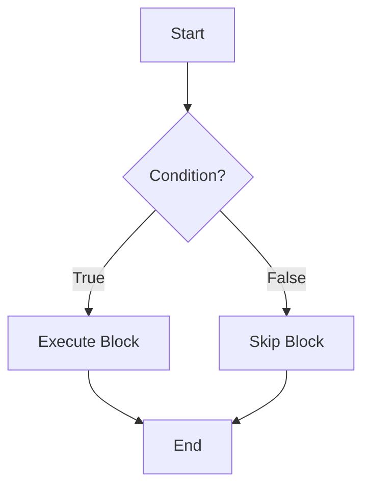

# Java Fundamentals

## Overview

Java Fundamentals form the bedrock of Java programming, covering essential concepts like variables, data types, operators, control flow statements, and basic object-oriented programming (OOP) principles. These elements enable developers to write simple yet effective Java programs, from command-line tools to foundational components of larger applications. Understanding Java Fundamentals is essential for anyone starting with Java, as they provide the syntax and logic building blocks for more advanced topics.

## Detailed Explanation

### Variables

Variables store data values that can change during program execution. In Java, variables must be declared with a data type before use. Naming conventions include starting with a letter, underscore, or dollar sign, and being case-sensitive.

### Primitive Data Types

Java has eight primitive data types:

| Data Type | Size | Range | Default Value | Example |
|-----------|------|-------|---------------|---------|
| `byte` | 8 bits | -128 to 127 | 0 | `byte b = 100;` |
| `short` | 16 bits | -32,768 to 32,767 | 0 | `short s = 1000;` |
| `int` | 32 bits | -2^31 to 2^31-1 | 0 | `int i = 100000;` |
| `long` | 64 bits | -2^63 to 2^63-1 | 0L | `long l = 100000L;` |
| `float` | 32 bits | ~1.4e-45 to 3.4e38 | 0.0f | `float f = 3.14f;` |
| `double` | 64 bits | ~4.9e-324 to 1.8e308 | 0.0d | `double d = 3.14159;` |
| `char` | 16 bits | 0 to 65,535 (Unicode) | '\u0000' | `char c = 'A';` |
| `boolean` | 1 bit | true or false | false | `boolean flag = true;` |

Reference types include classes, interfaces, arrays, and enums, which store references to objects.

### Arrays

Arrays are fixed-size containers for storing multiple values of the same type. Declaration: `int[] arr = new int[5];` or `int[] arr = {1, 2, 3, 4, 5};`.

### Operators

Operators perform operations on variables and values. Categories include:

- **Arithmetic**: `+`, `-`, `*`, `/`, `%`
- **Unary**: `+`, `-`, `++`, `--`, `!`
- **Assignment**: `=`, `+=`, `-=`, etc.
- **Relational**: `==`, `!=`, `<`, `<=`, `>`, `>=`
- **Logical**: `&&`, `||`, `!`
- **Bitwise**: `&`, `|`, `^`, `~`, `<<`, `>>`, `>>>`

### Expressions, Statements, and Blocks

Expressions compute values (e.g., `a + b`). Statements perform actions (e.g., assignment, method calls). Blocks group statements with `{}`.

### Control Flow Statements

Control flow determines the order of execution.

#### Conditional Statements

- `if-else`: Executes code based on condition.
- `switch`: Selects among multiple options.

#### Loops

- `for`: Repeats for a known number of iterations.
- `while`: Repeats while condition is true.
- `do-while`: Executes at least once, then checks condition.

#### Branching

- `break`: Exits loop or switch.
- `continue`: Skips to next iteration.
- `return`: Exits method.



### Classes and Objects

Classes are blueprints for objects. Basic class structure:

```java
public class MyClass {
    // Fields
    private int field;

    // Constructor
    public MyClass(int value) {
        this.field = value;
    }

    // Method
    public void display() {
        System.out.println("Value: " + field);
    }
}
```

Objects are instances created with `new MyClass(10);`.

## Real-world Examples & Use Cases

- **Console Applications**: Building command-line tools for data processing, like a simple file reader or calculator.
- **Utility Classes**: Creating helper classes for string manipulation, date formatting, or basic computations in larger systems.
- **Prototyping**: Quickly sketching out logic for algorithms before integrating into web or mobile apps.
- **Educational Software**: Developing programs to teach programming concepts, such as sorting algorithms or basic simulations.

## Code Examples

### Hello World

```java
public class HelloWorld {
    public static void main(String[] args) {
        System.out.println("Hello, World!");
    }
}
```

### Variables and Data Types

```java
public class DataTypesExample {
    public static void main(String[] args) {
        // Primitive types
        int age = 25;
        double salary = 50000.50;
        char grade = 'A';
        boolean isEmployed = true;

        // Reference type
        String name = "John Doe";

        // Array
        int[] numbers = {1, 2, 3, 4, 5};

        System.out.println("Name: " + name + ", Age: " + age + ", Salary: " + salary);
    }
}
```

### Operators

```java
public class OperatorsExample {
    public static void main(String[] args) {
        int a = 10, b = 5;

        // Arithmetic
        System.out.println("Addition: " + (a + b));
        System.out.println("Modulus: " + (a % b));

        // Relational
        System.out.println("a > b: " + (a > b));

        // Logical
        boolean x = true, y = false;
        System.out.println("x && y: " + (x && y));
    }
}
```

### Control Structures

```java
public class ControlFlowExample {
    public static void main(String[] args) {
        int number = 10;

        // if-else
        if (number > 0) {
            System.out.println("Positive");
        } else {
            System.out.println("Non-positive");
        }

        // for loop
        for (int i = 1; i <= 5; i++) {
            System.out.println("Count: " + i);
        }

        // switch
        switch (number % 2) {
            case 0:
                System.out.println("Even");
                break;
            case 1:
                System.out.println("Odd");
                break;
        }
    }
}
```

### Classes and Objects

```java
public class Person {
    private String name;
    private int age;

    public Person(String name, int age) {
        this.name = name;
        this.age = age;
    }

    public void introduce() {
        System.out.println("Hi, I'm " + name + " and I'm " + age + " years old.");
    }

    public static void main(String[] args) {
        Person person = new Person("Alice", 30);
        person.introduce();
    }
}
```

## Journey / Sequence

A typical learning path for Java Fundamentals:

1. **Install JDK and IDE**: Set up Java Development Kit and an IDE like IntelliJ IDEA or Eclipse.
2. **Learn Syntax**: Start with variables, data types, and basic I/O.
3. **Master Operators and Expressions**: Understand how to manipulate data.
4. **Control Flow**: Practice conditional statements and loops.
5. **OOP Basics**: Define classes, create objects, and use methods.
6. **Practice with Examples**: Build small programs to reinforce concepts.
7. **Debug and Test**: Learn to identify and fix common errors.

## Common Pitfalls & Edge Cases

- **Integer Overflow**: Using `int` for large numbers; use `long` or `BigInteger`.
- **Floating-Point Precision**: `double` may not be exact for decimals; consider `BigDecimal` for financial calculations.
- **Null Pointer Exceptions**: Always check for null before accessing object methods.
- **Array Index Out of Bounds**: Ensure indices are within array length.
- **Case Sensitivity**: Variable names like `age` and `Age` are different.
- **Implicit Casting**: Narrowing conversions (e.g., `double` to `int`) require explicit casting.

## Tools & Libraries

- **JDK (Java Development Kit)**: Essential for compiling and running Java code. Download from [Oracle](https://www.oracle.com/java/technologies/javase-downloads.html).
- **IDEs**: IntelliJ IDEA, Eclipse, VS Code with Java extensions for coding assistance.
- **Build Tools**: Maven or Gradle for project management and dependencies.
- **Libraries**: Standard Java libraries; for fundamentals, focus on `java.lang`, `java.util`.

## References

- [Oracle Java Tutorials - Language Basics](https://docs.oracle.com/javase/tutorial/java/nutsandbolts/index.html)
- [Primitive Data Types](https://docs.oracle.com/javase/tutorial/java/nutsandbolts/datatypes.html)
- [Operators](https://docs.oracle.com/javase/tutorial/java/nutsandbolts/operators.html)
- [Control Flow Statements](https://docs.oracle.com/javase/tutorial/java/nutsandbolts/flow.html)
- [Classes and Objects](https://docs.oracle.com/javase/tutorial/java/javaOO/index.html)
- [Java Language Specification](https://docs.oracle.com/javase/specs/jls/se21/html/index.html)

## Github-README Links & Related Topics

- [Java Data Types](../java-data-types/)
- [Java Operators](../java-operators/)
- [Java OOP Principles](../java-oop-principles/)
- [Java Collections](../java-collections/)
- [Java Exception Handling](../java-exception-handling/)
- [JVM Internals](../java-class-loaders/)
