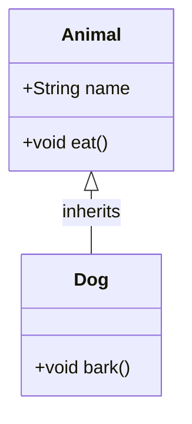

# Java Fundamentals

## Overview

Java Fundamentals encompass the core concepts and building blocks of the Java programming language, including syntax, data types, control structures, object-oriented programming (OOP) principles, and the Java Virtual Machine (JVM). These elements form the foundation for developing robust, platform-independent applications. Java's "write once, run anywhere" philosophy relies on compiling source code to bytecode, which executes on the JVM across operating systems.

## Detailed Explanation

### Key Concepts

- **JVM, JRE, and JDK**: The JVM executes bytecode, the JRE provides runtime environment, and the JDK includes development tools like compilers.
- **Data Types**: Primitive types (int, double, boolean, char) and reference types (objects, arrays).
- **Variables and Constants**: Declaration, initialization, and scope.
- **Operators**: Arithmetic, relational, logical, bitwise, and assignment.
- **Control Structures**: Loops (for, while, do-while), conditionals (if-else, switch), and branching.
- **OOP Principles**: Encapsulation, inheritance, polymorphism, and abstraction.
- **Classes and Objects**: Blueprints and instances, constructors, methods, and fields.
- **Packages and Imports**: Organizing code and managing dependencies.

### Data Types Table

| Type      | Size (bits) | Range/Example                  | Use Case                  |
|-----------|-------------|-------------------------------|---------------------------|
| byte     | 8          | -128 to 127                  | Small integers, file I/O |
| short    | 16         | -32,768 to 32,767            | Memory-efficient ints    |
| int      | 32         | -2^31 to 2^31-1              | General integers         |
| long     | 64         | -2^63 to 2^63-1              | Large numbers            |
| float    | 32         | 1.4e-45 to 3.4e+38           | Floating-point precision |
| double   | 64         | 4.9e-324 to 1.8e+308         | High-precision floats    |
| boolean  | 1          | true/false                   | Logical values           |
| char     | 16         | Unicode characters           | Text handling            |

### OOP Diagram



This diagram illustrates inheritance, where `Dog` extends `Animal`.

## Real-world Examples & Use Cases

- **Web Applications**: Using classes and objects to model user entities in frameworks like Spring.
- **Mobile Apps**: Android development relies on Java fundamentals for UI components and data handling.
- **Enterprise Software**: Inheritance and polymorphism enable scalable architectures in banking systems.
- **Data Processing**: Loops and conditionals process large datasets in batch jobs.

## Code Examples

### Basic Class and Object

```java
public class HelloWorld {
    public static void main(String[] args) {
        System.out.println("Hello, World!");
    }
}
```

### Data Types and Operators

```java
public class DataTypesExample {
    public static void main(String[] args) {
        int a = 10;
        double b = 3.14;
        boolean isJavaFun = true;
        String greeting = "Java Fundamentals";
        
        System.out.println(a + b); // 13.14
        System.out.println(isJavaFun); // true
        System.out.println(greeting.length()); // 18
    }
}
```

### Control Structures

```java
public class ControlExample {
    public static void main(String[] args) {
        int[] numbers = {1, 2, 3, 4, 5};
        
        for (int num : numbers) {
            if (num % 2 == 0) {
                System.out.println(num + " is even");
            } else {
                System.out.println(num + " is odd");
            }
        }
    }
}
```

### OOP Example

```java
class Vehicle {
    String brand;
    
    Vehicle(String brand) {
        this.brand = brand;
    }
    
    void drive() {
        System.out.println(brand + " is driving");
    }
}

class Car extends Vehicle {
    Car(String brand) {
        super(brand);
    }
    
    void honk() {
        System.out.println("Honk!");
    }
}

public class OOPExample {
    public static void main(String[] args) {
        Car myCar = new Car("Toyota");
        myCar.drive(); // Toyota is driving
        myCar.honk();  // Honk!
    }
}
```

## Common Pitfalls & Edge Cases

- **NullPointerException**: Accessing methods on null references; always check for null.
- **Integer Overflow**: Large int values wrap around; use long for big numbers.
- **Floating-Point Precision**: Avoid exact comparisons; use epsilon for equality checks.
- **Scope Issues**: Variables declared in loops may not be accessible outside.
- **Inheritance Pitfalls**: Overriding methods without considering super calls can break functionality.

## References

- [Oracle Java Tutorials](https://docs.oracle.com/javase/tutorial/)
- [Java Language Specification](https://docs.oracle.com/javase/specs/jls/se21/html/index.html)
- [JVM Architecture Overview](https://www.oracle.com/java/technologies/javase/jvm-architecture.html)

## Github-README Links & Related Topics

- [Java OOP Concepts](java/)
- [Java Collections](java-collections-deep-dive/)
- [Java Exception Handling](java-exception-handling/)
- [Java Generics](java-generics/)
- [Java Memory Management](java-memory-management/)