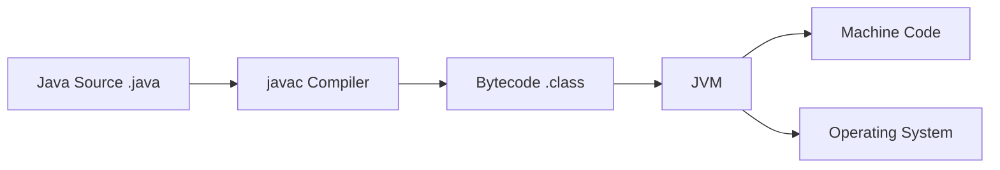

# Overview

Java Fundamentals encompass the essential building blocks of the Java programming language, including syntax, data types, control structures, and basic object-oriented concepts. These fundamentals provide the foundation for writing, compiling, and running Java applications across various platforms.

# Detailed Explanation

### Java Program Structure

Every Java program consists of classes and methods. The `main` method serves as the entry point for execution:

```java
public class MyClass {
    public static void main(String[] args) {
        // Program logic here
    }
}
```

## Compilation Process



### Data Types

Java supports primitive data types and reference types:

- **Primitive types**: `int`, `double`, `boolean`, `char`, `byte`, `short`, `long`, `float`
- **Reference types**: Objects, arrays, strings

| Type | Size | Default Value | Range |
|------|------|---------------|-------|
| byte | 8 bits | 0 | -128 to 127 |
| short | 16 bits | 0 | -32,768 to 32,767 |
| int | 32 bits | 0 | -2^31 to 2^31-1 |
| long | 64 bits | 0L | -2^63 to 2^63-1 |
| float | 32 bits | 0.0f | IEEE 754 |
| double | 64 bits | 0.0d | IEEE 754 |
| char | 16 bits | '\u0000' | 0 to 65,535 |
| boolean | 1 bit | false | true/false |

```java
int age = 25;
double salary = 50000.0;
boolean isActive = true;
String name = "John Doe";
```

### Control Structures

Java provides standard control flow statements:

- Conditional statements: `if-else`, `switch`
- Loops: `for`, `while`, `do-while`

```java
// If-else
if (age >= 18) {
    System.out.println("Adult");
} else {
    System.out.println("Minor");
}

// For loop
for (int i = 0; i < 5; i++) {
    System.out.println(i);
}
```

### Object-Oriented Basics

Java is fundamentally object-oriented:

- **Classes and Objects**: Blueprints and instances
- **Methods**: Functions within classes
- **Constructors**: Special methods for object initialization

```java
class Car {
    String model;
    int year;
    
    Car(String model, int year) {
        this.model = model;
        this.year = year;
    }
    
    void display() {
        System.out.println(model + " " + year);
    }
}

Car myCar = new Car("Toyota", 2020);
myCar.display();
```

### Exception Handling

Java uses try-catch blocks for error handling:

```java
try {
    int result = 10 / 0;
} catch (ArithmeticException e) {
    System.out.println("Division by zero: " + e.getMessage());
}
```

# Journey / Sequence

1. **Source Code Creation**: Write .java files with classes and main method.
2. **Compilation**: Use javac to compile source to bytecode (.class).
3. **Execution**: Run bytecode on JVM using java command.
4. **Runtime**: JVM loads classes, executes instructions, manages memory.
5. **Termination**: Program ends when main method completes or System.exit() called.

# Common Pitfalls & Edge Cases

- **NullPointerException**: Dereferencing null objects.
- **ArrayIndexOutOfBoundsException**: Accessing invalid array indices.
- **ClassCastException**: Invalid type casting.
- **Integer Overflow**: Silent wrap-around for int/long.
- **Floating Point Precision**: Inexact representation of decimal numbers.

# Tools & Libraries

- **JDK (Java Development Kit)**: Compiler, runtime, tools.
- **JRE (Java Runtime Environment)**: Runtime only.
- **IDEs**: Eclipse, IntelliJ IDEA, NetBeans.
- **Build Tools**: Maven, Gradle.
- **Testing**: JUnit, TestNG.

# Real-world Examples & Use Cases

- **Console Applications**: Command-line tools and utilities
- **Web Applications**: Backend services using frameworks like Spring
- **Desktop Applications**: GUI apps with JavaFX or Swing
- **Android Development**: Mobile apps (though with some differences)
- **Enterprise Software**: Large-scale business applications

# Code Examples

### Basic Calculator

```java
import java.util.Scanner;

public class Calculator {
    public static void main(String[] args) {
        Scanner scanner = new Scanner(System.in);
        
        System.out.print("Enter first number: ");
        double num1 = scanner.nextDouble();
        
        System.out.print("Enter operator (+, -, *, /): ");
        char operator = scanner.next().charAt(0);
        
        System.out.print("Enter second number: ");
        double num2 = scanner.nextDouble();
        
        double result = 0;
        
        switch (operator) {
            case '+':
                result = num1 + num2;
                break;
            case '-':
                result = num1 - num2;
                break;
            case '*':
                result = num1 * num2;
                break;
            case '/':
                if (num2 != 0) {
                    result = num1 / num2;
                } else {
                    System.out.println("Cannot divide by zero");
                    return;
                }
                break;
            default:
                System.out.println("Invalid operator");
                return;
        }
        
        System.out.println("Result: " + result);
    }
}
```

### Student Grade Management

```java
import java.util.ArrayList;
import java.util.List;

class Student {
    String name;
    List<Integer> grades;
    
    Student(String name) {
        this.name = name;
        this.grades = new ArrayList<>();
    }
    
    void addGrade(int grade) {
        grades.add(grade);
    }
    
    double getAverage() {
        if (grades.isEmpty()) return 0;
        int sum = 0;
        for (int grade : grades) {
            sum += grade;
        }
        return (double) sum / grades.size();
    }
}

public class GradeManager {
    public static void main(String[] args) {
        Student student = new Student("Alice");
        student.addGrade(85);
        student.addGrade(92);
        student.addGrade(78);
        
        System.out.println("Average grade: " + student.getAverage());
    }
}
```

# References

- [Oracle Java Tutorials - Getting Started](https://docs.oracle.com/javase/tutorial/getStarted/index.html)
- [Java Language Specification](https://docs.oracle.com/javase/specs/jls/se21/html/index.html)
- [GeeksforGeeks Java Fundamentals](https://www.geeksforgeeks.org/java/)

# Github-README Links & Related Topics

- [OOP Principles in Java](../oop-principles-in-java/README.md)
- [JVM Internals & Class Loading](../jvm-internals-class-loading/README.md)
- [Collections & Data Structures](../collections-and-data-structures/README.md)
- [Java Stream API & Functional Programming](../java-stream-api-and-functional-programming/README.md)
