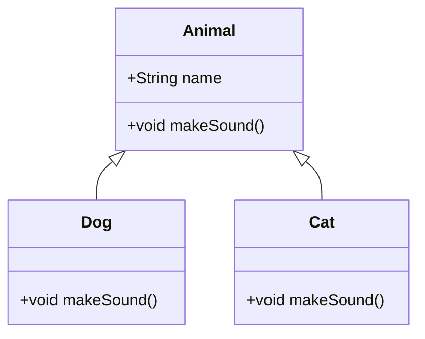

# Overview

Java Fundamentals form the core building blocks of the Java programming language, essential for developing robust, object-oriented applications. This includes basic syntax, data types, operators, control flow statements, object-oriented programming (OOP) concepts such as classes, objects, inheritance, and polymorphism, as well as fundamental exception handling. Mastering these elements enables developers to write efficient, maintainable code that runs on the Java Virtual Machine (JVM), leveraging platform independence and strong typing for enterprise and general-purpose programming.

# Detailed Explanation

## Variables and Data Types

Variables store data values, and Java supports primitive types (e.g., `int`, `double`, `boolean`) for basic values and reference types for objects. Primitive types are stored directly in memory, while reference types point to objects on the heap.

| Type      | Size (bits) | Range/Example                  | Use Case                  |
|-----------|-------------|-------------------------------|---------------------------|
| `byte`   | 8          | -128 to 127                  | Small integers, file I/O |
| `short`  | 16         | -32,768 to 32,767            | Memory-constrained apps  |
| `int`    | 32         | -2^31 to 2^31-1              | General integers         |
| `long`   | 64         | -2^63 to 2^63-1              | Large numbers            |
| `float`  | 32         | 1.4e-45 to 3.4e+38           | Floating-point precision |
| `double` | 64         | 4.9e-324 to 1.8e+308         | High-precision floats    |
| `char`   | 16         | Unicode characters           | Text manipulation        |
| `boolean`| 1          | `true`/`false`               | Logical conditions       |

Arrays are fixed-size collections of the same type, declared as `int[] arr = new int[10];`.

## Operators

Operators perform operations on operands. Java includes arithmetic (`+`, `-`, `*`, `/`, `%`), relational (`==`, `!=`, `<`, `>`), logical (`&&`, `||`, `!`), and assignment (`=`, `+=`) operators. Precedence follows standard rules, with parentheses for clarity.

## Control Flow Statements

Control flow manages execution order: conditional statements like `if-else` and `switch` for decisions, loops like `for`, `while`, and `do-while` for repetition, and branching with `break`, `continue`, and `return`.

## Object-Oriented Programming Concepts

Java is object-oriented, emphasizing encapsulation, inheritance, polymorphism, and abstraction.

- **Classes and Objects**: Classes are blueprints for objects, bundling state (fields) and behavior (methods). Objects are instances created via `new`.
- **Inheritance**: Subclasses inherit from superclasses using `extends`, promoting code reuse.
- **Polymorphism**: Methods can behave differently based on the object type, achieved via method overriding.
- **Encapsulation**: Hiding internal state with access modifiers (`private`, `public`).
- **Abstraction**: Interfaces and abstract classes define contracts without implementation.



This diagram illustrates inheritance, where `Dog` and `Cat` inherit from `Animal` and override `makeSound()`.

## Methods and Constructors

Methods define behaviors, with signatures including return type, name, and parameters. Constructors initialize objects and are called during instantiation.

## Packages

Packages organize classes into namespaces, preventing naming conflicts and aiding modularity.

## Exception Handling

Exceptions handle runtime errors. Use `try-catch-finally` blocks to catch and handle exceptions, or declare them with `throws`. Checked exceptions must be handled or declared, while unchecked (runtime) exceptions do not.

# Real-world Examples & Use Cases

- **E-commerce Application**: Use classes to model `Product` and `Order`, with inheritance for different product types (e.g., `Electronics` extending `Product`). Operators calculate totals, loops iterate over cart items, and exceptions handle invalid payments.
- **Banking System**: Encapsulate account data in a `BankAccount` class with methods for deposits/withdrawals. Polymorphism allows different account types (e.g., `SavingsAccount`) to override interest calculations.
- **Text Processing Tool**: Manipulate strings for parsing user input, using arrays for data storage and control flow for validation logic.
- **Game Development**: OOP models game entities like `Player` and `Enemy`, with inheritance for shared behaviors and exception handling for file loading errors.

# Code Examples

## Hello World
```java
public class HelloWorld {
    public static void main(String[] args) {
        System.out.println("Hello, World!");
    }
}
```

## Class with Methods and Inheritance
```java
class Vehicle {
    String brand;
    
    Vehicle(String brand) {
        this.brand = brand;
    }
    
    void start() {
        System.out.println(brand + " is starting.");
    }
}

class Car extends Vehicle {
    Car(String brand) {
        super(brand);
    }
    
    @Override
    void start() {
        System.out.println(brand + " car is starting with a roar.");
    }
}

public class Main {
    public static void main(String[] args) {
        Vehicle v = new Car("Toyota");
        v.start(); // Polymorphism in action
    }
}
```

## Control Flow and Operators
```java
public class Calculator {
    public static void main(String[] args) {
        int a = 10, b = 5;
        if (a > b) {
            System.out.println("a is greater: " + (a + b)); // Arithmetic operator
        }
        for (int i = 0; i < 3; i++) {
            System.out.println("Loop iteration: " + i);
        }
    }
}
```

## Exception Handling
```java
public class ExceptionExample {
    public static void main(String[] args) {
        try {
            int result = 10 / 0;
        } catch (ArithmeticException e) {
            System.out.println("Error: " + e.getMessage());
        } finally {
            System.out.println("Execution complete.");
        }
    }
}
```

# Common Pitfalls & Edge Cases

- **Null Pointer Exceptions**: Accessing methods on `null` references; always check with `if (obj != null)`.
- **Integer Overflow**: Operations like `int max = Integer.MAX_VALUE + 1;` wrap around; use `long` for large values.
- **String Immutability**: Strings cannot be modified in-place; use `StringBuilder` for concatenation in loops.
- **Access Modifier Misuse**: Overly permissive access can break encapsulation; prefer `private` fields with getters/setters.
- **Array Index Out of Bounds**: Accessing `arr[arr.length]` throws exception; validate indices.
- **Unchecked Exceptions**: Runtime exceptions like `NullPointerException` aren't caught by compiler; handle defensively.

# References

- [Language Basics](https://docs.oracle.com/javase/tutorial/java/nutsandbolts/index.html)
- [Object-Oriented Programming Concepts](https://docs.oracle.com/javase/tutorial/java/concepts/index.html)
- [Classes and Objects](https://docs.oracle.com/javase/tutorial/java/javaOO/index.html)
- [Numbers and Strings](https://docs.oracle.com/javase/tutorial/java/data/index.html)
- [Operators](https://docs.oracle.com/javase/tutorial/java/nutsandbolts/operators.html)
- [Control Flow Statements](https://docs.oracle.com/javase/tutorial/java/nutsandbolts/flow.html)
- [Exceptions](https://docs.oracle.com/javase/tutorial/essential/exceptions/index.html)

# Github-README Links & Related Topics

- [Java Collections Deep Dive](./java-collections-deep-dive/README.md)
- [Java Generics](./java-generics/README.md)
- [Java Annotations](./java-annotations/README.md)
- [Java Reflection](./java-reflection/README.md)
- [Java Exception Handling](./java-exception-handling/README.md) (if exists, otherwise related)
- [OOP Principles in Java](./oop-principles-in-java/README.md)