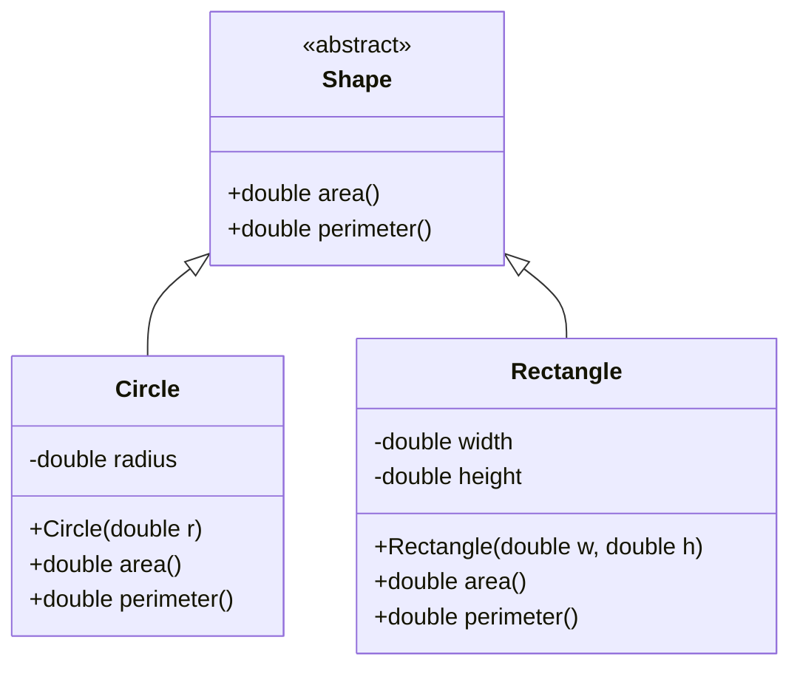

# Overview

Java Fundamentals encompass the core concepts and building blocks of the Java programming language, providing the foundation for writing robust, object-oriented, and platform-independent applications. Key areas include basic syntax, data types, operators, control flow, object-oriented programming (OOP) principles like classes, objects, inheritance, polymorphism, encapsulation, and abstraction, as well as exception handling. These fundamentals enable developers to create efficient, maintainable code that executes on the Java Virtual Machine (JVM), supporting everything from simple scripts to complex enterprise systems.

# Detailed Explanation

## Variables and Data Types

Variables in Java store data values and are declared with a type. Java distinguishes between primitive types, which hold basic values directly in memory, and reference types, which point to objects on the heap.

| Type      | Size (bits) | Range/Example                  | Use Case                  |
|-----------|-------------|-------------------------------|---------------------------|
| `byte`   | 8          | -128 to 127                  | Small integers, binary data |
| `short`  | 16         | -32,768 to 32,767            | Memory-efficient integers |
| `int`    | 32         | -2^31 to 2^31-1              | General-purpose integers  |
| `long`   | 64         | -2^63 to 2^63-1              | Large numbers, timestamps |
| `float`  | 32         | 1.4e-45 to 3.4e+38           | Single-precision floats   |
| `double` | 64         | 4.9e-324 to 1.8e+308         | Double-precision floats   |
| `char`   | 16         | Unicode characters           | Text characters          |
| `boolean`| 1          | `true`/`false`               | Logical flags            |

Reference types include classes, interfaces, and arrays. Arrays are fixed-size collections: `int[] arr = new int[5];`.

## Operators

Operators perform operations on variables and literals. Categories include:
- Arithmetic: `+`, `-`, `*`, `/`, `%`
- Relational: `==`, `!=`, `<`, `<=`, `>`, `>=`
- Logical: `&&`, `||`, `!`
- Assignment: `=`, `+=`, `-=`, etc.
- Bitwise: `&`, `|`, `^`, `~`, `<<`, `>>`
- Ternary: `condition ? trueValue : falseValue`

Operator precedence follows mathematical conventions; use parentheses for clarity.

## Control Flow Statements

Control flow directs program execution:
- Conditional: `if-else`, `switch`
- Loops: `for`, `while`, `do-while`
- Branching: `break`, `continue`, `return`

## Object-Oriented Programming (OOP)

Java's OOP paradigm revolves around four pillars:
- **Encapsulation**: Bundling data and methods, using access modifiers (`private`, `protected`, `public`).
- **Inheritance**: Subclasses extend superclasses with `extends`, enabling code reuse.
- **Polymorphism**: Method overriding and overloading allow different behaviors.
- **Abstraction**: Abstract classes and interfaces define contracts.



This diagram shows abstraction and inheritance, with `Circle` and `Rectangle` implementing `Shape`.

## Methods and Constructors

Methods define behaviors with return types, names, and parameters. Constructors initialize objects and match the class name. Overloading allows multiple methods with the same name but different signatures.

## Packages and Imports

Packages organize classes into namespaces, imported with `import` statements to avoid fully qualified names.

## Exception Handling

Exceptions manage errors. Use `try-catch-finally` for handling, `throw` for raising, and `throws` in method signatures. Checked exceptions require handling; unchecked do not.

# Real-world Examples & Use Cases

- **Web Application**: Model user entities with classes, use inheritance for roles (e.g., `Admin` extends `User`), handle form validations with control flow, and manage database errors with exceptions.
- **Financial Software**: Encapsulate account logic in classes, perform calculations with operators, iterate over transactions with loops, and ensure data integrity with polymorphism.
- **Mobile App Backend**: Use OOP for service layers, handle concurrent requests with threads (fundamentals extend to concurrency), and log errors via exception handling.
- **Data Processing Tool**: Manipulate arrays and collections for batch operations, apply control flow for conditional processing, and abstract common utilities.

# Code Examples

## Basic Variable Declaration and Operations
```java
public class VariablesExample {
    public static void main(String[] args) {
        int age = 25;
        double salary = 50000.0;
        boolean isEmployed = true;
        String name = "John Doe";
        
        System.out.println("Name: " + name + ", Age: " + age + ", Salary: " + salary + ", Employed: " + isEmployed);
    }
}
```

## Class Definition and Inheritance
```java
class Animal {
    String name;
    
    Animal(String name) {
        this.name = name;
    }
    
    void speak() {
        System.out.println("Animal speaks");
    }
}

class Dog extends Animal {
    Dog(String name) {
        super(name);
    }
    
    @Override
    void speak() {
        System.out.println(name + " barks");
    }
}

public class InheritanceExample {
    public static void main(String[] args) {
        Animal dog = new Dog("Buddy");
        dog.speak(); // Outputs: Buddy barks
    }
}
```

## Control Flow with Loops and Conditionals
```java
public class ControlFlowExample {
    public static void main(String[] args) {
        int[] numbers = {1, 2, 3, 4, 5};
        
        for (int num : numbers) {
            if (num % 2 == 0) {
                System.out.println(num + " is even");
            } else {
                System.out.println(num + " is odd");
            }
        }
    }
}
```

## Exception Handling
```java
public class ExceptionHandlingExample {
    public static void main(String[] args) {
        try {
            int result = divide(10, 0);
            System.out.println("Result: " + result);
        } catch (ArithmeticException e) {
            System.out.println("Error: " + e.getMessage());
        } finally {
            System.out.println("Operation completed");
        }
    }
    
    static int divide(int a, int b) throws ArithmeticException {
        return a / b;
    }
}
```

# References

- [Java Language Specification](https://docs.oracle.com/javase/specs/jls/se21/html/index.html)
- [Java Tutorials: Language Basics](https://docs.oracle.com/javase/tutorial/java/nutsandbolts/index.html)
- [OOP Concepts](https://docs.oracle.com/javase/tutorial/java/concepts/index.html)
- [Classes and Objects](https://docs.oracle.com/javase/tutorial/java/javaOO/index.html)
- [Operators](https://docs.oracle.com/javase/tutorial/java/nutsandbolts/operators.html)
- [Control Flow](https://docs.oracle.com/javase/tutorial/java/nutsandbolts/flow.html)
- [Exceptions](https://docs.oracle.com/javase/tutorial/essential/exceptions/index.html)

# Github-README Links & Related Topics

- [Java Collections Deep Dive](./java-collections-deep-dive/README.md)
- [Java Generics](./java-generics/README.md)
- [Java Annotations](./java-annotations/README.md)
- [Java Reflection](./java-reflection/README.md)
- [OOP Principles in Java](./oop-principles-in-java/README.md)
- [Java Exception Handling](./java-exception-handling/README.md)