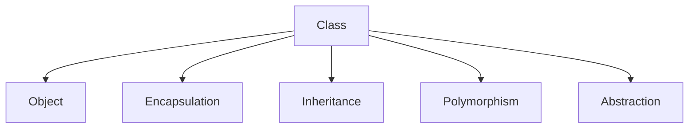

# Java Fundamentals

## Overview

Java Fundamentals encompass the core concepts and building blocks of the Java programming language. This includes syntax, data types, operators, control structures, object-oriented programming principles, and the Java Virtual Machine (JVM) ecosystem. Mastering these fundamentals is essential for developing robust, portable, and efficient Java applications across various domains.

## Detailed Explanation

### Data Types and Variables

Java supports two main categories of data types: primitive and reference types.

| Primitive Type | Size | Range | Example |
|----------------|------|-------|---------|
| `byte` | 8 bits | -128 to 127 | `byte b = 100;` |
| `short` | 16 bits | -32,768 to 32,767 | `short s = 1000;` |
| `int` | 32 bits | -2^31 to 2^31-1 | `int i = 100000;` |
| `long` | 64 bits | -2^63 to 2^63-1 | `long l = 100000L;` |
| `float` | 32 bits | ~1.4e-45 to 3.4e38 | `float f = 3.14f;` |
| `double` | 64 bits | ~4.9e-324 to 1.8e308 | `double d = 3.14159;` |
| `char` | 16 bits | 0 to 65,535 | `char c = 'A';` |
| `boolean` | 1 bit | true/false | `boolean flag = true;` |

Reference types include classes, interfaces, arrays, and strings.

### Operators

Java provides various operators for arithmetic, relational, logical, and assignment operations.

| Category | Operators | Example |
|----------|-----------|---------|
| Arithmetic | `+`, `-`, `*`, `/`, `%` | `int sum = a + b;` |
| Relational | `==`, `!=`, `<`, `>`, `<=`, `>=` | `if (a > b)` |
| Logical | `&&`, `||`, `!` | `if (a > 0 && b > 0)` |
| Assignment | `=`, `+=`, `-=`, etc. | `a += 5;` |
| Increment/Decrement | `++`, `--` | `a++;` |

### Control Structures

Control structures direct the flow of execution.

- **Conditional Statements**: `if-else`, `switch`
- **Loops**: `for`, `while`, `do-while`

### Object-Oriented Concepts

Java is fundamentally object-oriented, emphasizing encapsulation, inheritance, polymorphism, and abstraction.



### JVM and Compilation Process

Java source code is compiled to bytecode, which runs on the JVM.

```mermaid
flowchart LR
    A[Java Source (.java)] --> B[Javac Compiler]
    B --> C[Bytecode (.class)]
    C --> D[JVM]
    D --> E[Platform-Specific Execution]
```

## Real-world Examples & Use Cases

- **Enterprise Applications**: Banking systems, e-commerce platforms using Java's robustness and security.
- **Web Development**: Backend services with Spring Boot for RESTful APIs.
- **Mobile Apps**: Android development using Java or Kotlin on JVM.
- **Big Data Processing**: Frameworks like Hadoop and Spark leverage Java's concurrency.
- **Embedded Systems**: IoT devices running Java ME for portability.

## Code Examples

### Basic Hello World

```java
public class HelloWorld {
    public static void main(String[] args) {
        System.out.println("Hello, World!");
    }
}
```

### Data Types and Variables

```java
public class DataTypesDemo {
    public static void main(String[] args) {
        // Primitive types
        int age = 25;
        double height = 5.9;
        boolean isStudent = true;
        char grade = 'A';
        
        // Reference type
        String name = "Alice";
        
        System.out.println("Name: " + name + ", Age: " + age + ", Height: " + height + ", Student: " + isStudent + ", Grade: " + grade);
    }
}
```

### Operators in Action

```java
public class OperatorsDemo {
    public static void main(String[] args) {
        int a = 10, b = 5;
        
        // Arithmetic
        System.out.println("Addition: " + (a + b));
        System.out.println("Modulus: " + (a % b));
        
        // Relational
        System.out.println("a > b: " + (a > b));
        
        // Logical
        boolean x = true, y = false;
        System.out.println("x && y: " + (x && y));
        
        // Assignment
        a += 5;
        System.out.println("a after += 5: " + a);
    }
}
```

### Control Structures

```java
public class ControlDemo {
    public static void main(String[] args) {
        int number = 10;
        
        // If-else
        if (number > 0) {
            System.out.println("Positive");
        } else if (number < 0) {
            System.out.println("Negative");
        } else {
            System.out.println("Zero");
        }
        
        // Switch
        switch (number % 2) {
            case 0:
                System.out.println("Even");
                break;
            case 1:
                System.out.println("Odd");
                break;
        }
        
        // For loop
        for (int i = 1; i <= 5; i++) {
            System.out.println("Count: " + i);
        }
        
        // While loop
        int j = 1;
        while (j <= 3) {
            System.out.println("While count: " + j);
            j++;
        }
    }
}
```

### Classes and Objects

```java
public class Person {
    private String name;
    private int age;
    
    public Person(String name, int age) {
        this.name = name;
        this.age = age;
    }
    
    public void display() {
        System.out.println("Name: " + name + ", Age: " + age);
    }
    
    public static void main(String[] args) {
        Person person = new Person("Bob", 30);
        person.display();
    }
}
```

### Inheritance Example

```java
class Animal {
    void eat() {
        System.out.println("Eating...");
    }
}

class Dog extends Animal {
    void bark() {
        System.out.println("Barking...");
    }
}

public class InheritanceDemo {
    public static void main(String[] args) {
        Dog dog = new Dog();
        dog.eat();
        dog.bark();
    }
}
```

## Journey / Sequence

Learning Java Fundamentals typically follows this sequence:

1. **Setup Environment**: Install JDK and an IDE (e.g., IntelliJ IDEA or Eclipse).
2. **Basic Syntax**: Learn variables, data types, and operators.
3. **Control Flow**: Master if-else, loops, and switch statements.
4. **Methods and Classes**: Understand functions, constructors, and basic OOP.
5. **Advanced Concepts**: Explore inheritance, polymorphism, and exception handling.
6. **Practice**: Build small projects like calculators or simple games.

## Common Pitfalls & Edge Cases

- **Null Pointer Exceptions**: Always check for null before accessing object methods.
- **Integer Overflow**: Be cautious with large numbers; use `long` for bigger values.
- **Floating-Point Precision**: Avoid direct equality checks with floats/doubles due to precision issues.
- **String Immutability**: Remember strings are immutable; use `StringBuilder` for frequent modifications.
- **Array Bounds**: Accessing arrays beyond bounds throws `ArrayIndexOutOfBoundsException`.

## Tools & Libraries

- **JDK (Java Development Kit)**: Essential for compiling and running Java code.
- **IDEs**: IntelliJ IDEA, Eclipse, VS Code with Java extensions.
- **Build Tools**: Maven, Gradle for dependency management and project building.
- **Testing**: JUnit for unit testing.
- **Documentation**: Javadoc for generating API documentation.

## References

- [Oracle Java Tutorials](https://docs.oracle.com/javase/tutorial/)
- [Java Language Specification](https://docs.oracle.com/javase/specs/jls/se21/html/index.html)
- [Effective Java by Joshua Bloch](https://www.amazon.com/Effective-Java-Joshua-Bloch/dp/0134685997)
- [GeeksforGeeks Java Fundamentals](https://www.geeksforgeeks.org/java/)
- [Baeldung Java Tutorials](https://www.baeldung.com/java)

## Github-README Links & Related Topics

- [Java OOP Principles](../java-oop-principles/README.md)
- [Java Collections](../java-collections/README.md)
- [Java Multithreading and Concurrency](../java-multithreading-and-concurrency/README.md)
- [Java Exception Handling](../java-exception-handling/README.md)
- [Java Generics](../java-generics/README.md)