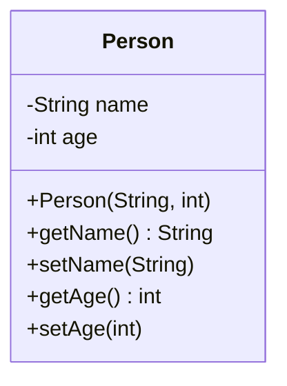

# Java Fundamentals

## Overview

Java Fundamentals encompass the core building blocks of the Java programming language, including syntax, data types, operators, control structures, object-oriented programming basics, and essential concepts like arrays, strings, and exception handling. Mastering these fundamentals is crucial for developing robust Java applications and serves as the foundation for advanced topics in Java development.

## Detailed Explanation

### Data Types

Java is a statically-typed language with two main categories of data types: primitive and reference types.

#### Primitive Data Types

Primitive types are the most basic data types available in Java. They are predefined by the language and are not objects.

| Type    | Size    | Description                          | Default Value | Range |
|---------|---------|--------------------------------------|---------------|-------|
| `byte`  | 8-bit  | Signed two's complement integer     | 0             | -128 to 127 |
| `short` | 16-bit | Signed two's complement integer     | 0             | -32,768 to 32,767 |
| `int`   | 32-bit | Signed two's complement integer     | 0             | -2^31 to 2^31-1 |
| `long`  | 64-bit | Signed two's complement integer     | 0L            | -2^63 to 2^63-1 |
| `float` | 32-bit | IEEE 754 floating-point             | 0.0f          | Approximately ±3.4028235E+38F |
| `double`| 64-bit | IEEE 754 floating-point             | 0.0d          | Approximately ±1.7976931348623157E+308 |
| `char`  | 16-bit | Unicode character                   | '\u0000'      | '\u0000' to '\uffff' |
| `boolean`| 1-bit  | True or false                       | false         | true or false |

#### Reference Types

Reference types include classes, interfaces, arrays, and enums. They store references to objects rather than the objects themselves.

### Variables and Constants

Variables are containers for storing data values. They must be declared with a data type.

```java
int age = 25;
String name = "Alice";
double salary = 50000.0;
```

Constants are immutable variables declared with the `final` keyword:

```java
final double PI = 3.14159;
final String COMPANY_NAME = "Tech Corp";
```

### Operators

Java provides various operators for performing operations on variables and values.

#### Arithmetic Operators

| Operator | Description | Example |
|----------|-------------|---------|
| `+`      | Addition   | `a + b` |
| `-`      | Subtraction| `a - b` |
| `*`      | Multiplication | `a * b` |
| `/`      | Division   | `a / b` |
| `%`      | Modulus    | `a % b` |

#### Relational Operators

| Operator | Description | Example |
|----------|-------------|---------|
| `==`     | Equal to   | `a == b` |
| `!=`     | Not equal to | `a != b` |
| `>`      | Greater than | `a > b` |
| `<`      | Less than  | `a < b` |
| `>=`     | Greater than or equal | `a >= b` |
| `<=`     | Less than or equal | `a <= b` |

#### Logical Operators

| Operator | Description | Example |
|----------|-------------|---------|
| `&&`     | Logical AND | `a && b` |
| `||`     | Logical OR  | `a || b` |
| `!`      | Logical NOT | `!a` |

#### Assignment Operators

| Operator | Description | Example |
|----------|-------------|---------|
| `=`      | Simple assignment | `a = b` |
| `+=`     | Add and assign | `a += b` |
| `-=`     | Subtract and assign | `a -= b` |
| `*=`     | Multiply and assign | `a *= b` |
| `/=`     | Divide and assign | `a /= b` |
| `%=`     | Modulus and assign | `a %= b` |

### Control Structures

Control structures direct the flow of program execution.

#### Conditional Statements

```java
if (condition) {
    // code to execute if condition is true
} else if (anotherCondition) {
    // code to execute if anotherCondition is true
} else {
    // code to execute if no conditions are true
}

switch (expression) {
    case value1:
        // code
        break;
    case value2:
        // code
        break;
    default:
        // code
}
```

#### Loops

```java
// For loop
for (int i = 0; i < 10; i++) {
    System.out.println(i);
}

// While loop
while (condition) {
    // code
}

// Do-while loop
do {
    // code
} while (condition);
```

### Methods

Methods are blocks of code that perform specific tasks and can be called from other parts of the program.

```java
public static int addNumbers(int a, int b) {
    return a + b;
}

public static void printMessage(String message) {
    System.out.println(message);
}
```

### Classes and Objects

Classes are blueprints for creating objects. Objects are instances of classes.

```java
public class Person {
    private String name;
    private int age;
    
    public Person(String name, int age) {
        this.name = name;
        this.age = age;
    }
    
    public String getName() {
        return name;
    }
    
    public void setName(String name) {
        this.name = name;
    }
    
    public int getAge() {
        return age;
    }
    
    public void setAge(int age) {
        this.age = age;
    }
}
```



### Arrays

Arrays are fixed-size data structures that store elements of the same type.

```java
// Declaration and initialization
int[] numbers = new int[5];
int[] primes = {2, 3, 5, 7, 11};

// Accessing elements
int firstPrime = primes[0]; // 2

// Iterating through an array
for (int i = 0; i < primes.length; i++) {
    System.out.println(primes[i]);
}
```

### Strings

Strings represent sequences of characters. In Java, strings are immutable objects.

```java
String greeting = "Hello, World!";
String name = "Alice";

// String concatenation
String message = greeting + " My name is " + name;

// String methods
int length = message.length();
String upper = message.toUpperCase();
boolean contains = message.contains("Alice");
```

### Exception Handling

Exception handling allows programs to deal with runtime errors gracefully.

```java
try {
    // Code that might throw an exception
    int result = 10 / 0;
} catch (ArithmeticException e) {
    // Handle the exception
    System.out.println("Cannot divide by zero: " + e.getMessage());
} finally {
    // Code that always executes
    System.out.println("This always runs");
}
```

## Real-world Examples & Use Cases

- **E-commerce Platform**: Using classes and objects to model products, customers, and orders; arrays for shopping carts; strings for product descriptions.
- **Banking Application**: Implementing secure user authentication with conditional statements; performing financial calculations using arithmetic operators; handling transaction errors with exception handling.
- **Data Processing Tool**: Reading and parsing large datasets using loops and arrays; validating input data with relational and logical operators.
- **Game Development**: Creating game entities as objects with methods for movement and interaction; using control structures for game logic and scoring.
- **Web Application Backend**: Processing user requests with methods and classes; managing session data with variables and constants; logging errors with exception handling.

## Code Examples

### Hello World Program

```java
public class HelloWorld {
    public static void main(String[] args) {
        System.out.println("Hello, World!");
    }
}
```

### Simple Calculator

```java
import java.util.Scanner;

public class Calculator {
    public static void main(String[] args) {
        Scanner scanner = new Scanner(System.in);
        
        System.out.print("Enter first number: ");
        double num1 = scanner.nextDouble();
        
        System.out.print("Enter operator (+, -, *, /): ");
        char operator = scanner.next().charAt(0);
        
        System.out.print("Enter second number: ");
        double num2 = scanner.nextDouble();
        
        double result = 0;
        boolean validOperation = true;
        
        switch (operator) {
            case '+':
                result = num1 + num2;
                break;
            case '-':
                result = num1 - num2;
                break;
            case '*':
                result = num1 * num2;
                break;
            case '/':
                if (num2 != 0) {
                    result = num1 / num2;
                } else {
                    System.out.println("Error: Division by zero");
                    validOperation = false;
                }
                break;
            default:
                System.out.println("Error: Invalid operator");
                validOperation = false;
        }
        
        if (validOperation) {
            System.out.println("Result: " + result);
        }
        
        scanner.close();
    }
}
```

### Student Grade Management System

```java
import java.util.Scanner;

public class StudentGradeSystem {
    public static void main(String[] args) {
        Scanner scanner = new Scanner(System.in);
        
        System.out.print("Enter number of students: ");
        int numStudents = scanner.nextInt();
        
        String[] names = new String[numStudents];
        double[] grades = new double[numStudents];
        
        // Input student data
        for (int i = 0; i < numStudents; i++) {
            System.out.print("Enter name for student " + (i + 1) + ": ");
            names[i] = scanner.next();
            
            System.out.print("Enter grade for " + names[i] + ": ");
            grades[i] = scanner.nextDouble();
        }
        
        // Calculate average
        double sum = 0;
        for (double grade : grades) {
            sum += grade;
        }
        double average = sum / numStudents;
        
        // Find highest and lowest grades
        double highest = grades[0];
        double lowest = grades[0];
        String highestStudent = names[0];
        String lowestStudent = names[0];
        
        for (int i = 1; i < numStudents; i++) {
            if (grades[i] > highest) {
                highest = grades[i];
                highestStudent = names[i];
            }
            if (grades[i] < lowest) {
                lowest = grades[i];
                lowestStudent = names[i];
            }
        }
        
        // Display results
        System.out.println("\nGrade Summary:");
        System.out.println("Average grade: " + String.format("%.2f", average));
        System.out.println("Highest grade: " + highest + " (" + highestStudent + ")");
        System.out.println("Lowest grade: " + lowest + " (" + lowestStudent + ")");
        
        scanner.close();
    }
}
```

### Exception Handling Example

```java
public class ExceptionExample {
    public static void main(String[] args) {
        try {
            int[] numbers = {1, 2, 3};
            System.out.println("Accessing element at index 5: " + numbers[5]);
        } catch (ArrayIndexOutOfBoundsException e) {
            System.out.println("Error: Array index out of bounds - " + e.getMessage());
        } finally {
            System.out.println("This code always executes");
        }
        
        System.out.println("Program continues after exception handling");
    }
}
```

## References

- [Oracle Java Tutorials - Language Basics](https://docs.oracle.com/javase/tutorial/java/nutsandbolts/index.html)
- [Primitive Data Types](https://docs.oracle.com/javase/tutorial/java/nutsandbolts/datatypes.html)
- [Operators](https://docs.oracle.com/javase/tutorial/java/nutsandbolts/operators.html)
- [Control Flow Statements](https://docs.oracle.com/javase/tutorial/java/nutsandbolts/flow.html)
- [Classes and Objects](https://docs.oracle.com/javase/tutorial/java/concepts/index.html)
- [Arrays](https://docs.oracle.com/javase/tutorial/java/nutsandbolts/arrays.html)
- [Strings](https://docs.oracle.com/javase/tutorial/java/data/strings.html)
- [Exceptions](https://docs.oracle.com/javase/tutorial/essential/exceptions/index.html)

## Github-README Links & Related Topics

- [Java OOP Principles](../java-oop-principles/README.md)
- [Java Data Types](../java-data-types/README.md)
- [Java Operators](../java-operators/README.md)
- [Java Exception Handling](../java-exception-handling/README.md)
- [Java Collections](../java-collections/README.md)
- [Java Arrays and Strings](../java-arrays-and-strings/README.md)