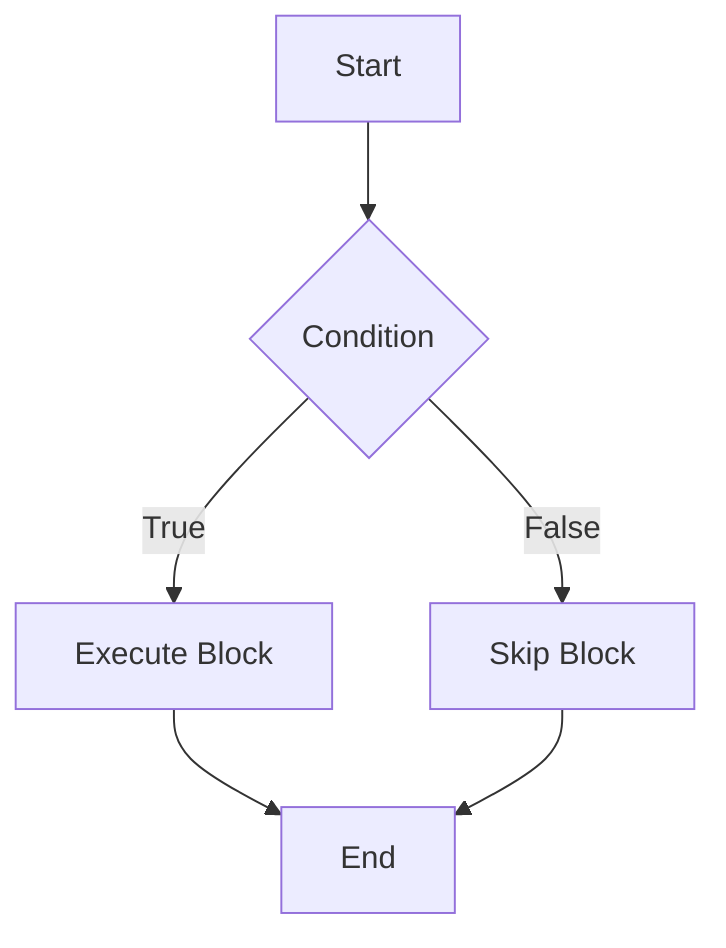

# Overview

Java Fundamentals form the core building blocks of the Java programming language, encompassing variables, data types, operators, control flow statements, expressions, statements, and blocks. These elements enable developers to write structured, efficient, and maintainable code that runs on the Java Virtual Machine (JVM), ensuring platform independence and robustness in software development.

# Detailed Explanation

## Variables

Variables in Java are containers for storing data values. They must be declared with a specific data type before use. Java supports instance variables, class variables (static), and local variables. Variable names follow camelCase convention and must start with a letter, underscore, or dollar sign.

```java
int age; // Declaration
age = 25; // Initialization
int height = 180; // Declaration and initialization
```

## Data Types

Java has eight primitive data types and reference types. Primitive types are stored directly in memory, while reference types store references to objects.

| Data Type | Size | Default Value | Range |
|-----------|------|---------------|-------|
| byte | 8 bits | 0 | -128 to 127 |
| short | 16 bits | 0 | -32,768 to 32,767 |
| int | 32 bits | 0 | -2,147,483,648 to 2,147,483,647 |
| long | 64 bits | 0L | -9,223,372,036,854,775,808 to 9,223,372,036,854,775,807 |
| float | 32 bits | 0.0f | IEEE 754 floating-point |
| double | 64 bits | 0.0d | IEEE 754 floating-point |
| char | 16 bits | '\u0000' | 0 to 65,535 (Unicode) |
| boolean | 1 bit | false | true or false |

Reference types include classes, interfaces, arrays, and strings. Strings are immutable objects.

```java
String name = "Java";
int[] numbers = {1, 2, 3, 4, 5};
```

## Operators

Operators perform operations on variables and values. Java supports arithmetic, relational, logical, bitwise, assignment, and other operators.

### Operator Precedence Table

| Precedence | Operators | Description |
|------------|-----------|-------------|
| 1 | `()` `[]` `.` | Parentheses, array access, member access |
| 2 | `++` `--` `+` `-` `~` `!` | Unary operators |
| 3 | `*` `/` `%` | Multiplicative |
| 4 | `+` `-` | Additive |
| 5 | `<<` `>>` `>>>` | Shift |
| 6 | `<` `>` `<=` `>=` `instanceof` | Relational |
| 7 | `==` `!=` | Equality |
| 8 | `&` | Bitwise AND |
| 9 | `^` | Bitwise XOR |
| 10 | `\|` | Bitwise OR |
| 11 | `&&` | Logical AND |
| 12 | `\|\|` | Logical OR |
| 13 | `? :` | Ternary |
| 14 | `=` `+=` `-=` `*=` `/=` `%=` `&=` `^=` `\|=` `<<=` `>>=` `>>>=` | Assignment |

```java
int a = 10, b = 20;
int sum = a + b; // 30
boolean isEqual = (a == b); // false
int max = (a > b) ? a : b; // 20
```

## Expressions, Statements, and Blocks

- **Expressions**: Combinations of variables, operators, and method calls that evaluate to a value (e.g., `a + b`, `method()`).
- **Statements**: Complete units of execution, often ending with a semicolon (e.g., assignment, method call).
- **Blocks**: Groups of statements enclosed in curly braces `{}`.

```java
{ // Block
    int x = 5; // Declaration statement
    x++; // Expression statement
    System.out.println(x); // Method invocation statement
}
```

## Control Flow Statements

Control flow statements direct the execution path of a program.

### Conditional Statements

```java
if (condition) {
    // code
} else if (anotherCondition) {
    // code
} else {
    // code
}

switch (variable) {
    case value1:
        // code
        break;
    case value2:
        // code
        break;
    default:
        // code
}
```

### Loops

```java
for (int i = 0; i < 10; i++) {
    // code
}

while (condition) {
    // code
}

do {
    // code
} while (condition);
```

### Branching Statements

- `break`: Exits the loop or switch.
- `continue`: Skips to the next iteration.
- `return`: Exits the method.



# Real-world Examples & Use Cases

- **Financial Applications**: Using `double` for precise calculations in banking software, with `BigDecimal` for currency to avoid floating-point errors.
- **Data Processing**: Loops for iterating over large datasets, conditional statements for filtering data.
- **User Interfaces**: Control flow for handling user inputs and events in GUI applications.
- **Embedded Systems**: Primitive types for memory-efficient storage in IoT devices.
- **Web Services**: Strings and arrays for processing HTTP requests and responses.

# Code Examples

## Example 1: Basic Arithmetic Calculator

```java
public class Calculator {
    public static void main(String[] args) {
        int a = 10;
        int b = 5;
        
        System.out.println("Addition: " + (a + b));
        System.out.println("Subtraction: " + (a - b));
        System.out.println("Multiplication: " + (a * b));
        System.out.println("Division: " + (a / b));
        System.out.println("Modulus: " + (a % b));
    }
}
```

## Example 2: Control Flow with Loops

```java
public class LoopExample {
    public static void main(String[] args) {
        // For loop
        for (int i = 1; i <= 5; i++) {
            System.out.println("Count: " + i);
        }
        
        // While loop
        int j = 1;
        while (j <= 5) {
            System.out.println("While count: " + j);
            j++;
        }
        
        // If-else
        int number = 10;
        if (number > 0) {
            System.out.println("Positive number");
        } else if (number < 0) {
            System.out.println("Negative number");
        } else {
            System.out.println("Zero");
        }
    }
}
```

## Example 3: Working with Arrays and Strings

```java
public class ArrayStringExample {
    public static void main(String[] args) {
        // Array
        int[] numbers = {1, 2, 3, 4, 5};
        for (int num : numbers) {
            System.out.println("Number: " + num);
        }
        
        // String
        String text = "Hello, Java!";
        System.out.println("Length: " + text.length());
        System.out.println("Uppercase: " + text.toUpperCase());
        System.out.println("Substring: " + text.substring(7, 11));
    }
}
```

## Example 4: Switch Statement

```java
public class SwitchExample {
    public static void main(String[] args) {
        int day = 3;
        String dayName;
        
        switch (day) {
            case 1:
                dayName = "Monday";
                break;
            case 2:
                dayName = "Tuesday";
                break;
            case 3:
                dayName = "Wednesday";
                break;
            case 4:
                dayName = "Thursday";
                break;
            case 5:
                dayName = "Friday";
                break;
            case 6:
                dayName = "Saturday";
                break;
            case 7:
                dayName = "Sunday";
                break;
            default:
                dayName = "Invalid day";
                break;
        }
        
        System.out.println("Day: " + dayName);
    }
}
```

# References

- [Oracle Java Tutorials - Language Basics](https://docs.oracle.com/javase/tutorial/java/nutsandbolts/index.html)
- [Primitive Data Types](https://docs.oracle.com/javase/tutorial/java/nutsandbolts/datatypes.html)
- [Operators](https://docs.oracle.com/javase/tutorial/java/nutsandbolts/operators.html)
- [Control Flow Statements](https://docs.oracle.com/javase/tutorial/java/nutsandbolts/flow.html)
- [Expressions, Statements, and Blocks](https://docs.oracle.com/javase/tutorial/java/nutsandbolts/expressions.html)
- [Java Language Specification](https://docs.oracle.com/javase/specs/jls/se21/html/index.html)

# Github-README Links & Related Topics

- [Java Design Patterns](../java-design-patterns/)
- [Java Collections Deep Dive](../java-collections-deep-dive/)
- [Java Exception Handling](../java-exception-handling/)
- [Java Stream API and Functional Programming](../java-stream-api-and-functional-programming/)
- [JVM Internals and Class Loading](../jvm-internals-and-class-loading/)