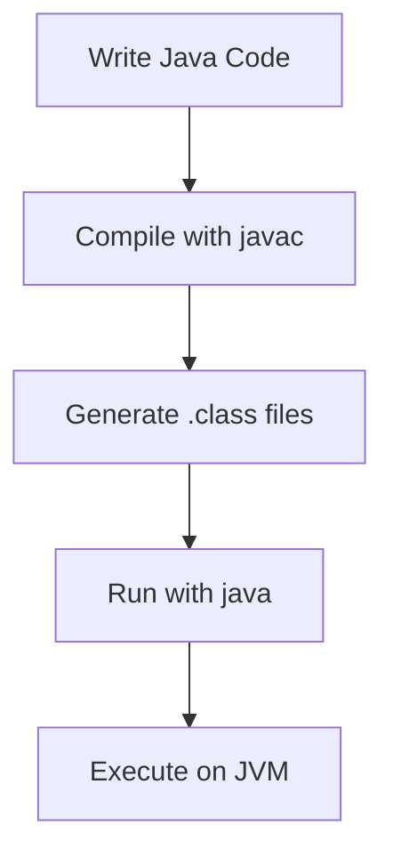
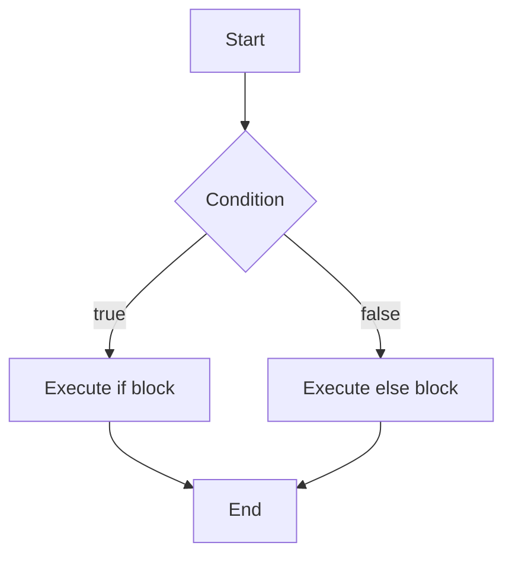

# Java Fundamentals

## Overview

Java Fundamentals cover the core concepts and building blocks of the Java programming language. This includes basic syntax, data types, control structures, object-oriented principles, and essential language features that form the foundation for more advanced Java development.

## Detailed Explanation

### Basic Syntax and Structure

Java programs are organized into classes and methods. Every Java application must have a `main` method as the entry point.

```java
public class HelloWorld {
    public static void main(String[] args) {
        System.out.println("Hello, World!");
    }
}
```



### Data Types

Java has two categories of data types: primitive and reference.

**Primitive Types:**

| Type | Size | Range | Description |
|------|------|-------|-------------|
| `byte` | 8-bit | -128 to 127 | Signed integer |
| `short` | 16-bit | -32,768 to 32,767 | Signed integer |
| `int` | 32-bit | -2^31 to 2^31-1 | Signed integer |
| `long` | 64-bit | -2^63 to 2^63-1 | Signed integer |
| `float` | 32-bit | IEEE 754 | Floating-point |
| `double` | 64-bit | IEEE 754 | Floating-point |
| `char` | 16-bit | Unicode | Character |
| `boolean` | 1-bit | true/false | Boolean |

**Reference Types:**
- Objects, arrays, and strings

### Variables and Constants

Variables store data values, while constants are immutable.

```java
int age = 25;
final double PI = 3.14159;
String name = "John Doe";
```

### Operators

Java supports various operators:
- Arithmetic: `+`, `-`, `*`, `/`, `%`
- Relational: `==`, `!=`, `<`, `>`, `<=`, `>=`
- Logical: `&&`, `||`, `!`
- Assignment: `=`, `+=`, `-=`, etc.

### Control Structures

**Conditional Statements:**
```java
if (condition) {
    // code
} else if (anotherCondition) {
    // code
} else {
    // code
}

switch (variable) {
    case value1:
        // code
        break;
    case value2:
        // code
        break;
    default:
        // code
}
```



**Loops:**
```java
for (int i = 0; i < 10; i++) {
    System.out.println(i);
}

while (condition) {
    // code
}

do {
    // code
} while (condition);
```

### Arrays

Arrays store multiple values of the same type.

```java
int[] numbers = new int[5];
int[] primes = {2, 3, 5, 7, 11};

for (int num : primes) {
    System.out.println(num);
}
```

### Methods

Methods encapsulate reusable code blocks.

```java
public static int add(int a, int b) {
    return a + b;
}

public static void main(String[] args) {
    int result = add(5, 3);
    System.out.println(result);
}
```

## Real-world Examples & Use Cases

1. **Calculator Application**: Using arithmetic operators and methods to perform calculations.

2. **Student Grade Management**: Arrays and loops to store and process student grades.

3. **Simple Banking System**: Variables and conditionals to manage account balances and transactions.

4. **Temperature Converter**: Methods and data types to convert between Celsius and Fahrenheit.

5. **Number Guessing Game**: Loops and random number generation for interactive gameplay.

## Code Examples

### Complete Calculator Class

```java
public class Calculator {
    public static double add(double a, double b) {
        return a + b;
    }

    public static double subtract(double a, double b) {
        return a - b;
    }

    public static double multiply(double a, double b) {
        return a * b;
    }

    public static double divide(double a, double b) {
        if (b == 0) {
            throw new IllegalArgumentException("Cannot divide by zero");
        }
        return a / b;
    }

    public static void main(String[] args) {
        System.out.println("5 + 3 = " + add(5, 3));
        System.out.println("5 - 3 = " + subtract(5, 3));
        System.out.println("5 * 3 = " + multiply(5, 3));
        System.out.println("5 / 3 = " + divide(5, 3));
    }
}
```

### Array Manipulation Example

```java
public class ArrayExample {
    public static void main(String[] args) {
        int[] scores = {85, 92, 78, 96, 88};
        
        // Calculate average
        double sum = 0;
        for (int score : scores) {
            sum += score;
        }
        double average = sum / scores.length;
        
        System.out.println("Average score: " + average);
        
        // Find maximum
        int max = scores[0];
        for (int i = 1; i < scores.length; i++) {
            if (scores[i] > max) {
                max = scores[i];
            }
        }
        System.out.println("Highest score: " + max);
    }
}
```

## References

- [Oracle Java Tutorials - Language Basics](https://docs.oracle.com/javase/tutorial/java/nutsandbolts/index.html)
- [Java Language Specification](https://docs.oracle.com/javase/specs/jls/se17/html/index.html)
- [GeeksforGeeks Java Fundamentals](https://www.geeksforgeeks.org/java/)

## Github-README Links & Related Topics

- [java/README.md](../java/README.md)
- [oop-principles-in-java/README.md](../oop-principles-in-java/README.md)
- [java-language-basics/README.md](../java/java-language-basics/README.md)
